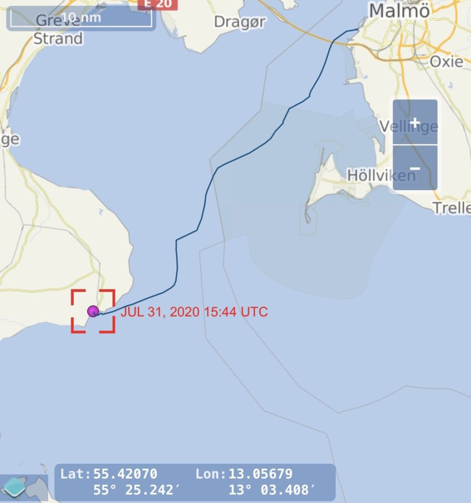
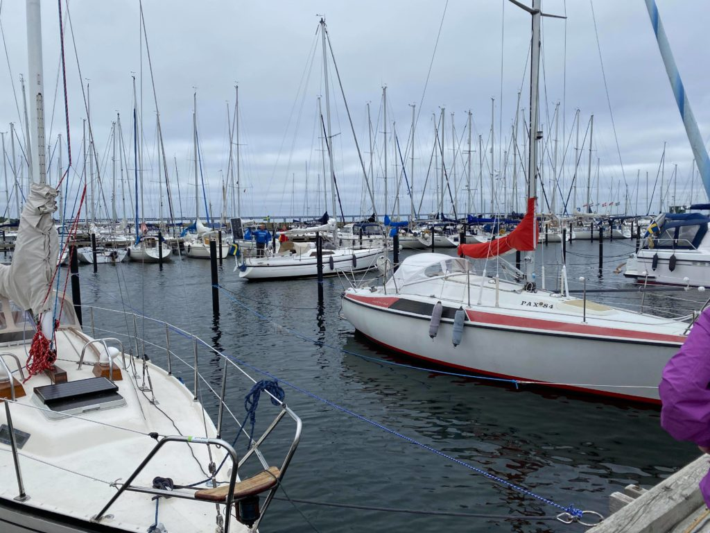
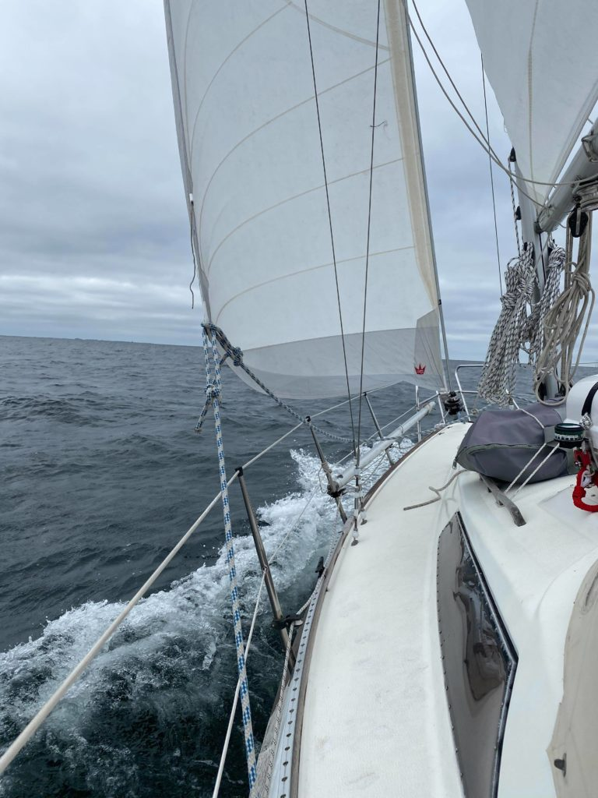
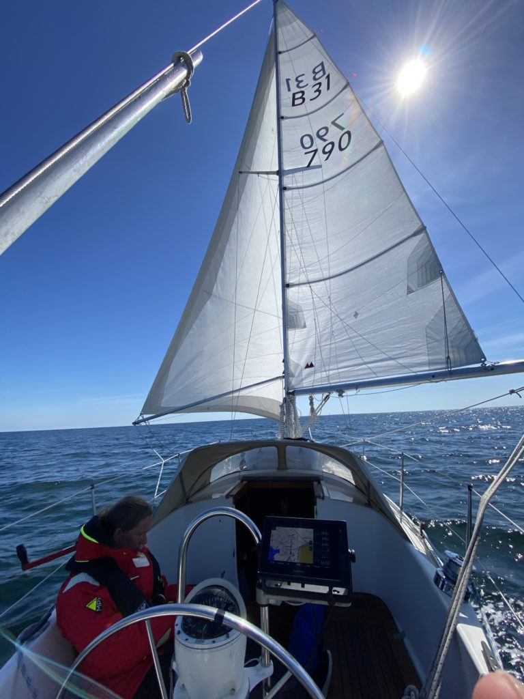
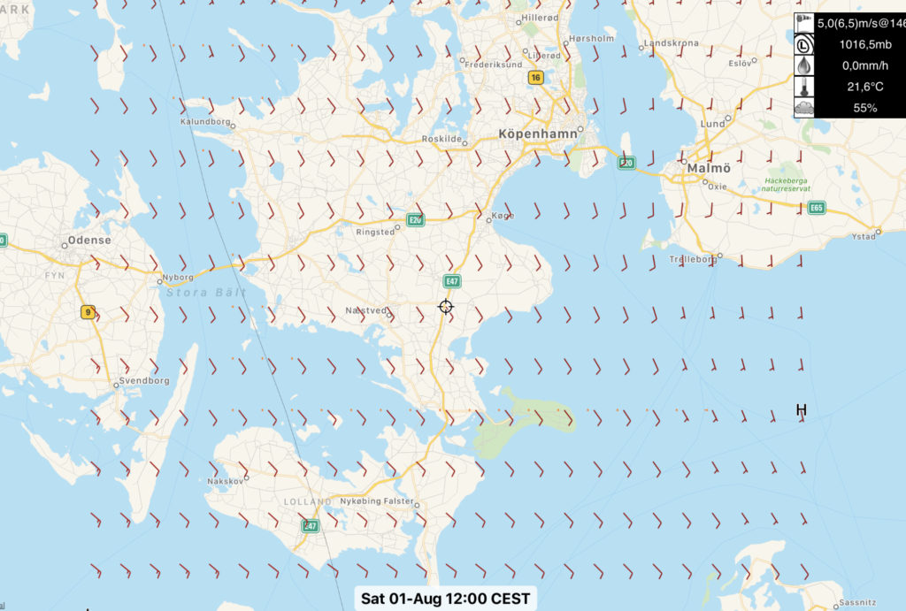

Dag: 1  
Loggdatum: 2020-07-31  
Rutt: Malmö – Rødvig  
Tid: 09:20 – 17:30 ( 8h 10min )  
Distans: 29 nm  
Snittfart: 3,75 knots  
Vind: 0 – 20 knots  

Äntligen på väg, vårt mål för dagen låg lite längre bort än vad vinden tyckte men vad gör det vi har ju tid.

Allt började hur bra som helst, massor av vänner som vinkade av oss från bryggan på Limhamn i Malmö, det är tusan inte lätt att lämna alla men det är tur att det bara är ett "vi ses snart" och inte ett farväl.

Första dagen förvånade oss med trevlig segling och ett riktigt toppenväder, under de första timmarna kunde vi till och med klämma ur över 6 knops fart ur den gamla damen vilket inte är så illa med tanke på hur tungt lastad hon är.

Efter ett par timmar både vred och minskade vinden och det blev svårare för oss att hålla farten uppe sedan gick det bara utför, mindre och mindre vind och mer och mer sol. Hur härligt som helst på land men för oss var det inget vidare...

Efter ett tag var vi tvungna att tvinga ut våra segel för att de skulle fånga den lilla vinden där var.

Efter ytterligare några timmar med mer eller mindre ingen vind alls gav vi upp och ändrade kursen mot Rødvig istället för Klintholm som det var tänkt. Vi kunde inte riktigt acceptera att behöva motorera 6 timmar redan första dagen bara för att komma dit det var tänkt.

Hamnen i Rødvid var fylld till bredden när vi kom dig så det slutade med att vi låg som fjärde båt utanför tre andra. Tack och lov kom det inte fler då vi skulle lämna tidigt nästa morgon.

