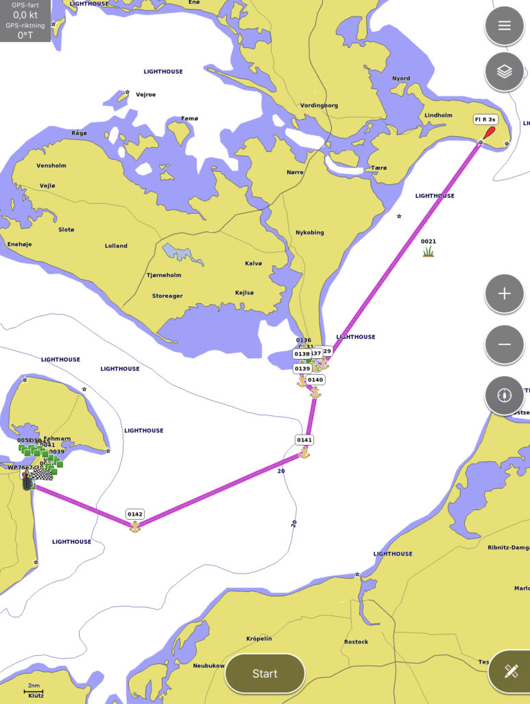
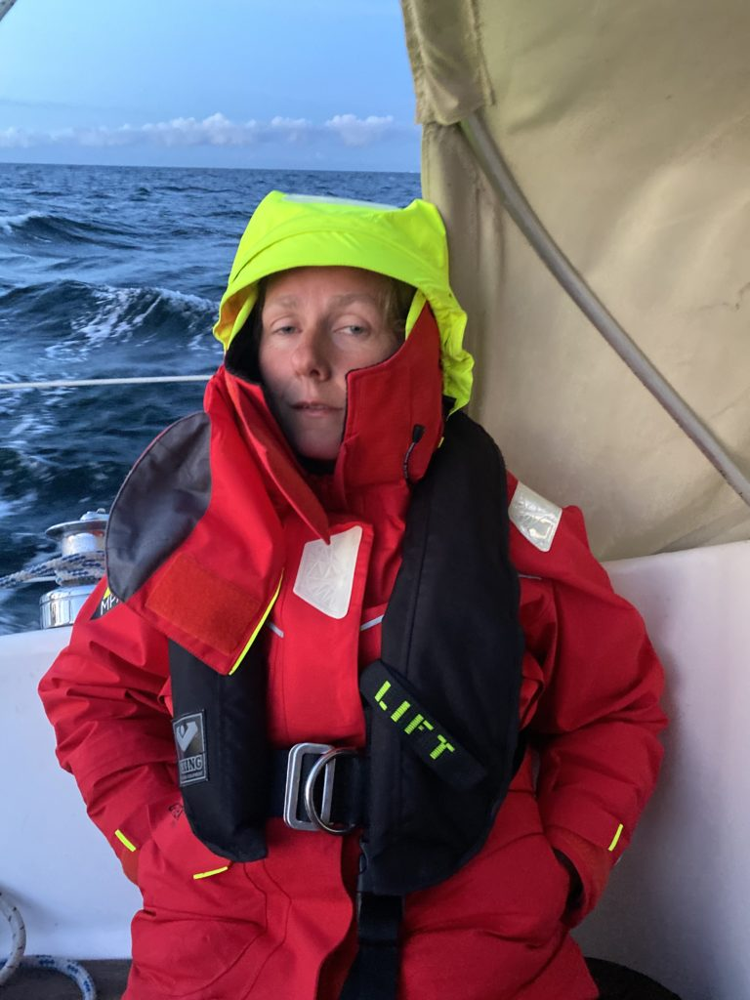
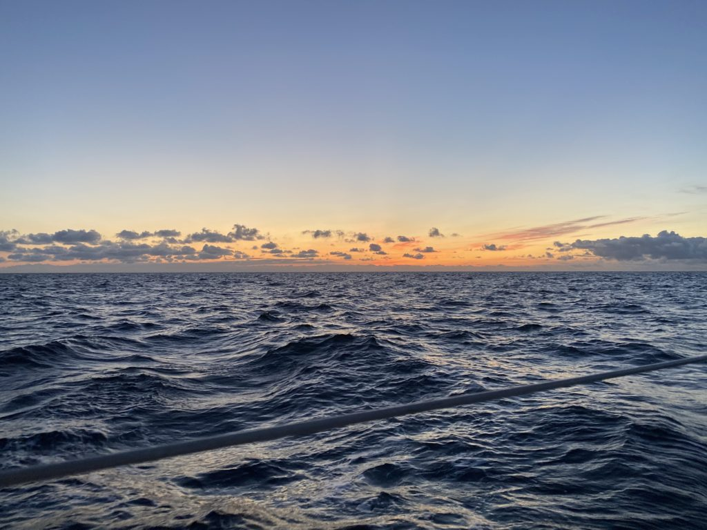
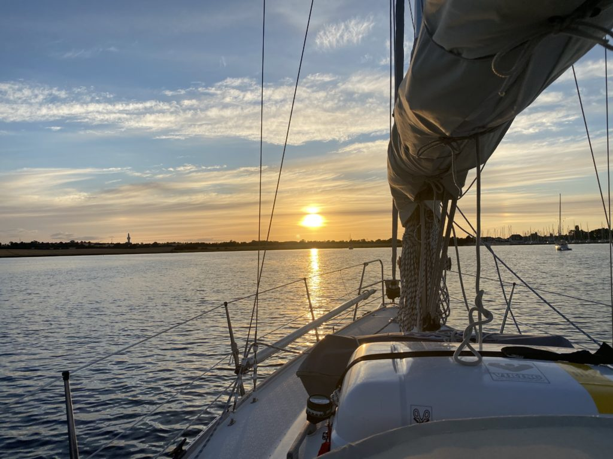

A small step for mankind but a quite good leap for Trull.

Day: 3 & 4  
Log date: 2020-08-03  
Route: Klintholm – Marina Grossenbrode  
Time: 07:40 – 09:05 ( 25h 25min )  
Distance: 102 nm  
Average speed: 4 knots  
Wind: 0 – 30 knots  
Rain: Quite a lot  
Visibility: Great to horrible

Yesterday we decided to go from Klintholm in Denmark to Gedser the small harbor in the very southern parts of Denmark, just a small jump that would bring us about 35nm closer to our target. However, things seldom go as planned so just about when we was about to turn our rudder to enter Gedser we decided to sail through the night to our other neighbour Germany instead.

It all started when we reviewed the weather chart and noted that the wind should turn to west and bump from a few knots to and average of 15 knots through the night. We decided to sail through the night since Mia never tried that before and the experience could come handy when we reach the North Sea in a few days especially since I hate to be awake 24 hours or more without any sleep.

Klintholm – Marina Grossenbrode

The plan was simple 80nm or so in total, arrive around 04.00 get some sleep and enjoy the day sailing towards Kiel. As Mike Tyson once said, everyone got a plan till they get punched in the face. The punch we got was 30 knots of wind instead of 20 and quite a lot of rain and to sprinkle the entire thing we wasn’t entirely correct about how high agains the wind the boat could go so the entire night ended with us tacking across the Baltic Sea. We arrived about 5 hours and 25nm later than expected with no sleep.

However everything wasn’t that bad, we got to enjoy a beautiful and relaxed sunset before the clouds that can be seen in the horizon caught up with us.

<iframe title="Sunset sailing - 2020-08-03" width="640" height="360" src="https://www.youtube.com/embed/td2_0yCqUz8?feature=oembed" frameborder="0" allow="accelerometer; autoplay; clipboard-write; encrypted-media; gyroscope; picture-in-picture; web-share" allowfullscreen=""></iframe>

And for a while the night calmed down and gave us a moment to relax and enjoy the moon that kept us company for a while. That single moment made the trip worth it, just enjoying the night and the silent company of the bright fella in the clouds.

<iframe title="Night sailing accompanied by the moon" width="640" height="360" src="https://www.youtube.com/embed/MRKK1mX9Qys?feature=oembed" frameborder="0" allow="accelerometer; autoplay; clipboard-write; encrypted-media; gyroscope; picture-in-picture; web-share" allowfullscreen=""></iframe>

When the morning finally arrived we both tried to stay away after a long night, Mia tried really hard not to fall asleep but failed over and over again while keeping me company and even if there are no pictures of me at the helm I can promise I had the same look at my face.

But as they say, after rain comes sunshine and after dark nights comes a bright beautiful mornings. Well the last part I just made up but this time it was correct. What a sunrise we got!

When we later arrived to Marina Grossenbrode we decided to moor in outside of the marina that was way to crowded for our taste and after a few hours of sleep and relaxing we cleaned the boat and had it ready for setting sail again.

