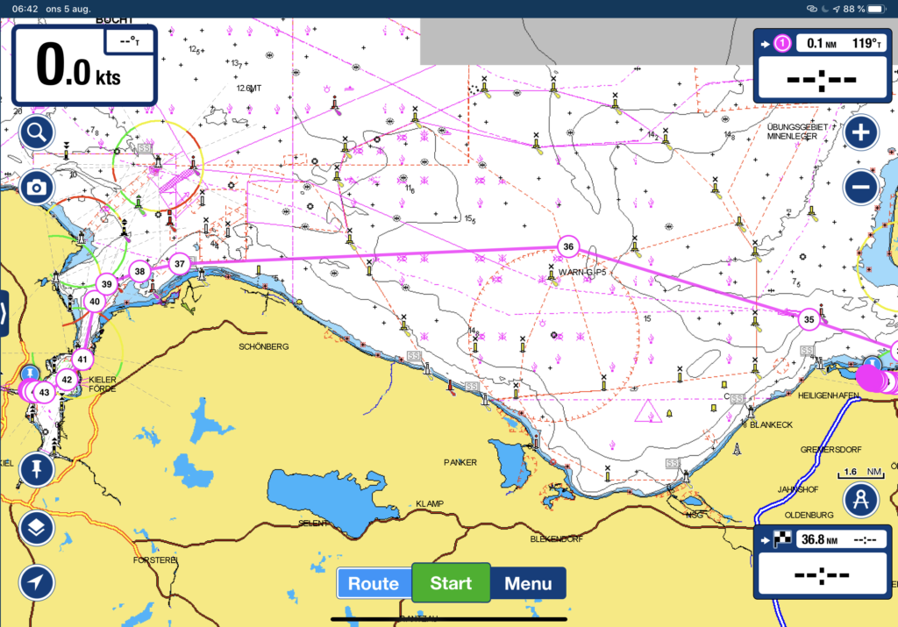
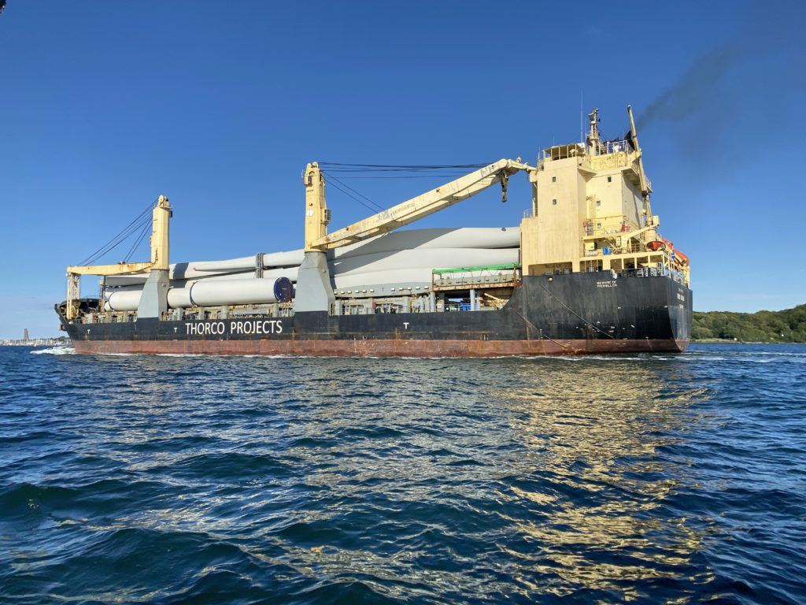
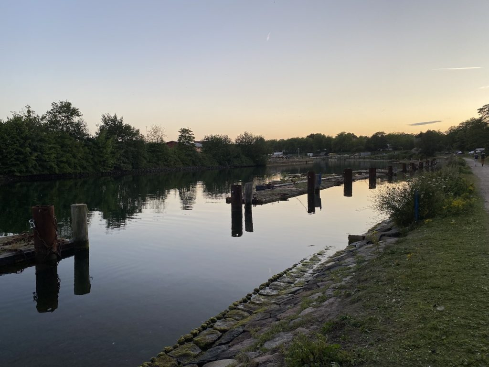

Dag: 6
Loggdatum: 5 aug. 2020
Rutt: Heiligenhafen – Kiel
Tid: 07:15 – 18:55 (11h 38min)
Distans: 56,3 nm
Genomsnittlig hastighet: 4,6 knop
Vind: 20 knop
Regn: Inget
Sikt: Utmärkt

Idag lossade vi förtöjningarna och lämnade Heiligenhafen för att segla mot Kiel. Enligt sjökortet bör det inte ta så lång tid då det bara är 38nm så med lite tur bör vi klara det på 8 till 10 timmar. Med då vi hade vinden mot oss (som vanligt) seglade vi 56 nm istället för de planerade 38 på grund av alla slag, men den högre farten kompenserade för den extra sträckan så vi nådde bryggan i Holtenau utanför Kiel bara 2 timmar senare än förväntat, inte så illa ändå.

När vi kom närmare Kiel var det lite läskigt att se alla stora fartyg som närmade sig och veta att vi snart kommer att dela sluss och kanal med dem. De är enorma och när man kommer närmre är de ännu större! Läskigt!

När vi var förtöjda kollade vi runt och hittade den gamla slussen, de gamla bryggorna fanns fortfarande kvar. Trevligt ställe förutom alla Kanadagäss som ockuperade området, tack för det Kanada... Om någon av dem bestämmer sig för att lämna "något" på vår båt kommer jag personligen förklara krig och börja tillverka dunjackor på heltid.

Förutom att hitta den gamla slussen hittade vi också en Covid-19-skylt som informerade oss om att kanalavgiften hade tagits bort för fritidsbåtar så den var bara att tacka och buga då en sparad slant är minst lika bra som en tjänad slant. Det var det första vettiga som kom ut av den här skitviruset.

