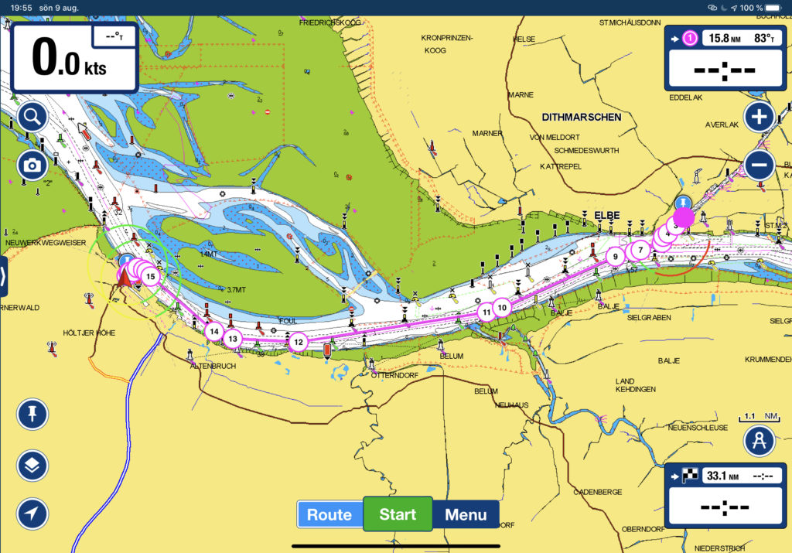
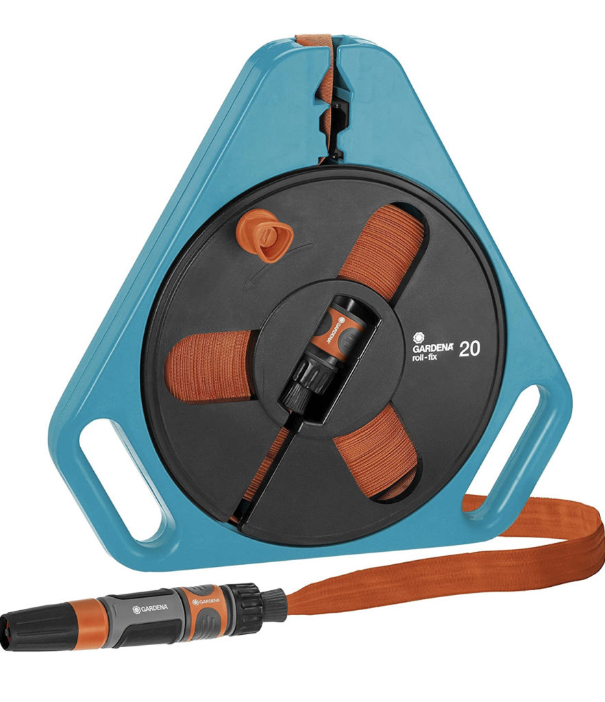

Loggdatum: 9 aug. 2020
Rutt: Brunnsbüttel – Cuxhaven
Tid: 09:00 – 11:47 ( 2h 47min )
Distans: 17,7 nm
Snittfart: 5,4 knots –> Max speed: 8,3 knots #happyface

<iframe title="The last lock, for now..." width="640" height="360" src="https://www.youtube.com/embed/XJaPYn_IWpA?feature=oembed" frameborder="0" allow="accelerometer; autoplay; clipboard-write; encrypted-media; gyroscope; picture-in-picture; web-share" allowfullscreen=""></iframe>

*Svamlande svenskar*

Idag blev det ett kort hopp från tryggheten på insidan av slussen till det stora läskiga på andra sidan med tidvatten, vågor och massa strömmar. Vi var riktigt glada att det var fint väder med sol och inte så mycket vind så att vi kunde fokusera på att inte stöka till det mer än vad som behövs för oss. När vi lämnade så var strömmen mellan tre och fyra knop, det låter kanske inte så mycket men för en båt vars snittfart är mellan fyra och fem knop är det en hel del.

Vår plan var att lämna med tidvattnet och få en liten extra knuff mot Cuxhaven och nog blev det så alltid. Sträckan som i vanliga fall tar fyra timmar tog idag under tre och då var all väntan i slussen inräknad. I Elbe åkte vi snålskjuts i över åtta knop utan att belasta motorn det minsta lilla, helt galet!

På "vägen" mötte vi den största skutan sedan vi lämnade, båten nedan är 400 meter lång och 53 meter bred och inte ens fullastad är den gigantisk!! Jag har inte en blekaste aning om vad som gömmer sig i alla legobitarna ombord men jag är helt säker på att det är en hel del “[prylar](https://youtu.be/MvgN5gCuLac)” och andra kul och extremt nödvändiga saker.

När vi nådde Cuxhaven insåg vi att vi räknat lite fel på strömmen (oväntat), den höll fortfarande stadiga fyra knop och inte en och en halv som väntat. Vi missade nästan hamninloppet på grund av strömmen, det hade varit något att inte skryta om.

Efter ett kort samtal med slussen i Cuxhaven öppnades den och fick vi komma in i hamnen där vi gjorde en tilläggning som såg ut som att vi inte gjort annat under hela vårt liv (det var ren tur att vi inte kraschade in i bryggan och körde av den på mitten). 

Då Cuxhaven verkar vara en trevlig marina är planen att stanna här i två nätter för att både byta olja och för att få fatt i en liten smidig trädgårdsslang att klämma in i den redan överlastade skutan. Allt för att slippa fylla vår 125 liters vattentank med den lilla tioliters hinken vi har ombord.

Nästa steg är att planera rutten från Cuxhaven ner mot England eller norra Frankrike. Tidvatten med strömmar kommer göra det hela hur roligt som helst för en nordbo som bara seglat i Östersjön. Vad skulle kunna gå fel? :-)