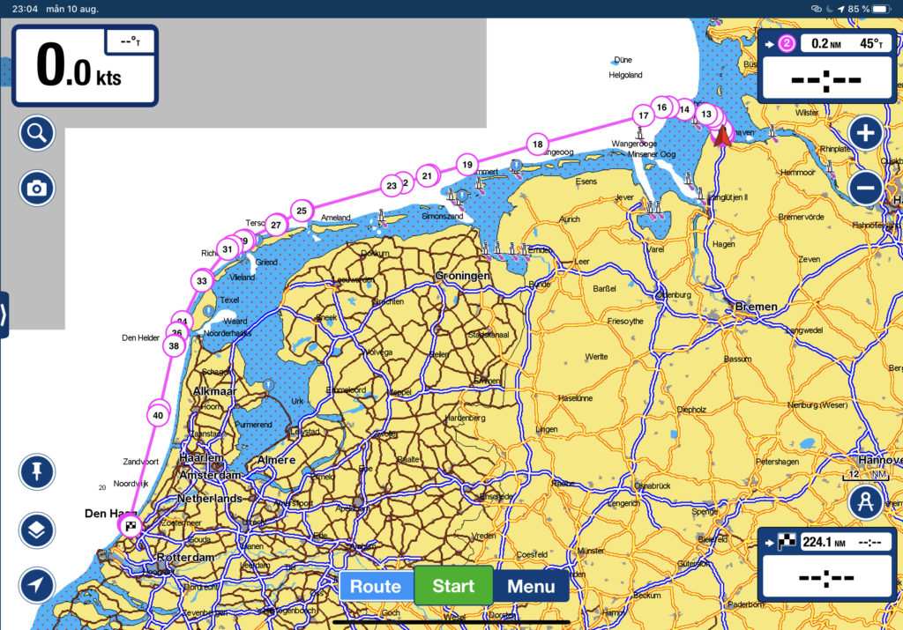

Log date: 10 aug. 2020  

Since we plan to head out tomorrow on our first +200nm trip that probably will last for at least 2,5 day or so we spent the entire day taking care of the boat in other words, today was one busy day…

\[X\] Cleaned the deck  
\[X\] Cleaned the cockpit  
\[X\] Changed the engine oil  
\[X\] Added safety lines from bow to stern  
\[X\] Got the spinnaker pole uphaul in place  
\[X\] Reinforced the bowsprit  
\[X\] Secured the bowsprit anchor  
\[X\] Refilled the disel reserve  
\[X\] Bought courtesy flag for Belgium, Netherlands, France and Spain  
\[X\] Fitted our leecloth

Unfortunately I didn’t get any ice cream but we found a burger joint with monstrous burgers and nice drinks so the day wasn’t just business.

Tomorrow we head out and set course for a small marina north of Haag.

