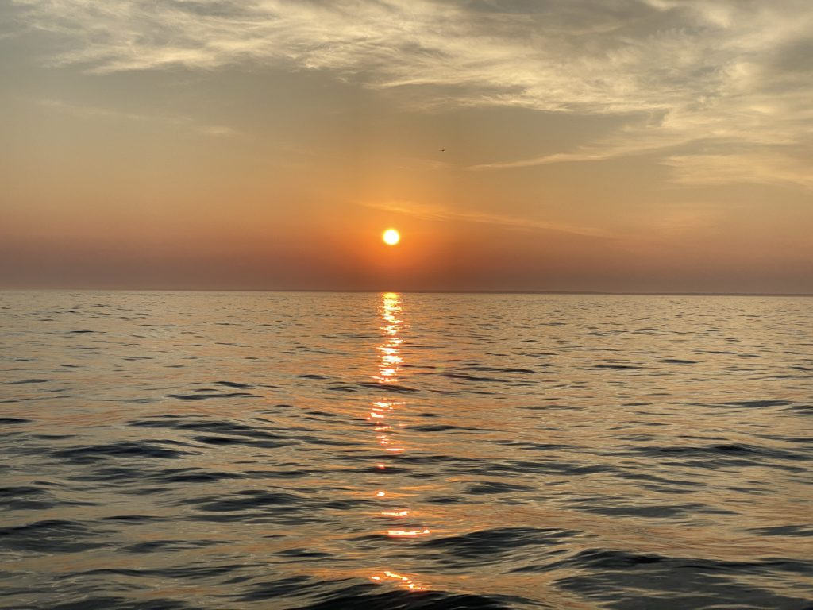
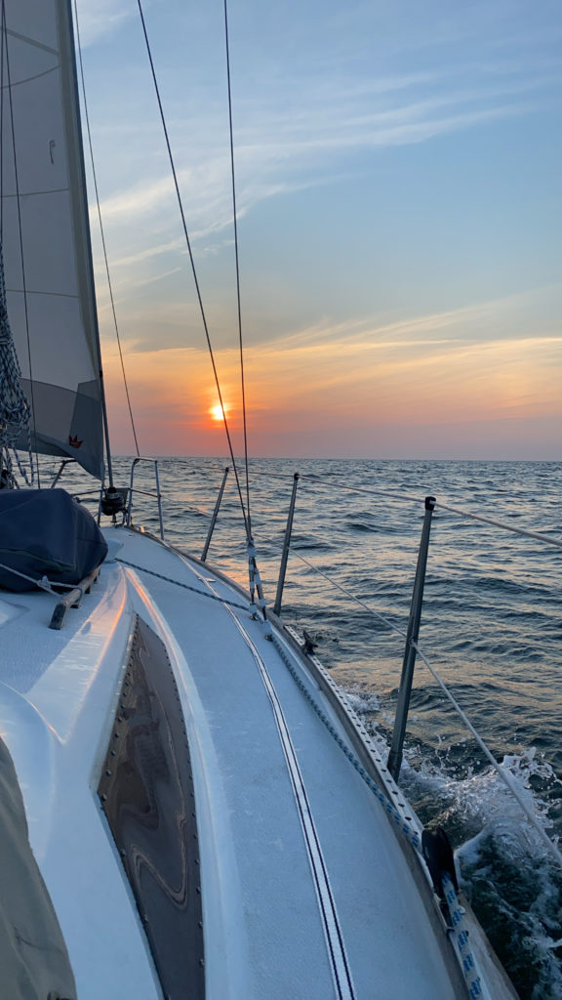
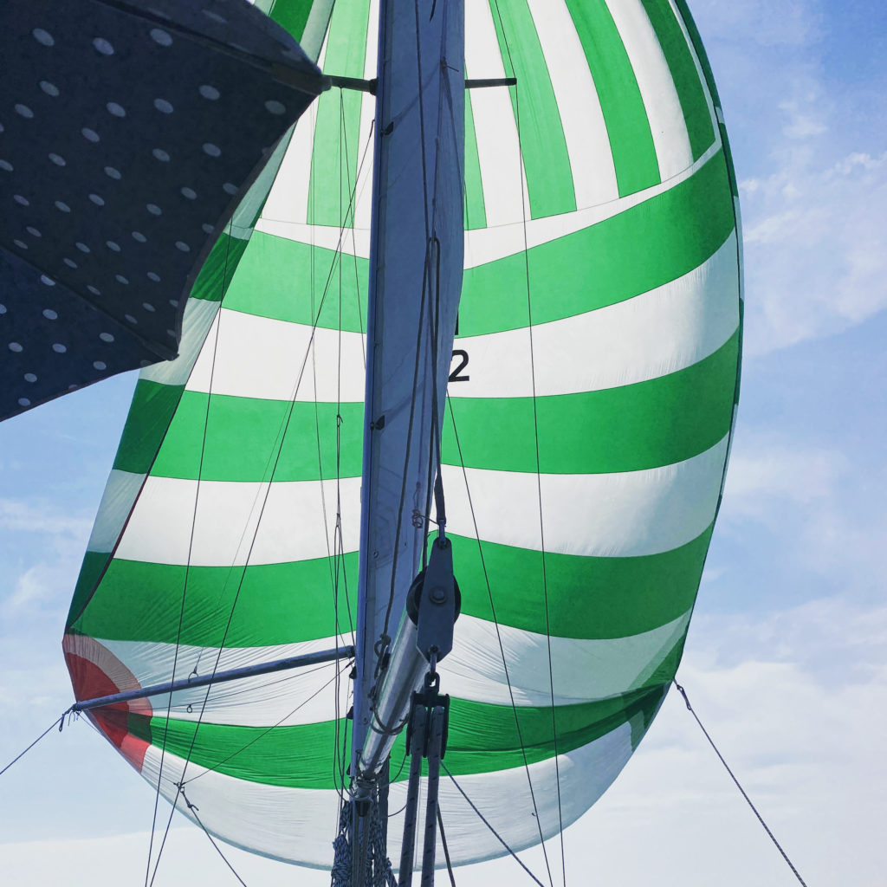
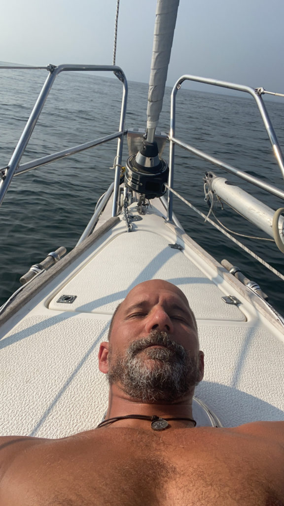
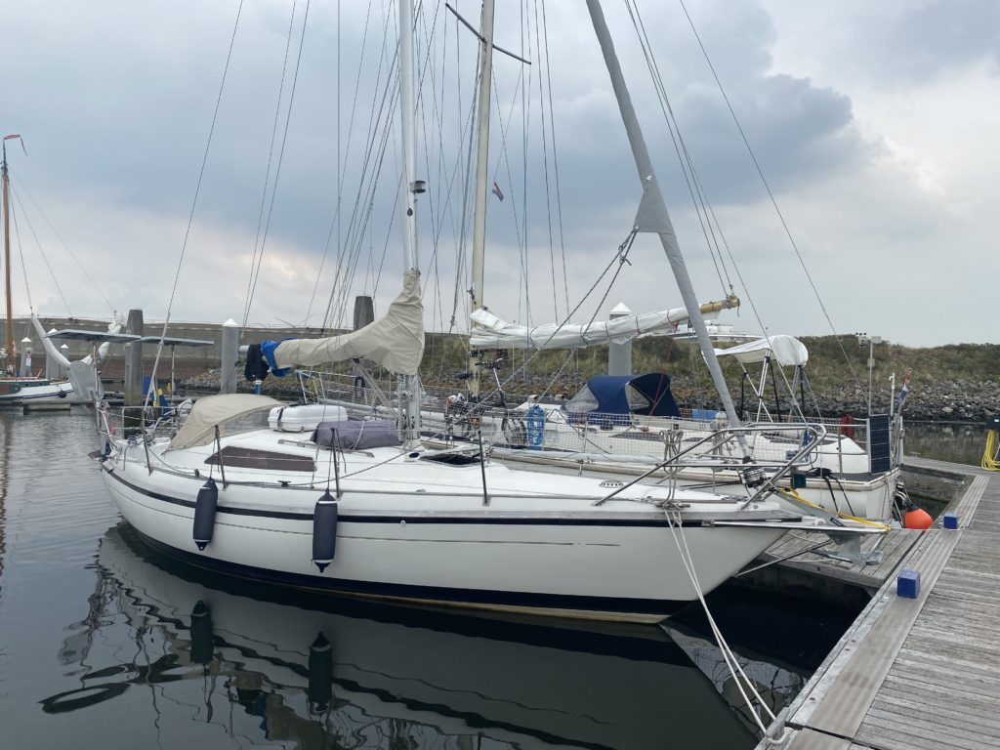

It was time for us to keep going but with tides and shores of never ending sandbanks we decided to head for Haag about 225 nm away. We should be able to reach port in about two and a half day. Spoiler alert, we didn’t.

Log date: 2020-08-13  
Route: Cuxhaven – IJmuiden  
Time: 07:00 (08/11) – 19:48 (08/13) ( 60h 48min )  
Distance: 232 nm  
Average speed: 3,8 knots  
Wind: 0 – 30 knots  
Rain: None  
Visibility: Great

We left Cuxhaven with the tides to reach open water outside of river Elbe as smooth and easy as possible. We planned the tide pretty okey however the wind wasn’t in our favour so we had to tack our way out.

The tacking itself wasn’t a problem (we are getting quite used to that now), the problem was that there were a ton of super big ships all over the place and we had to use “their” lane to allow us to get some kind of wind.

Apparently they didn’t like that since Cuxhaven Traffic Control called us on our VHF and told us to get the “F” out of the waterway since one of the big guys had to make “adjustments” due to us. (To our defence we were already on our way)

When we finally got out of the waterway they called us again and told us that we were heading towards “danger”. Apparently they knew something we didn’t, our chart said 10 meters so better safe than sorry we tacked again and hurried out of there. Cuxhaven was nice but I will not head over there again for quite some time.

From the “danger” encounter the following hours went well (all 60 of them). We spent more than two full days and nights at sea and had the opportunity to try out our new lee cloth, it worked perfekt we both slept like babies when our watch was over.

The weather was kind to us and both day and night passed without any issues, we even got the windvane running for some time till the wind shifted and blessed us with 100% downwind. It might sound great but without a spinnaker up and running downwind sucks…

But at least we had two beautiful evenings and equally beautiful nights, it’s sad that it’s so hard to capture how amazing the nights are. When there aren’t any light pollution all the stars, Milky Way and the shooting stars are super clear and just WOW!

Since the downwind decided to stay for some time we hoisted our “get away”-sail (the mighty spinnaker) and just enjoyed the sunny day. Sailing can be everything from “Fuck, fuck, fuck we are going down!!” when the wind decide to almost flip the boat to “Sweeeet home Alabama” when the wind is kind and the sun is shining. I kind of enjoy them both, Mia only fancy one of them. 😉

After more than 2 days we downloaded the weather report and it said thunder and thunder storms usually bring really shitty weather so we had to decide, one more night at sea and reach Haag or bail out and grab the closest marina we could find. Better safe than sorry (again) we went for the marina IJmuiden.

IJmuide isn’t the coziest marina out there according to the reviews but it for sure did the trick and they had showers!!! 2×7 minutes of warm water. Pure joy, I love IJmuiden cozy or not! We decided to stay for two nights, it was two good nights.

