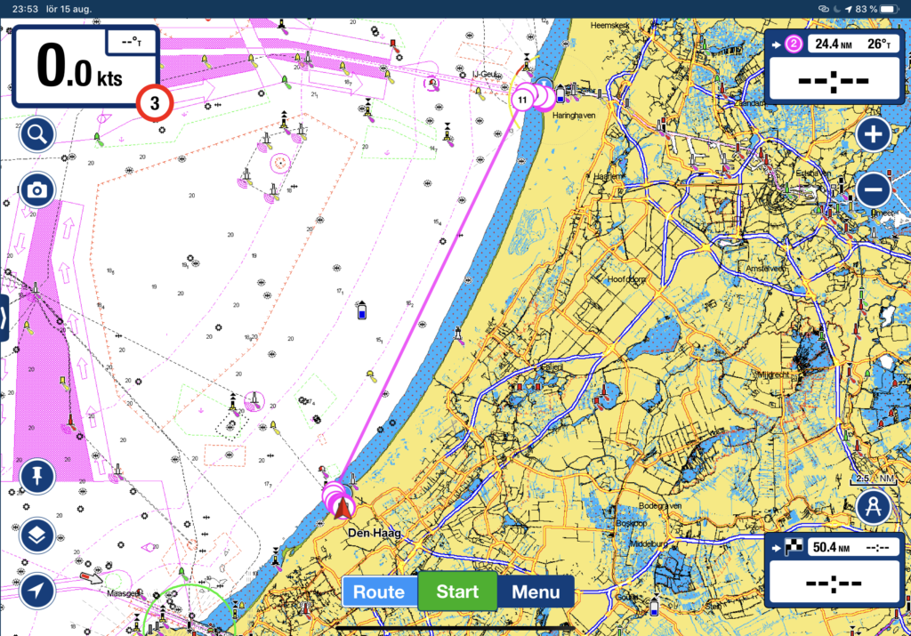
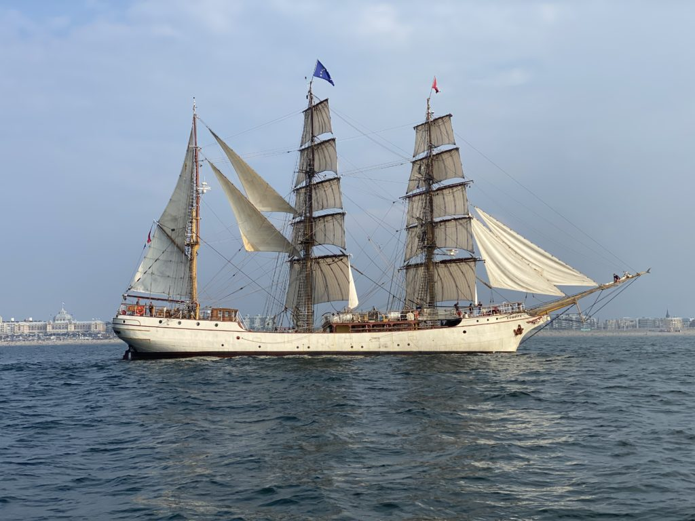

Vi lämnar IJmuiden och fortsätter söderut

Logdatum: 2020-08-15  
Rutt: IJmuiden – Yacht Club Scheveningen (Haag)  
Tid: 11:00 – 18:34 ( 7h 34min )  
Distans: 27,7 nm  
Snittfart: 3,7 knots  

Eftersom vi är på väg söderut har vi kommit överens om att det är bättre att ta ett kort hopp söderut än inget alls så vi satte segel med riktning mot Yacht Club Scheveningen precis utanför Haag.

Det där med att sätta segel var dagens överdrift, det slutade med att vi fick motorera i sju timmar för att komma fram då vinden gjorde sitt absolut bästa för att hålla sig undan och under halva den tiden gjorde stömmen sitt för att göra livet surt för vår lilla 12 hästars motor som fick svettas runt 80 grader efter att ha varit van att luffa på vid 65 under snart 40års tid. Anar att det hänger ihop lite med att vi kan ha luft i kylssystemet så det får bli att sätta av några timmar på att lösa det när vi kommer fram.

På väg in mot marinan passerade vi ett fartyg med betydligt mer segel än oss, de hade inte en chans då vi fuskade med motorn. Oavsett så var det en vacker syn så hatten av till alla dem som ser till att hålla gamla fartyg i ordning och flytande!

Yacht Club Scheveningen är en ganska stor marina som fortfarande är supertrevlig (de har varma duschar!!), personalen är hjälpsamma och hur trevliga som helst! Marinan är väl skyddad både mot havet och land så här ligger lilla Trull tryggt.

Efter den obligatoriska bunkringen på Aldi efter att vi landat i marinan blev det till att diskutera vad vi skulle äta för dagen (i vanliga fall är det huvudsakliga samtalsämnen när vi är under färd).

Lata som vi är tyckte vi än en gång att vi var värda att prova en av de lokala restaurangerna i närheten av marinan. Den här gången blev det en italiensk hörna med fantastisk pizza och tiramisu. Att de skämde bort oss ytterligare med Limoncello gjorde såklart inte det hela värre. Om du är i krokarna så hette stället Trattoria la Riva. (stället har tyvärr slagit igen nu)
