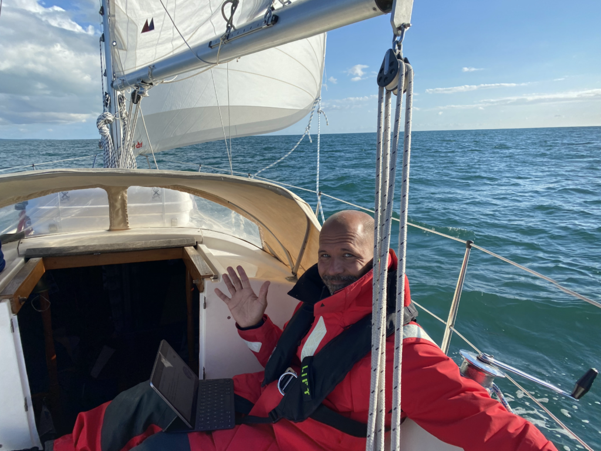

Under vår senaste passage hände en del kul saker, vi;

\[ X \] Passerade noll-meridianen (0°)  
\[ X \] Tog oss en latitud längre söderut, vi är officiellt i 49° istället för tidigare 50° (Jippi!!)  
\[ X \] Seglat 1000 distans  sedan vi kastade loss på Limhamn
\[ X \] Passerade de vita klipporna vid Dover (på håll, ärligt talat så var de långt, långt bort.)

Det sägs att var resa börjar med ett steg, vi har nu tagit 1000 små steg mot någonstans.

Logdatum: 3 sep. 2020  
Rutt: Calais – Cherbourg  
Tid: 2020-08-31 12.16.00 – 2020-09-02 15.28.00 ( 51h 12m )  
Distans: 202 nm  
Snittfart: 4 knots  

Calais var trevligt samtidigt som det inte var det, vädret var lite märkligt så vi fick inte tillfälle att undersöka stället så noga så ska man vara riktigt ärlig gav vi inte området en ärlig chans att visa sina bättre sidor.

Marinan var ok även om besöksbryggan inte var något vidare, det rullade och ryckte i tamparna från dyningar och vågor som tog sig genom den yttre marinan in mot där vi låg. Det tog inte så lång tid att tröttna på att ligga still så när vädret gick från dåligt till okey'ish lämnade vi och tog sikte på Cherbourg istället för att få ytterligare lite distna under kölen.

Större delen av resan stog  vår outtröttliga besättningsman “Styrbjörn” vid rodret, han blir aldrig trött och behöver extremt lite mat, får han bara lite vattenfast fett lite då och då är han nöjd. Då första delen av resan var ganska nära land lyckades vi klämma in ett seminarium på ett par timmar om aktiehandel och trading, det är ganska coolt vad man kan hitta på med Internet.

*Tony ST3*

Då senaste skuttet varade med än 50 timmar fick vi njuta av 2 vackra soluppgångar och två lugna nättre till havs. Det som slår mig var kväll är hur rofyllt det är att segla mot solnedgången, det är verkligen synd att det är så svårt att fånga känslan och hur vackert det är på bild.

<iframe title="Sailing sunset" width="640" height="360" src="https://www.youtube.com/embed/MVSBiWWG00w?feature=oembed" frameborder="0" allow="accelerometer; autoplay; clipboard-write; encrypted-media; gyroscope; picture-in-picture; web-share" allowfullscreen=""></iframe>

Hela resan var lugn och och behaglig, det enda "problemet" var att när vi kom närmre vårt mål kom vi till det oundvikliga och fick tidvattnet mot oss. Med mer än fem knops stöm under under ett gäng timmar utan vind  gjorde att vi bara tog oss framåt i en knops fart. Vår stackars lilla motor...

När tidvattnet väl vände fick vi bra fart mot vårt mål och vi hittade fram till marinan under tidig eftermiddag.

In perfect time to have a short walk to explore the area close to the marina. We met quite a few fellow sailors that are heading south as well just like us, some heading for Spain and the meds and other aiming for the ARC this november, something that they all have in common is that they all get surprised when we tell them how big (actually how small) our boat is. One of the questions we’ve heard a few times so far is: “But how did you manage to cross the North sea? We thought it was scary and our boat is much bigger than yours!”.

I guess we just don’t know better….
