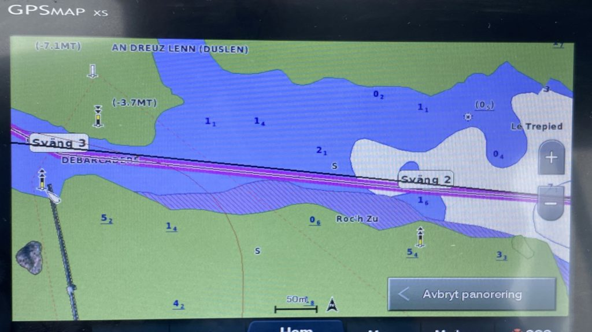
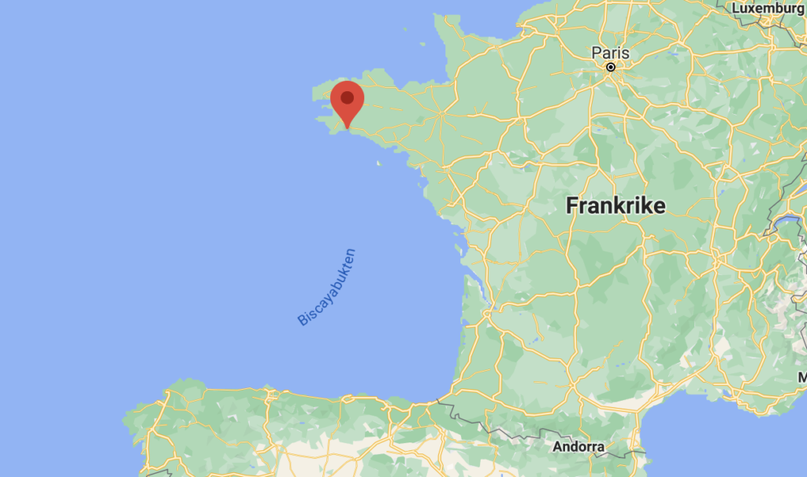
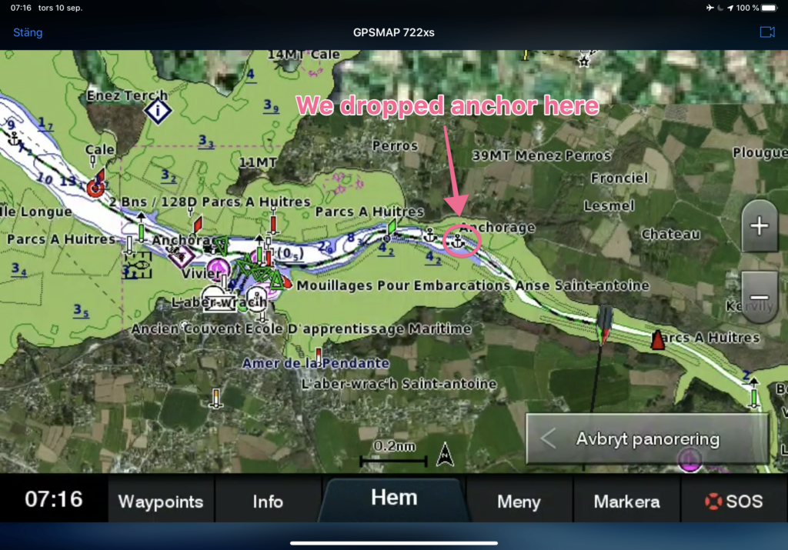
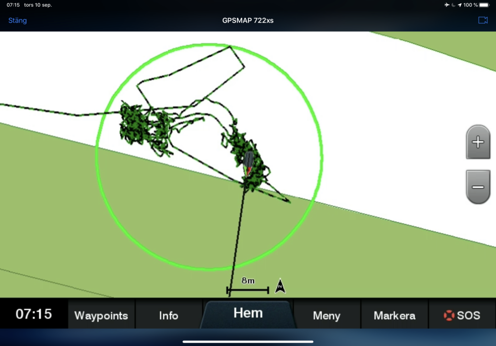
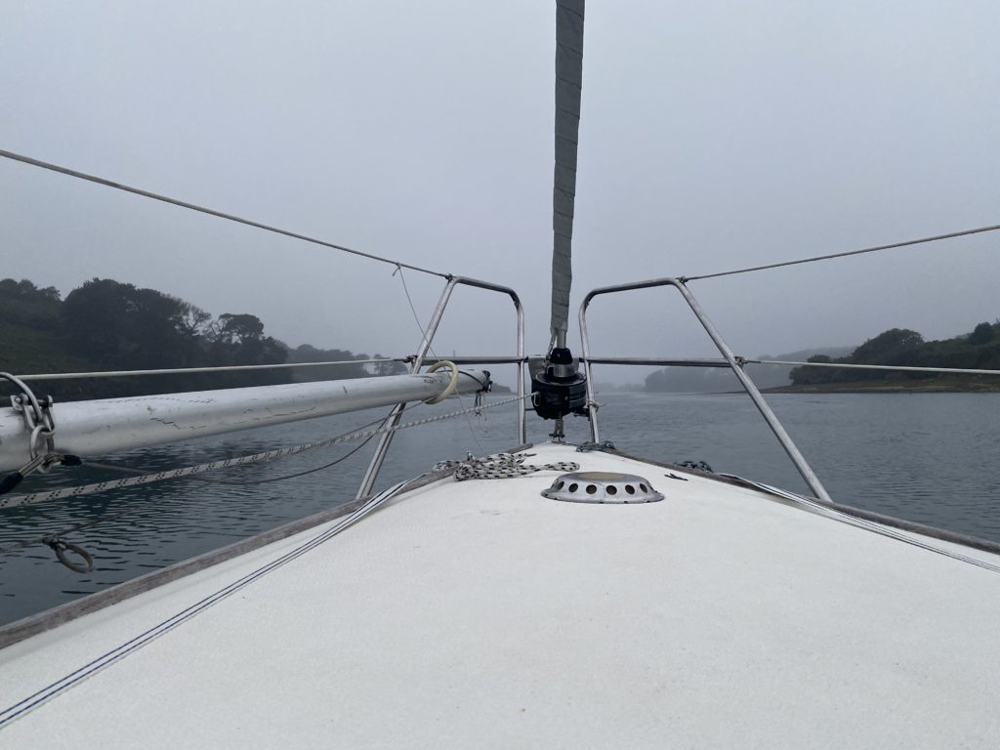
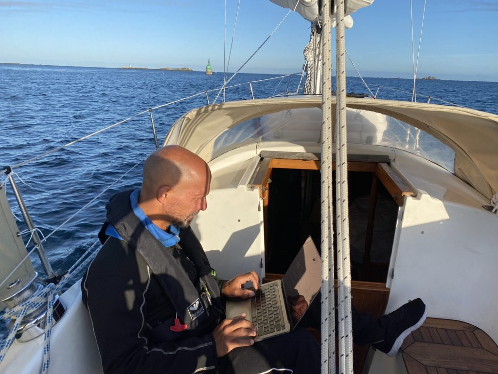
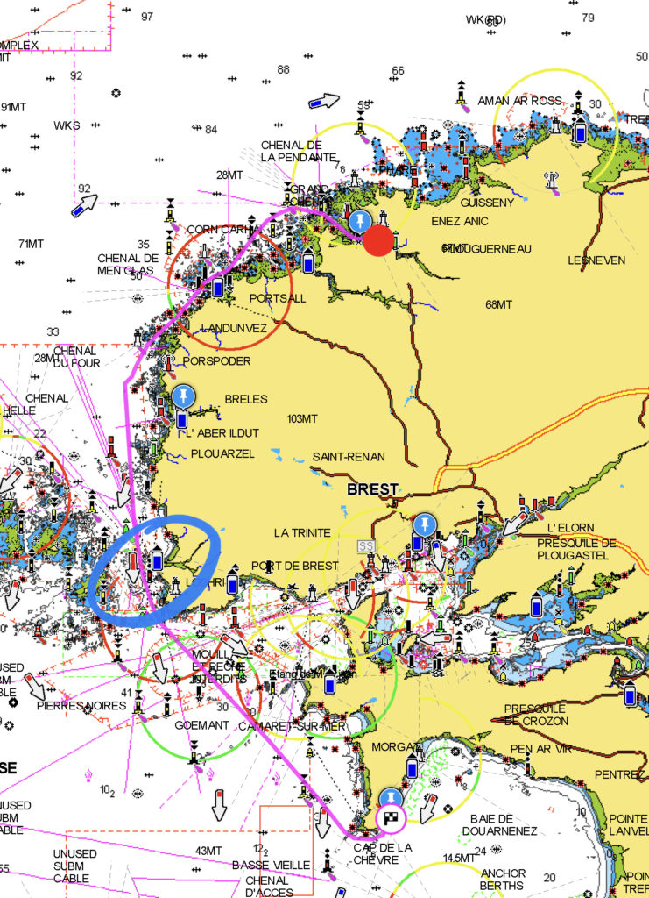
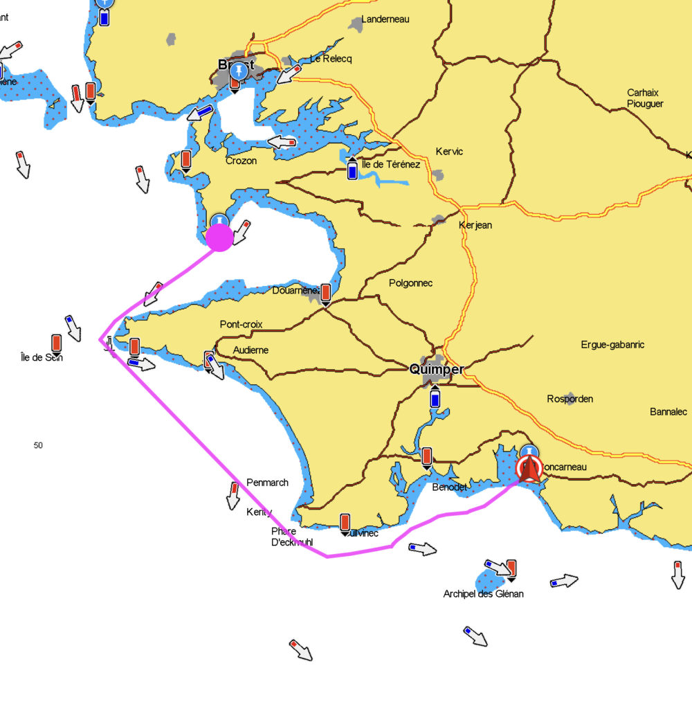
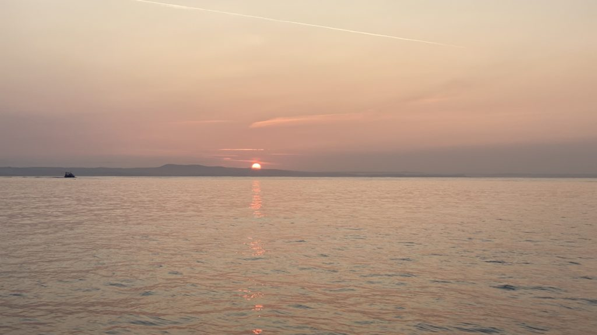
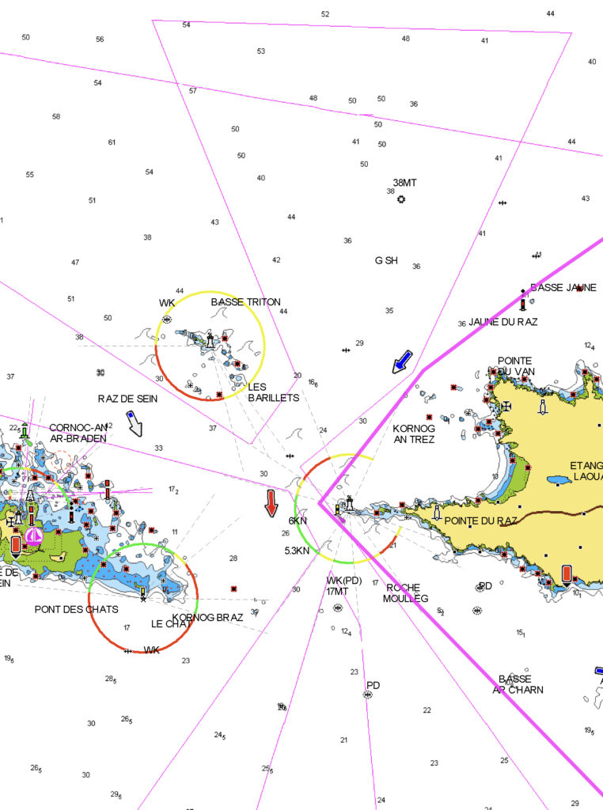

After a few days in Roscoff we decided that it was time to leave the little sweet town behind and continue south. This time the helm was pointing at Concarneau on the south side of Bretagne, but we also planned a few stops on the way.

Log date: 11 sep. 2020  
Route: Roscoff – Concarneua  
Time: 2020-09-09 09.50 – 2020-09-11 20.31 ( 29h 45 min at sea )  
Distance: 133 nm  
Average speed: 4,4 knots  
Wind: 10 knots  
Weather: \[ \] Rain, \[ \] Fog, \[X\] Sunshine, \[ \] Cloudy  
Visibility: Great  
Temperature: 20 °C

However the first part of the journey was planned to go through a narrow and not so deep channel just outside of Roscoff. By using the channel we saved about 2 hours but it was scary since out draft is 1.8 meters and the chart said everything except that.

Thanks to the tide it was slightly higher than stated so everything went just fine, we had almost no current passing through and this time that was something good. 8 knots of current wouldn’t have been a good thing this time, it was scary close to both dry land and stones as it was.

We aimed for Concarneau, even if we didn’t know that at the time of departure. The only thing we knew was that we really badly would like to get to the other side of that peninsula Bretagne we’ve been aiming at for so long.

At first we planned to cross the bay of Biscay at this time but with the current weather we would have to more or less motor across the entire bay and that wasn’t really what we had in mind so we slowed down a bit (quite a lot actually) and decided it was time to put our anchor at test, the first night was spent just next to Port de l’Aberwrac’h in a narrow channel. The anchoring area was super protected but narrow, the channel was less than 150m wide and with tide that’s not a lot.

Our beloved 15kg Rocna set perfectly in the channel and even with almost full reverse on the engine we didn’t move a bit. Now the only thing left was to cross fingers for when the tide would turn the boat 180° in the middle of the night. It sure did. The green parts of the chart is land when chart datum (super lowest low) occur but since that only happens every 18,6 years we felt pretty safe.

After a good nights sleep, well maybe not so good the first time on the hook is always a bit scary. But nevertheless the evil alarm went off before sunrise so that we could head out with the sunrise and tide. It’s easy to tell that the autumn is getting closer, it was both cold and a bit foggy in the morning when we slowly headed out to the ocean again.

The second day was similar to the first one, no wind or very little wind from the wrong direction. Yes, yes I know a real sailor doesn’t ask for downwind he learns how to sail. But I promise, it doesn’t really matter what direction the wind comes from when the gusts are between 4 and 5 knots. The iron genua got hoisted also today.

The good thing was that the day could be spent on other things than clinging to a heeling boat. With proper connection some trades could be done to keep the growth rate of the portfolio that sustain the trip.

According to the pilot books and the mighty Internet the narrow passage marked in blue on the chart could be a bit messy depending on the tide and weather but with almost no wind and good timing we swooped through it with the tide doing well above 7 knots (8.3). I’m very very happy that we did the planning the day before so that we could pass at the right time since our engine wouldn’t have been able to go against the current.

At the end of the day we ended up just next to a huge cliff at Anse De Saint-Nicolas and once again we dropped anchor, this time the swell was very noticeable, so to be on the safe side we used 40 meters of chain also today the anchor bit like glue in the sandy bottom.

The night was a bit bumpy or more accurate rocking due to the Atlantic swell that found its way around the corner of the peninsula where we were hiding for the night. But just as the day before, the anchor did what it was supposed to we didn’t move a cm. Well we moved quite a lot of cm’s but never farther away than the chain allowed.

After a good night sleep it was time to keep moving south.

When we broke the mooring we did it with the rising sun, it’s always nice and relaxed to head out when the water is calm especially today since we were about to cross Raz de Sein on our way to Concarneau.

For you who are a bit observant and know your chars it’s easy to notice the small angry waves that surrounds both the lighthouses. Something that is really interesting with this area is that there are a few different currents hitting the area at the same time if you are unlucky and if you are really unlucky then you reach the area when they are going in different directions. Today wasn’t a day like that, we arrived a day before neap and with almost no wind at all and that is pretty much as good as it gets. For sure we had quite some current with us but nothing that we couldn’t handle with one hand on the helm and a coffee in the other (figuratively speaking), we had coffee right after. 🙂

A few hours later we finally got some wind and could hoist our sails, it’s always super nice to kill the engine and just listen to the boat and the waves. At one point we were beating the wind and enjoying 6 knots of speed when something big caught up with us. The green guy did 21,9 knots. Slightly demotivating but still super cool to see.

<iframe title="trimaran" width="640" height="360" src="https://www.youtube.com/embed/vdVPxxQuhBw?feature=oembed" frameborder="0" allow="accelerometer; autoplay; clipboard-write; encrypted-media; gyroscope; picture-in-picture; web-share" allowfullscreen=""></iframe>

When we finally reached Concarneau we found one (1) free spot in the entire marina to moor our boat, sometimes it’s good with smaller vessels. And since it means bad luck to break a tradition we felt strong-armed to find a nice place to eat. This time a small restaurant quite close to the marina. Fish, red wine and some cheese. We totally deserved that.. 🙂
