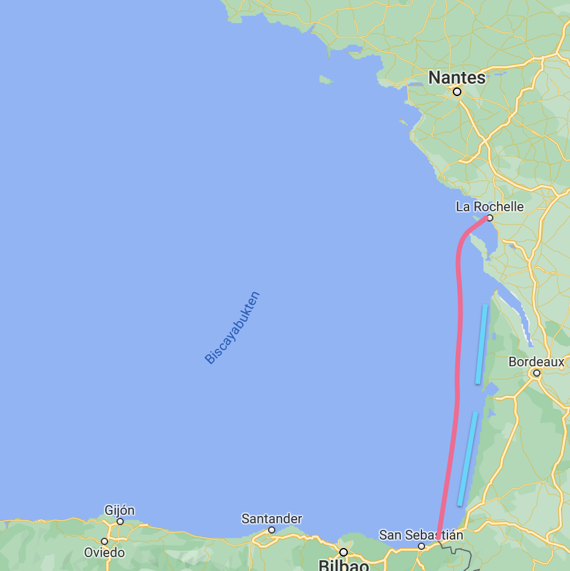
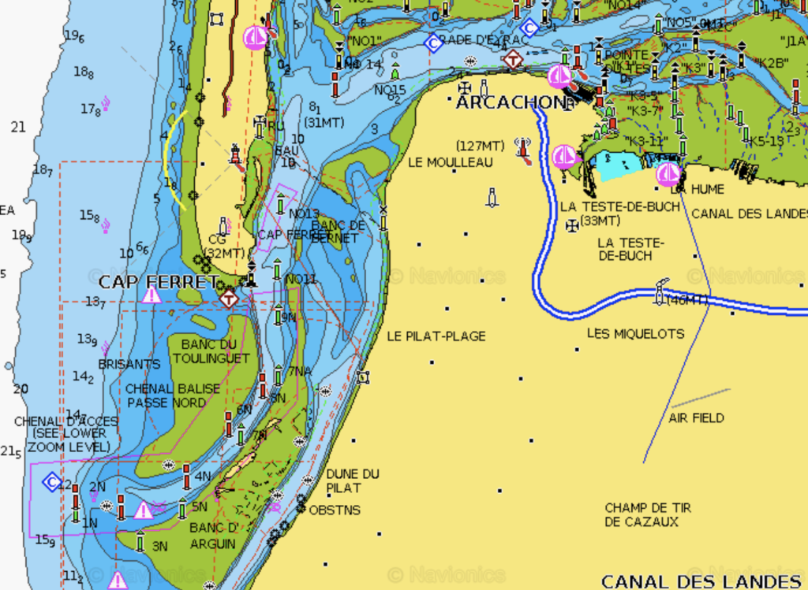
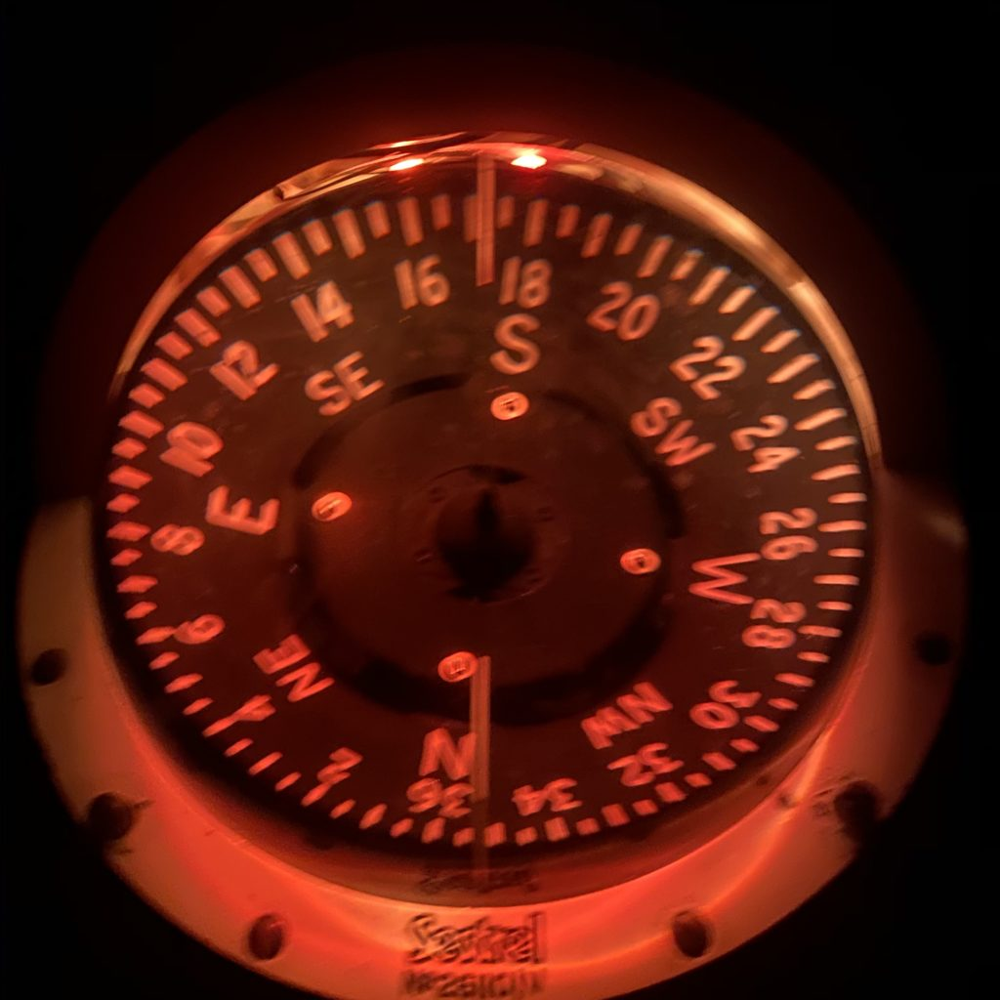
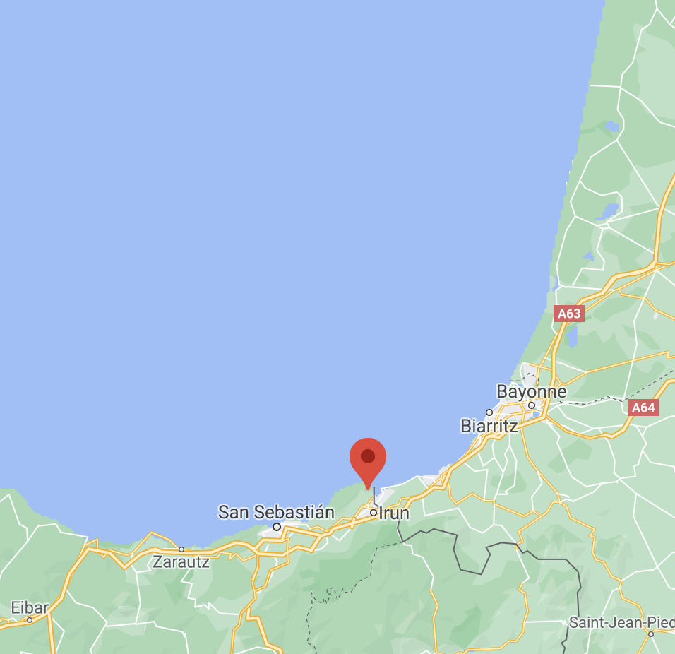
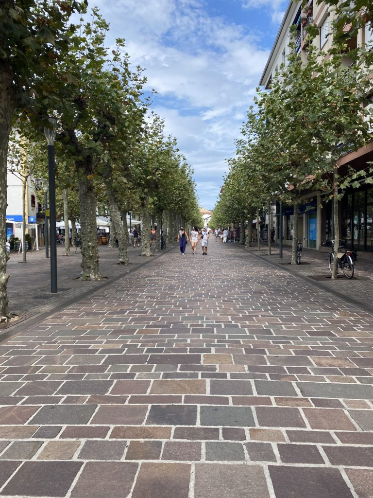
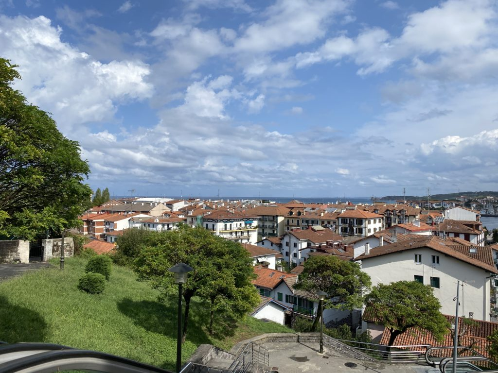
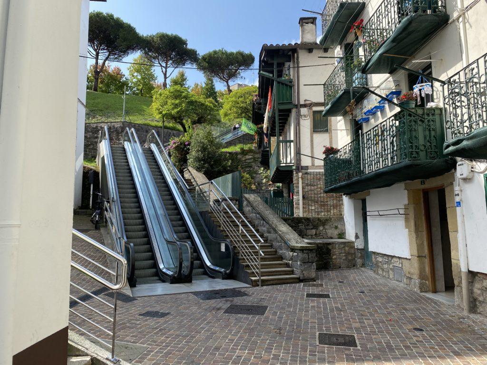
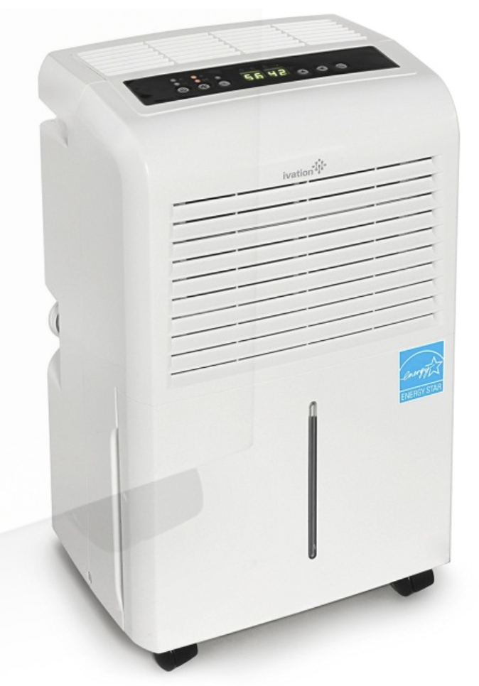

Frogs and oysters might be great but a sangria with some tapas is hard to beat so we decided it was time to head to Spain. The only twist was that Spain is kind of far away from La Rochelle and in between there are two active shooting ranges and only one marina that is insanely expensive so we had to plan for two nights at sea.

Log date: 2020-09-23  
Route: La Rochelle – Hondarribia  
Time: 2020-09-21 10.20.00 – 2020-09-23 07.45.00  
Distance: 180 nm  
Average speed: 3,9 knots  
Wind: 0 – 10 knots  
Weather: \[ \] Rain, \[ \] Fog, \[X\] Sunshine, \[X\] Cloudy  
Visibility: Average  
Temperature: 15-25 °C

The entire coastline from La Rochelle down to Spain is more or less empty and just a big long boring beach without any harbours to hide in in case of bad weather beside the super expensive marina Arcachon that is also really difficult to get into in bad weather so when the weather forecast stated easy winds from NW in our direction that allowed our beloved wind vane managing the steering for us we were more than happy. Relaxed and really nice sailing with a few dolphins and a small shark (not at the same time).

Unfortunately it didn’t last, early morning the second day the wind died on us. The weather in the bay is strange, it’s probably related to this time of the year but it’s either super calm with no wind at all (motor) or a ton of wind that makes it more or less impossible for us to sail in (moored). Stupid bay….

When we do night sailing we have been trying different alternatives, this time we aimed at 3 hours sleep. We tried 4 hours once and it was really hard to stay awake, Tony usually grab a few minutes of sleep here and there during his watch when nothing is around so I guess it’s not as hard for him.Last trip we tried 2 hours and that was horrible so this jump we aimed for 3. It was kind of ok this time just a bit lonely when the moon disappeared and the sky was covered by black clouds and the only thing you could see was the compass.

After motoring for 25 hours without any wind at all (super boring) we finally reached Hondarribia right on the border between France and Spain. Our plan was to hunker down in Hondarribia during the storm that was about to hit the area within the next few days.

Hondarribia is nice little town with a terrific marina, friendly and helpful staff and most of all, great showers!! I would never have guessed that I would begin to rate marinas and places by the showers they provide. <3

The town was filled with small coffee shops, bars and restaurants and all of them was no more than 10minutes away from our home for the weekend, perfect for the Trull crew.

And for the lazy ones who would like to get a view of the town they even got an escalator.

During our last day we upgraded our boat with a dehumidifier, probably one of the best things so far. Now both our clothes and bed linen are dry and the boat is a lot warmer. Imagine what 2-3 liters/day of removed humidity can do for the comfort. The only thing left now is the heater.

Den går hit, den går dit, den går runt en _liten_ bit. Den startar på ett kick, _det är en makalös manick_…

We also stumbled upon some wet concrete at one point and who could resist? Now there’s a new landmark and tourist attraction in Hondarribia!

<iframe title="We were here" width="640" height="360" src="https://www.youtube.com/embed/orAbTirOtd4?feature=oembed" frameborder="0" allow="accelerometer; autoplay; clipboard-write; encrypted-media; gyroscope; picture-in-picture; web-share" allowfullscreen=""></iframe>
