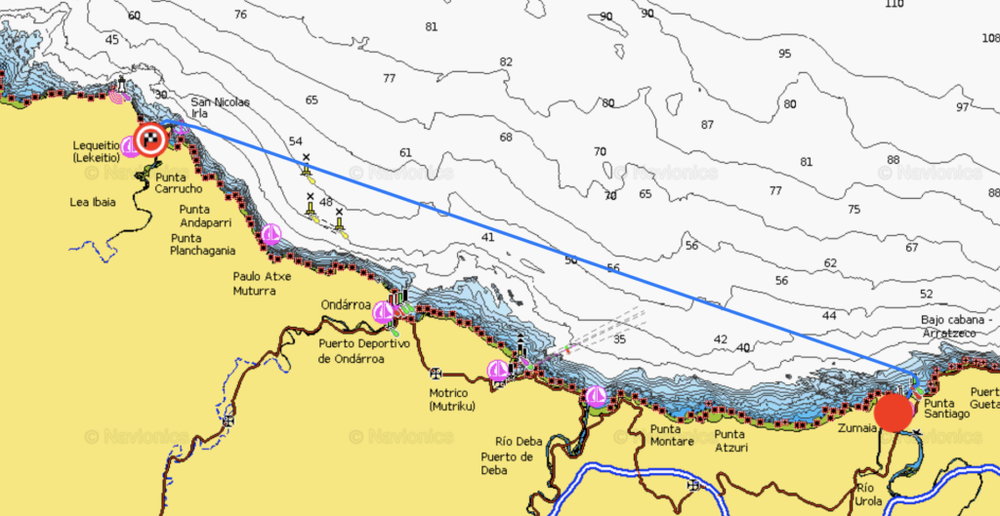
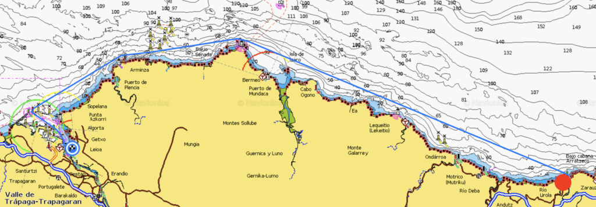
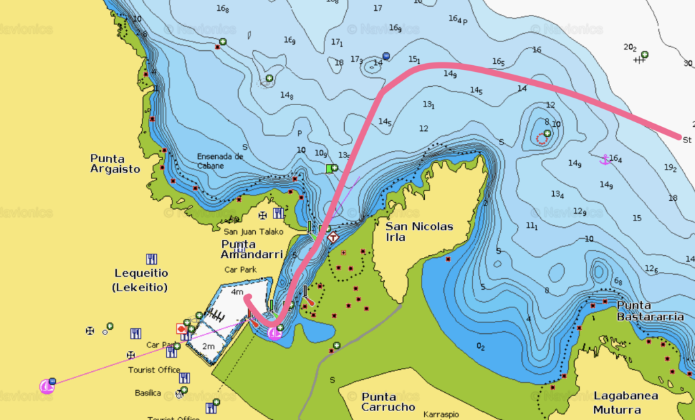
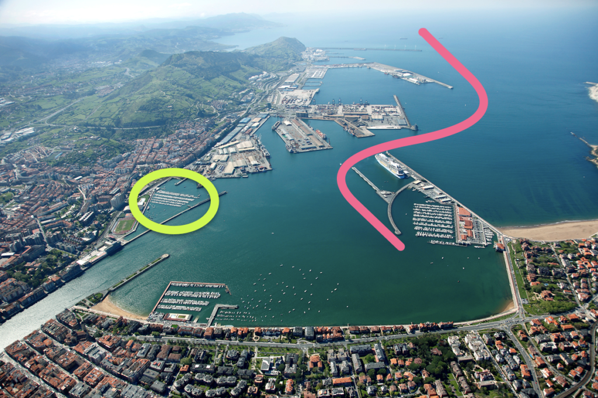
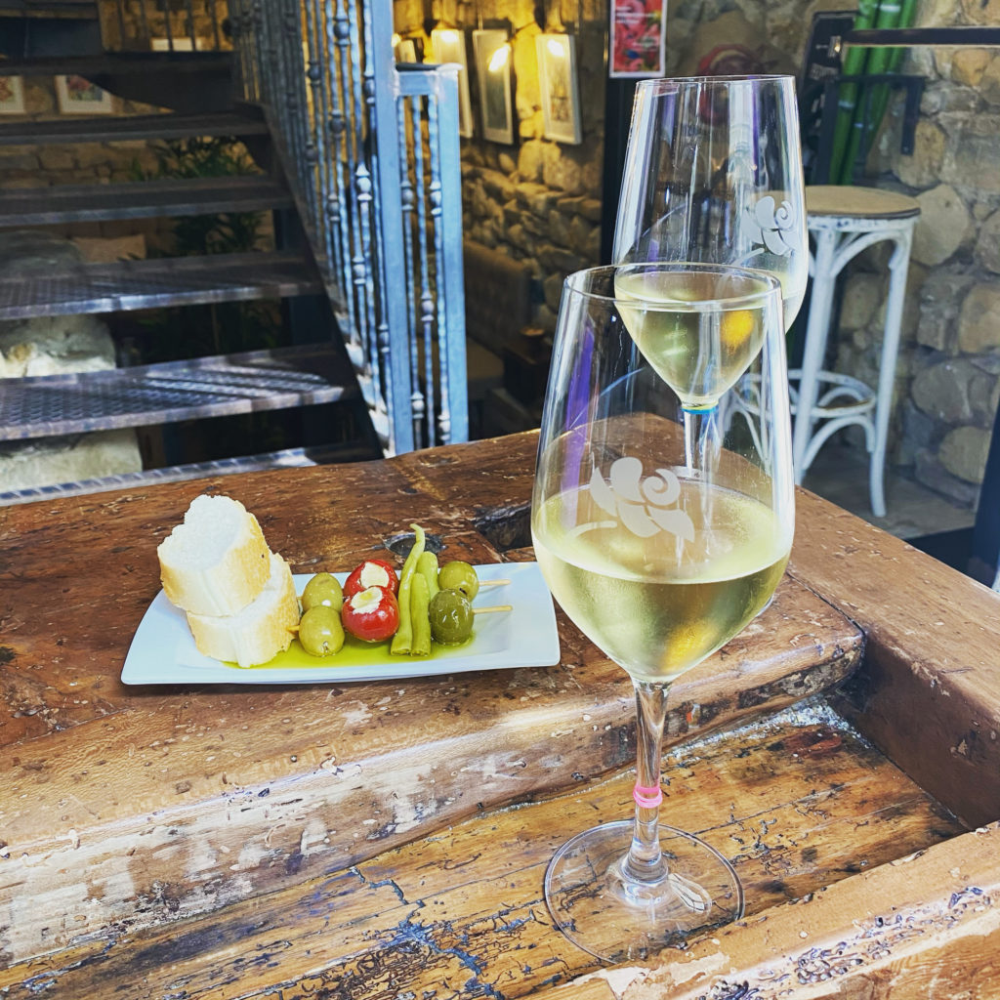
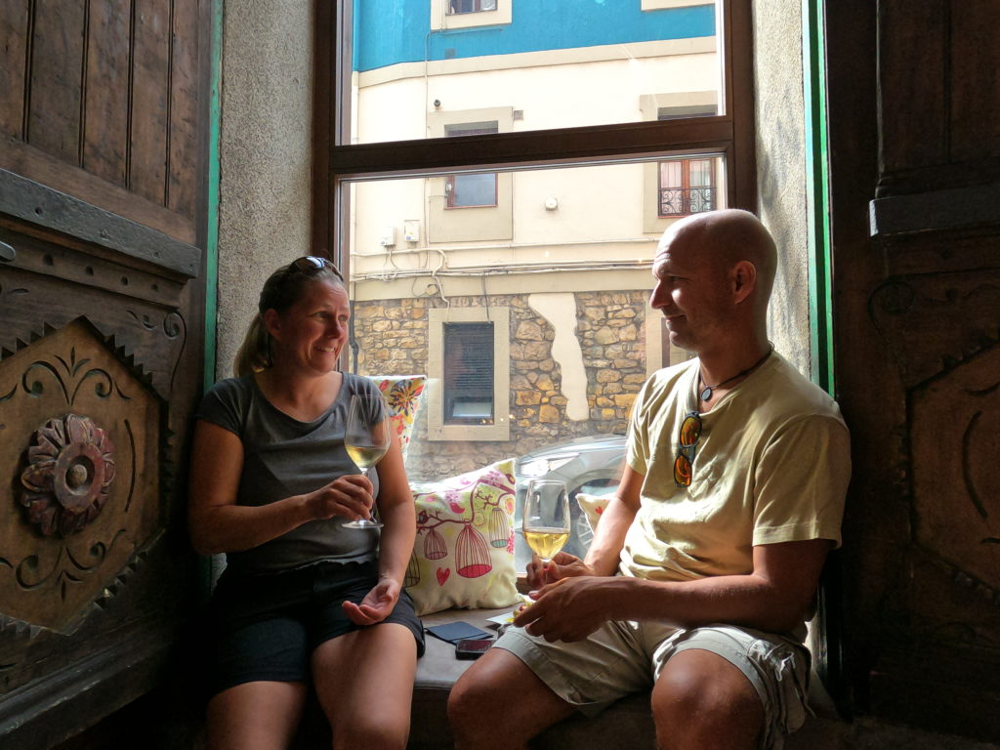

Our grand master plan was to head out for a 45 nm trip from Zumaia to Bilbao but since the autumn is here the days are quite short and we weren’t sure to make it during daylight. The rainy morning didn’t really help either so we decided to wait until the afternoon and instead head for Lequeitio that was just a few hours away.

Zumaia – Lequeitio

Log date: 08 okt. 2020  
Route: Zumaia – Bilbao  
Time: 2020-10-07 15.45 – 2020-10-08 03.59 ( 12h 14m )  
Distance: 47,5 nm  
Average speed: 3,9 knots  
Wind: 10 knots  
Weather: \[ \] Rain, \[ \] Fog, \[ \] Sunshine, \[X\] Cloudy  
Temperature: 17 °C

When we left Zumaia the weather was nice but there was quite a lot of swell (between 2.5 and 3m) from the north-north-west that added quite some thrill to the event when we left the narrow passage from the marina with swell transitioning into breaking waves so now we’ve added one more thing to our “keep track of”-list; – _Make darn sure that it’s safe to leave the marina before trying_!

We had to motor since we had almost no wind at all and the one that we had was head on and that combined with the swell made the ride pretty much to a crazy roller coaster, but that was expected and the plan was to only go 13nm to make sure that the new impeller ridge worked as supposed.

However when we got closer to Lequeitio we quickly realized that when 3m swell gets squeezed into a narrow 5 meter deep bay it turns the entire bay into a big washing machine. The entire bay was filled with waves breaking from all directions and the inlet to the harbor was narrow and surrounded with wave breakers. At that point we understood that it would be a long night unless we put our boat at stake by trying to enter the marina. We choose the long night and added one more thing to the list of things to keep track of; – _Make sure that you are able to enter the marina in the expected weather of your arrival_.

So we ended up paying the roller coaster guy a few more bucks and kept motoring, sweet lord we hated the ride. To make the swell slightly less intrusive we stayed outside the 50 meters depth curve but it was still horrible with the boat rocking in all directions at the same time. When we finally reached the crazy big harbour of Bilbao, it’s 3 nm (5km) from the outer wave breakers to the inner harbour, it was just a few hours before sunrise.

If you ever end up in Bilbao by boat then the marina marked with green in the picture above offer two nights for free if you call ahead and reserve a berth, however the marina on the right is way better with superb facilities.

We stayed a week in Bilbao, mainly due to the weather but also because it was a darn nice place. Friendly marina with super helpful staff, absolutely stunning food, great town Getxo ”the small one with the marina” and also the actual city Bilbao that was located a short train ride away. We actually discussed staying for the winter since we liked the place as much as we did.

During one of our walkabouts we found a small pintxos (tapas) bar called Jai Alai ([map](http://jai%20alai%20ibaiondo%20kalea,%202,%2048930%20getxo,%20bizkaia,%20spanien%20+34%20944%2098%2070%2090%20https//goo.gl/maps/V3KCW37TokGYHMyh7)) not far from the marina, apparently Jai Alai was rated nr 4 in the area when it comes to pintxos and their prices were crazy low, 1€ for any of their pintxos and 1,2€ for a glass of wine. I guess it’s needless to say that we went there more than once…

We spent most of our time walking around in Getxo that is filled with small lovely ”drop in for a glass of wine and a bite”-places. Since we are super cultural we had to pay the Guggenheim museum, the food market and the old town in Bilbao a visit. We had to spend two days to cover it all, mainly because we had so much to eat and drink. The museum only took 15 minutes since they were about to close when we arrived on our last day so we just had a walk around the place. #notsoculturalafterall

If you ever end up in the area do not forget to take a stroll in Algorta that is just next to Getxo. A lot of small cute streets and a stunning ocean view from the head of the cliff and whatever you do do not forget to try the pinxos and wine at Etxetxu Berria. Totally worth it. 🙂

<i>Etxetxu Berria</i>

Head over to our [Google maps list](https://goo.gl/maps/WJsLH7ViN3RK9dAB6) to see some of the places we visited in the area.