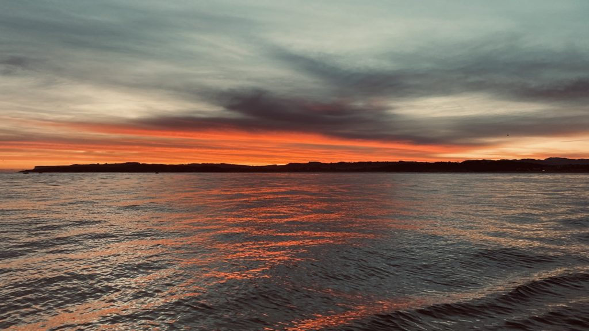
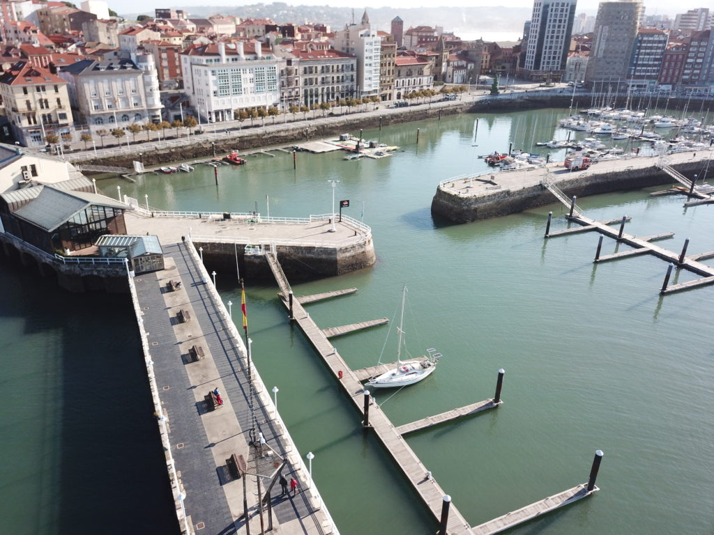

We fired up the engine about half an hour before daybreak both to give it some time to heat up before we head out in the current from the river but also to wake up our french neighbours that was rafting us from the evening before. The guys just crossed the Bay of Biscay so we figured that it would take some time to get them up and running. 🙂

Even if the current from the river exit just behind us was strong it was easy to leave the pontoon however it for sure did the exit from the harbour out into the ocean quite interesting. When the current met the swell at the end of the piers the otherwise flat water became brutal and more or less converted the boat into a part time submarine that went more under water on top of it from one meter to the next. But about 100 meters later it stopped as quick as it began. Tides and current are definitely the oceans equivalent of Dr Jekyll and Mr Hyde.

Log date: 18 okt. 2020  
Route: San Vicente de la Barquera – Gijon  
Time: 2020-10-18 08.00 – 2020-10-18 19.58 ( 11h 58m )  
Distance: 59,8 nm  
Average speed: 5 knots  
Wind: 10-20 knots  
Weather: \[ \] Rain, \[ \] Fog, \[X\] Sunshine, \[X\] Cloudy

When we got out of the harbor we got greeted by a a magic sunrise but we can’t stop thinking of the old red sky saying.

> “Red sky tonight sailors delight, red sky in the morning sailors take warning…”

If you are interested in the facts behind the saying stay tuned for the “Red sky”-post to get all the facts.

Even if the day was a “sailors take warning”-day we had a good time with sun and about 10-20 knots of down wind the entire day. We used the spinnaker boom and a preventer to run with sprouted sails, that gave us quite some speed so instead of heading for the small town Ribadesella 30 nm away we took aim at Gijon 60 nm.

With the slightly adjusted distance we were supposed to reach Gijon at 2200 but with increasing winds at the end of the day and full sails we managed to reach 9 knots (8,7 to be honest) in the gusts and that shaved a good 2 hours of our predicted arrival. It felt really good to get the mooring lines in place when we reached the marina at the same time as the sun gave the evening sky the last red glow before nightfall.

When this is written we’ve already spent more than 2 weeks in Gijon and we can’t say anything but good about both the city and the marina. The marina is located in the middle of the old town between two beautiful beaches (not very crowded during late autumn and winter). The old town is filled with pubs, restaurants, coffee shops and churrerias. This place got it all except for a well sorted ship chandler. :-/

**Caution – Food porn ahead!**  
Talking about “churrerias”, the small shacks all over town that sell the Spanish delicacy churros are totally worth a visit. Churros when they are freshly made and served with hot chocolate sauce is a gift from heaven that is really hard to resist.

<iframe title="Churros" width="640" height="360" src="https://www.youtube.com/embed/A07afo1m5rs?feature=oembed" frameborder="0" allow="accelerometer; autoplay; clipboard-write; encrypted-media; gyroscope; picture-in-picture; web-share" allowfullscreen=""></iframe>

As you already might have noticed we are kind of into food and snacks so imagine what happened when we noticed that the first building on the pier below is a guide michelin restaurant. Oh, happy days. 🙂

“Winter” at Gijon visitor pontoon just next to the Michelin restaurant

The restaurant [Auga](https://restauranteauga.com/en/) combines traditional and regional cooking with modern, updated dishes. We tried their 11 dishes tasting menu that had a lot of nice surprises, our waiter was far from fluent in english but still did a great job trying to explain each dish through the evening.

There are of course a ton of restaurants in Gijon but unfortunately the stupid Covid-19 is making it difficult for us to try them at the moment since Gijon and the state is under a soft lockdown that doesn’t allow non essential stores to be open.

Beside all the great food in the area they also got quite a lot of swell depending on the weather far out in the Atlantic. We noticed this first hand during a few days. The video below is a capture from within the marina just next to the pontoon where we moore the boat. Imagine arriving at night to get a berth without knowing and understanding the conditions within the marina –> Pinball……

<iframe title="Current in Gijon" width="640" height="360" src="https://www.youtube.com/embed/KjaW4Wzyj58?feature=oembed" frameborder="0" allow="accelerometer; autoplay; clipboard-write; encrypted-media; gyroscope; picture-in-picture; web-share" allowfullscreen=""></iframe>
