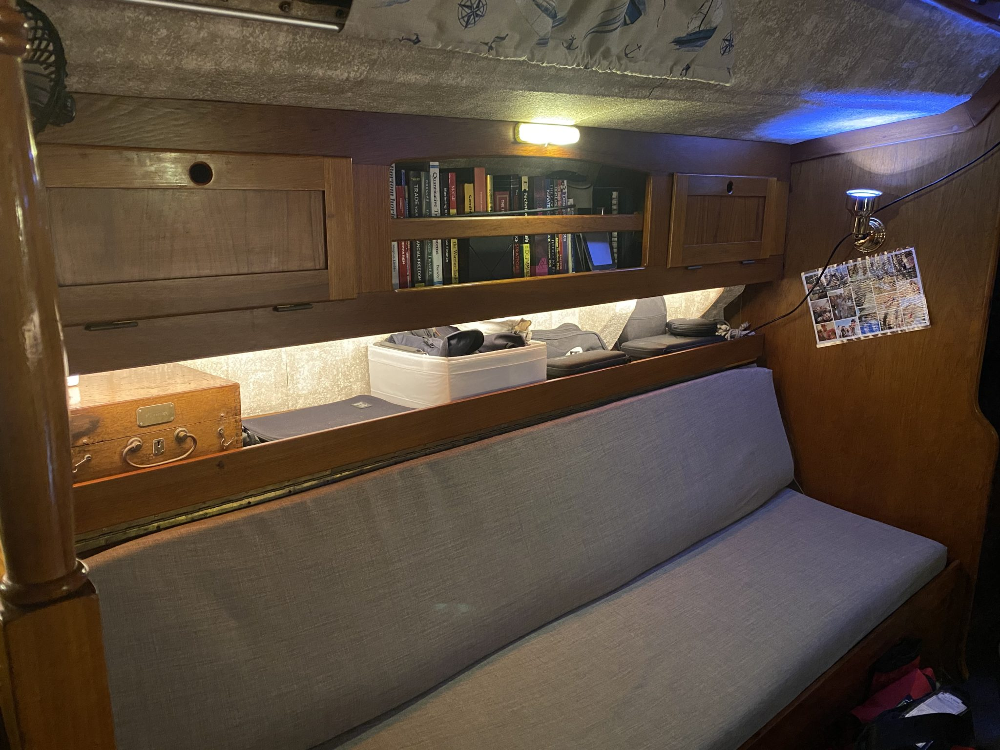
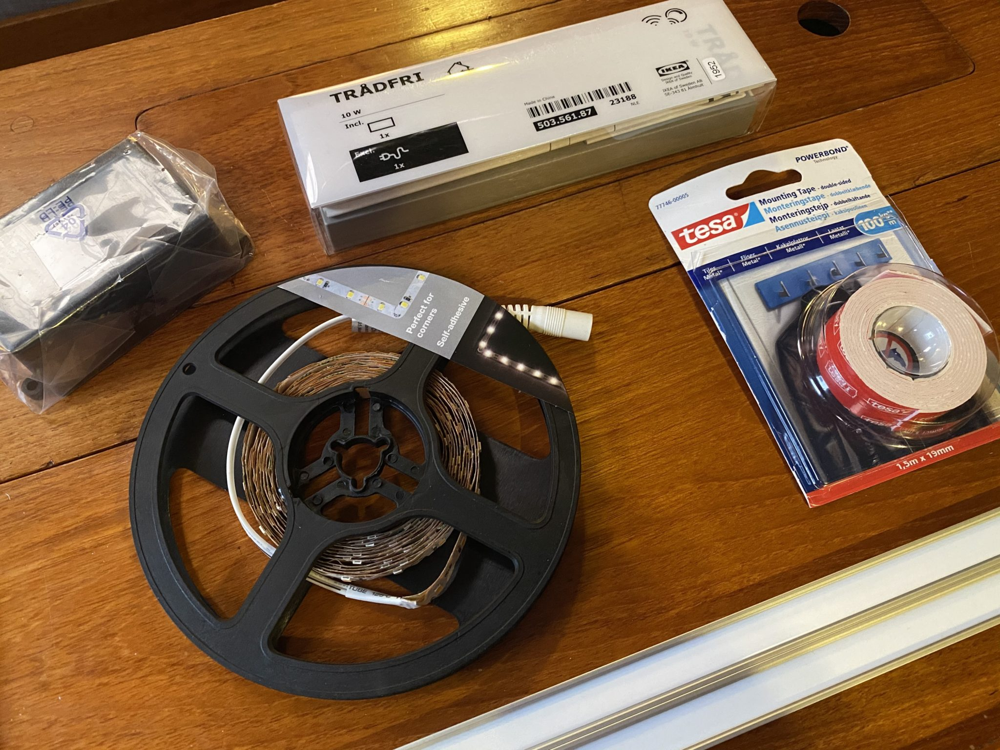
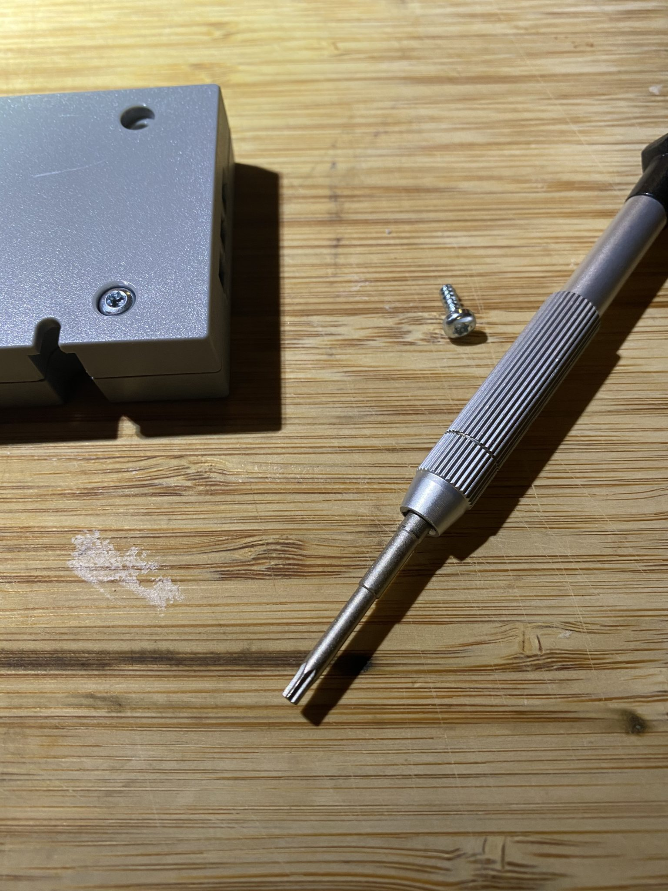
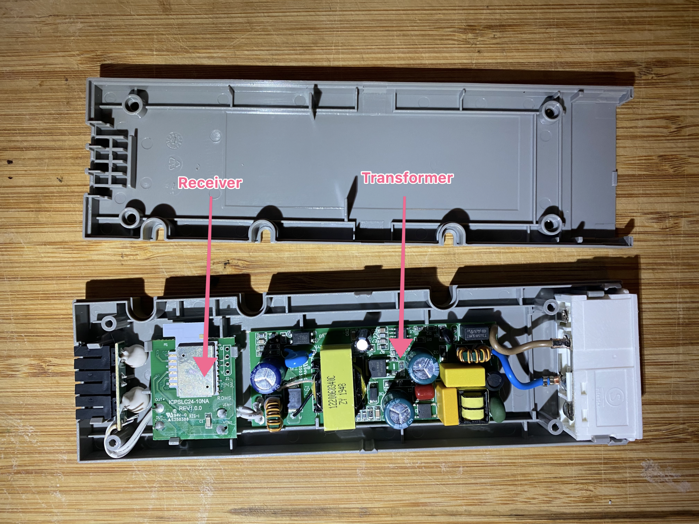
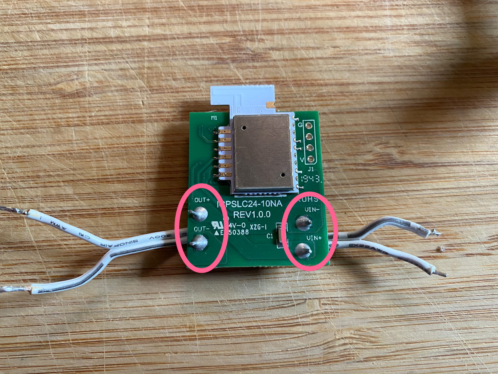
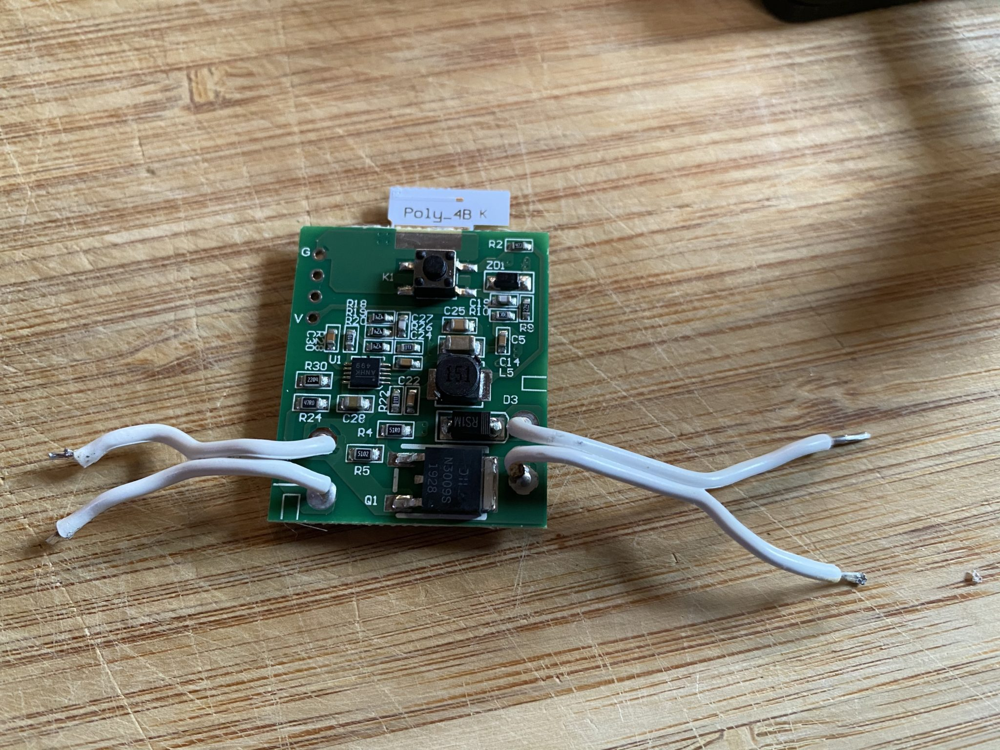
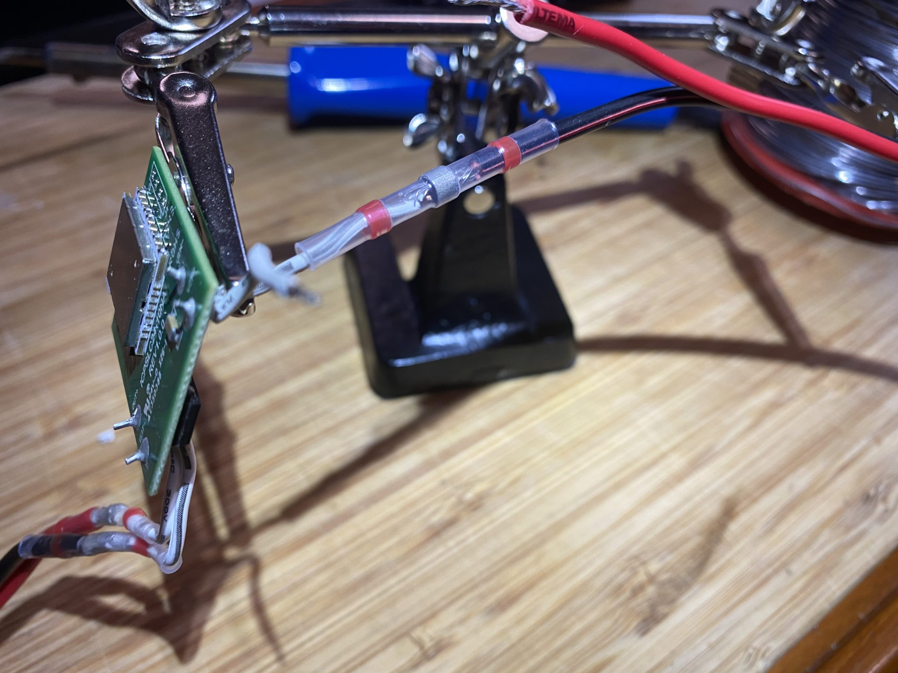
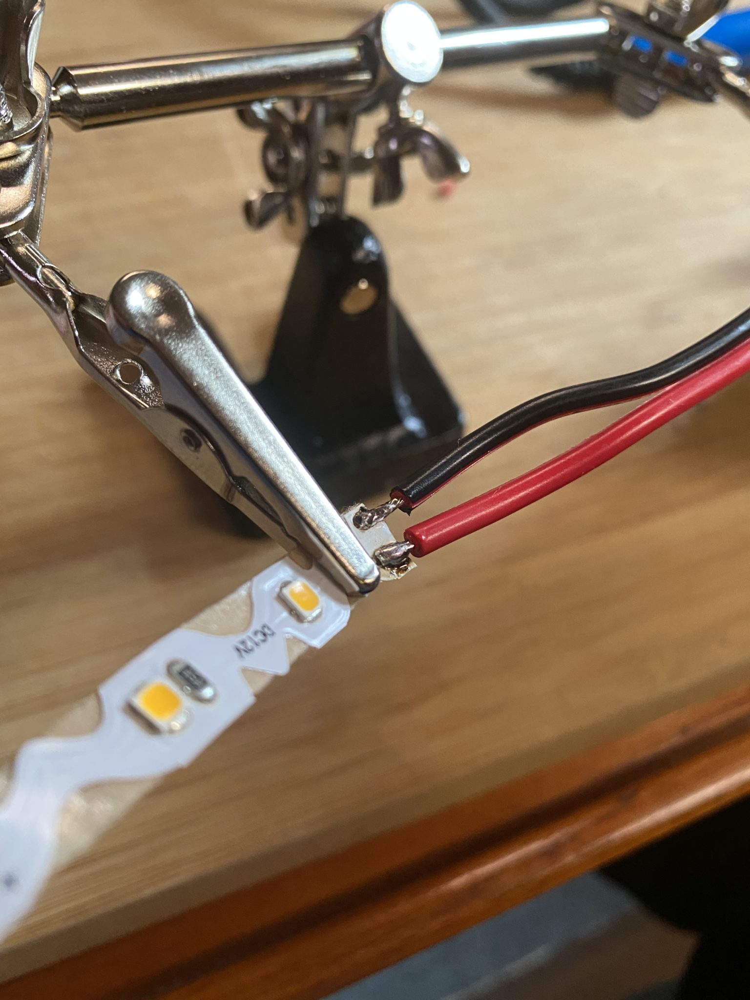
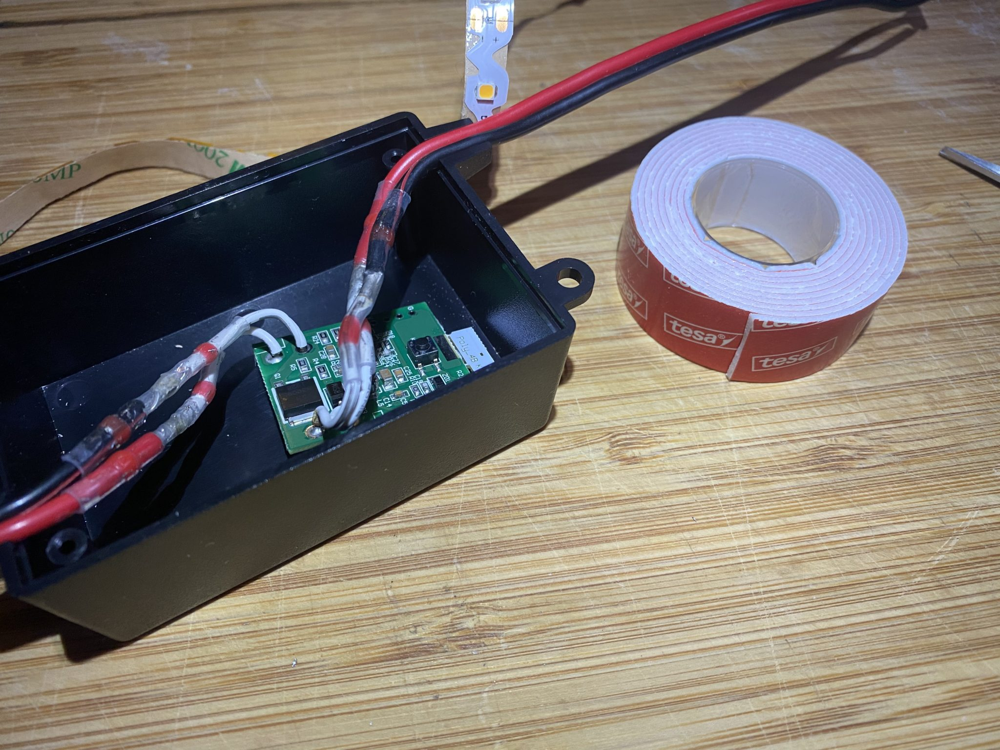
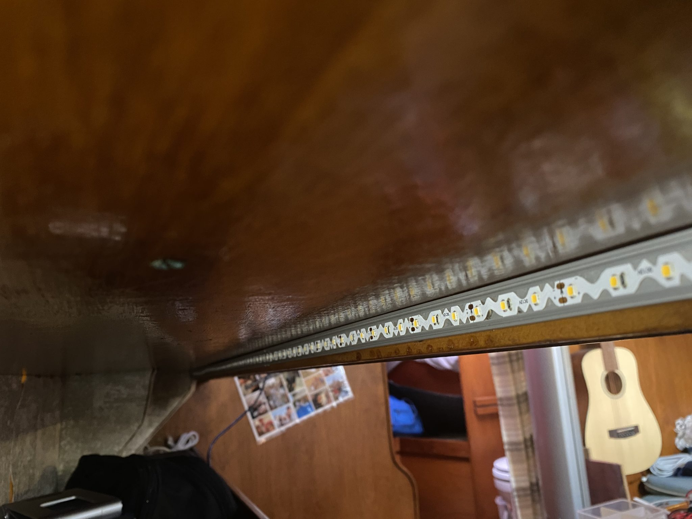

If you are like me and enjoy building stuff this is a fun project that will keep you occupied for half a day or so and it’s totally worth it.

Let’s dive right in, don’t get me wrong I love our boat but it was finally time to do something about the dark shelves in the saloon and with a few toys from Ikea, the local hardware store and a soldering iron the success was inevitable.

Let’s start with a before and after picture so that you know what we are dealing with.

 |  
*Before – dark and boring* | *After – bright and nice*

The light can of course be adjusted to suit the moment.

<iframe width="560" height="315" src="https://www.youtube.com/embed/bycrGAHKMKI?si=Jkpf8od3NKMcQlJ_" title="YouTube video player" frameborder="0" allow="accelerometer; autoplay; clipboard-write; encrypted-media; gyroscope; picture-in-picture; web-share" allowfullscreen></iframe>

To install something similar yourself you will need the following:

- 2 Ikea Trådfri Driver 10W 2 x 13€ *1
- 1 Ikea Trådfri dimmer button 7€
- Dimmable LED-list 5m I use the one from Nextec 50€’ish
optionals
- Aluminium profile to fit the LED-list in. (Looks nicer and will also make the light softer) 10€/m’ish
- 2 Control card boxes. Besides making the installation look more professional the boxes also protect the digital stuff. 2€

When you’ve got all the stuff the first thing you need to do is to open the Trådfri driver case, to do that you’ll need a T10 torx or your favorite case opening tool (do not use a sledgehammer that will probably damage the techie stuff inside).

When all four screws have been removed you just have to crack the case open like an oyster, there are a few clamps keeping it together but don’t mind them just rip it apart like our green friend would have.

When you finally get into the box you’ll find two circuit boards, the bigger one is the transformer and the small one is the receiver and dimmer that we need.

A slightly cool thing that you get with Trådfri is that the receiver usually run on 24V but works perfectly fine with 12V so you won’t damage the device if you run your generator and feed the system with 14V. If you have no clue what I’m talking about at the moment, don’t worry, the only thing that you need to know is that if you use a 12V system in your boat, buss, caravan or tent you are good to go.

You probably noted the *1 asterisk in the beginning of the post and have been wondering about it since then. Let me elaborate, when you get your LED list it will tell you the number of W that it use per meter and if you’ve got a big boat you might end up with quite a few meters that eventually will end up connected to the receiver. Since you got sharp eyes you’ve already noticed that I wrote 10W on the Trådfri driver and not 30W (they do sell those as well for about 25€). The cool thing with the two different devices is that they use the same receiver in both of them so since we only need the received we are fine off with the cheaper one and happy to shave 13€ off the price. So with that said, when you buy your driver, buy the cheap one.

It is now time to bring out your soldering iron and remove the receiver, make sure to keep the short cables on the receiver board otherwise you’ll have to attach new ones to the receiver and unless you are a master solderer, which you are not since you read this text, you will most likely overheat the board and have to get a new one. So what your end result should look like is this.

 | 

Before you move on make sure that you’ve noticed the VIN/OUT and the polarity so that you don’t end up connecting it wrong to the system and accidentally fry the circuit.

Everything else in the little grey box called Trådfri from Ikea can now be recycled unless you feel that you need something to convert your 220V or 110V to 24V then you should keep the stuff.. But then again, if you are one of those guys you wouldn’t read this so just recycle it.

Now it’s time to get creative, extend the VIN+ and VIN- cables to fit your installation. These are the ones that you will feed with 12V from your system.

I prefer using heat shrink solder sleeves when I extend cables, they are super easy to work with and only need a heat gun, but you can of course go for the regular soldering and some heat shrink tubing to get the job done. Whatever gets the job done.

When both sides have been extended you are ready to connect the LED. If you, just like me, use a LED list that you can cut to the correct length you are now up for a treat. Get your soldering iron hot and connect the wires to the thin LED list and for the love of God (1) make sure that you get the polarity right and for the love of God (2) be gentle so that you don’t burn the LED list.

When everything is connected, stuff the controller in a nice box. I used some double-sided tape to make sure that the receiver doesn’t vibrate or jumps around in the box when the boat is moving. (less risk for messing with the soldering)

Now there’s only two steps left. Put the LED list in place and connect the box to power.

Aluminium profile and LED list without cover
Now you only have to do the same exercise on the other side of the boat and when everything is connected and tested, tidy the boat, grab the phone and invite your friends, mother or neighbour over, brew some coffee while waiting and read all the comments about how cool and awesome your boat became after the upgrade.
	
If you enjoyed the read feel free to share the link and if you know someone that would need some light why not tag them at the same time.

Let there be light: and there was light... 😀