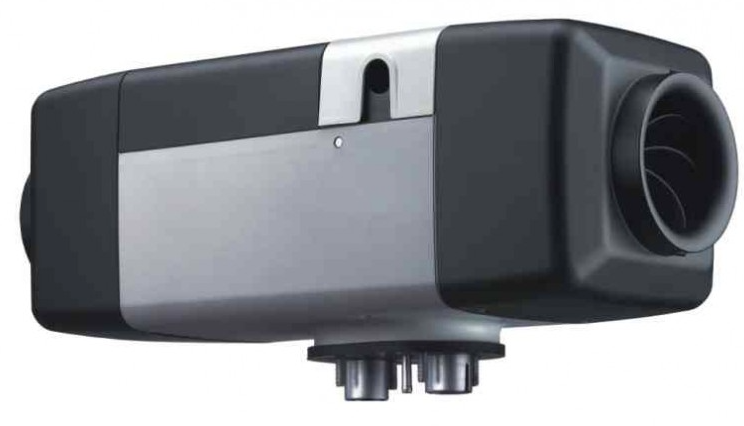
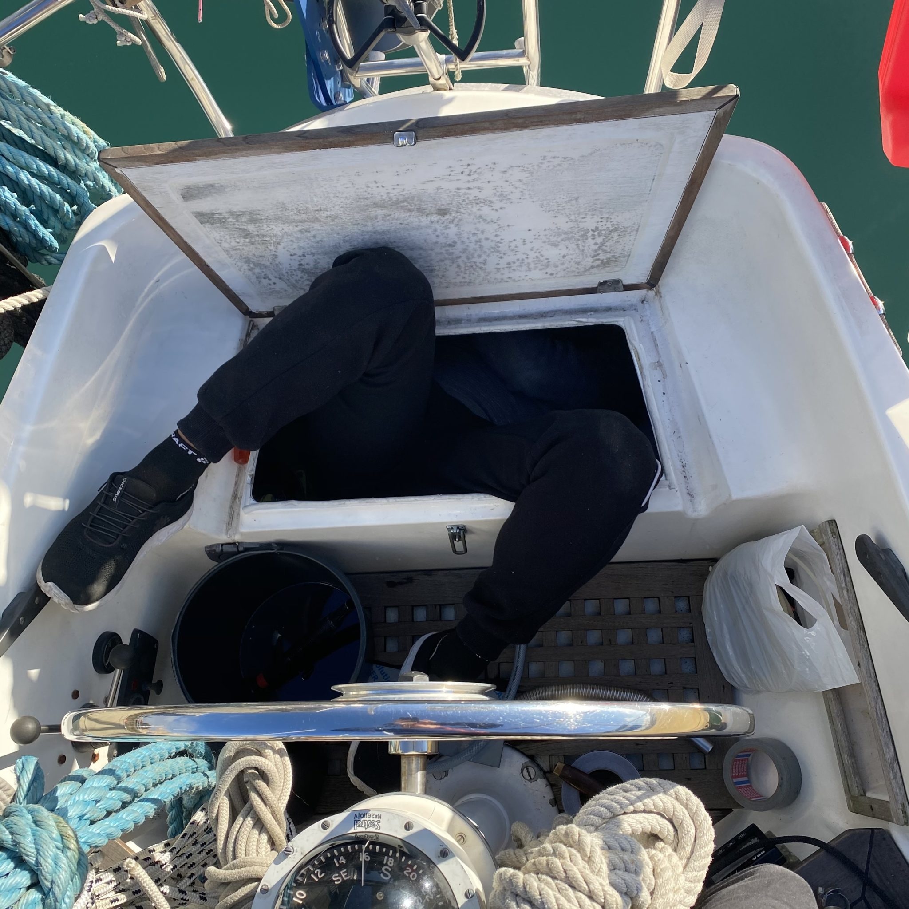
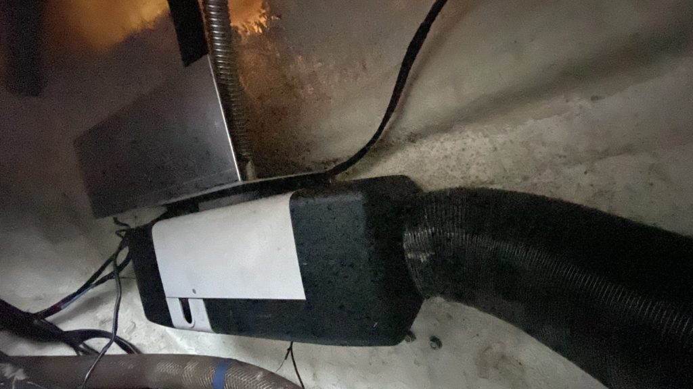
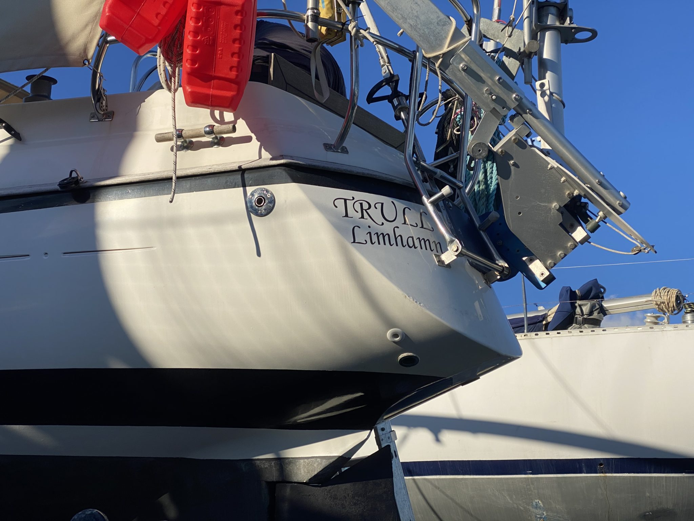
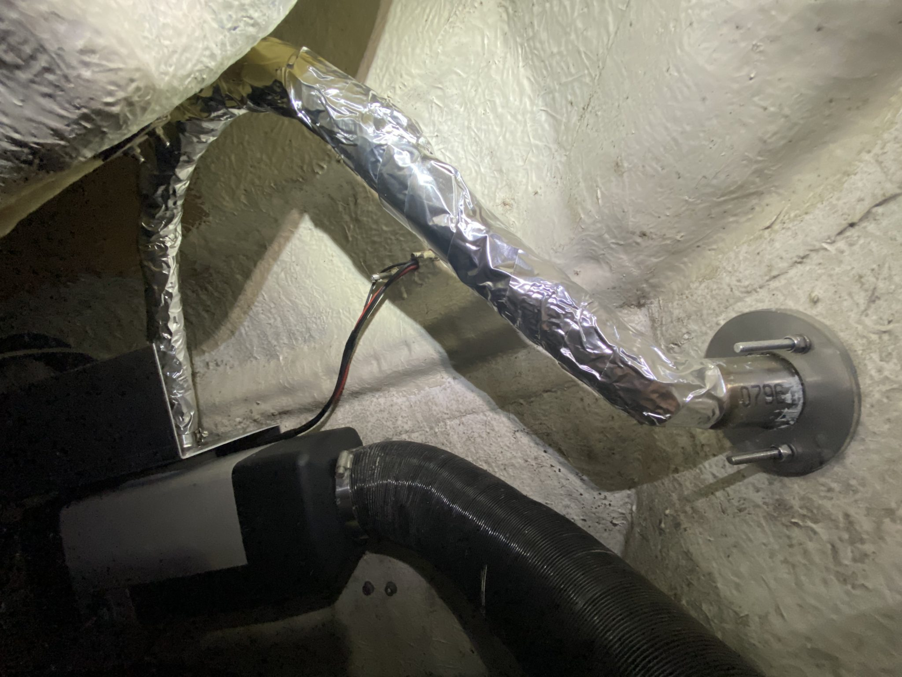
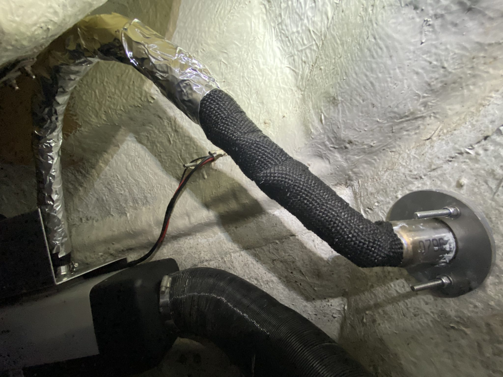
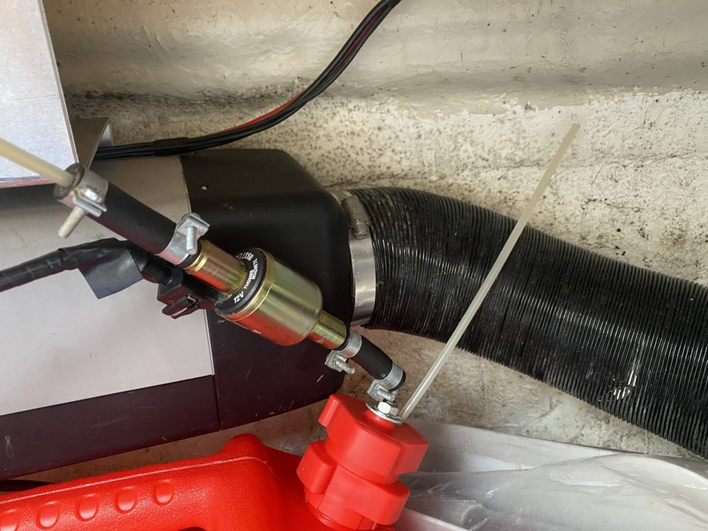
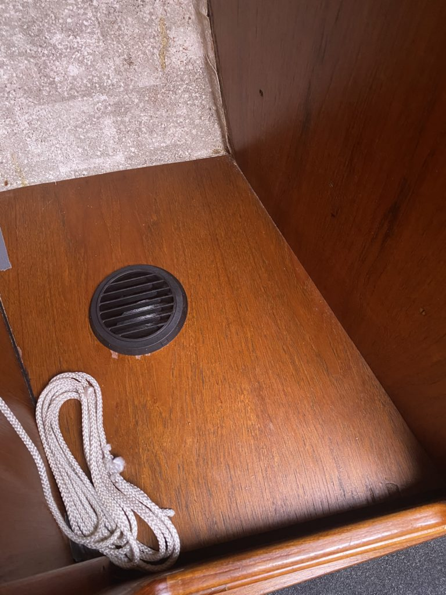
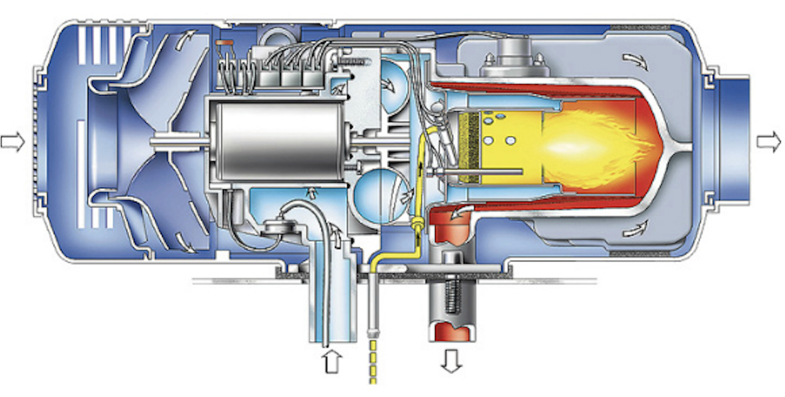

Almost a year ago we found a Webasto Air Top 5000 heater up for sale and since the price was more or less a steal we bought it. Since then it’s been living either under the table in the cabin or been rotating between the lockers in the cockpit, at least up until now. The last weekend was the breaking point of moving the sucker (or actually the heat blower) around.

The first plan was to mount the heater on the bulkhead in the port side locker right where the old Wallas heater previously had lived. It was a good plan except that the exhaust pipe of the Webasto more or less had to pass through our butane gas tanks which didn’t feel like a brilliant plan so that plan was scratched.

New plan had to be cooked, the stern locker is pretty close (due to the size of the boat) so the current hot air pipes could quite easy be rearranged to the back without too much hassle and it couldn’t be that difficult to install a new exhaust pipe close to the heater either on the transom or on the side of the boat. For once something seemed to come together easier than expected.

*There’s actually quite a lot of space down there… #not*

As soon as we (Tony) dove into the locker we realised that the sturdy bolts our Sailomat windvane is mounted to the transom with could be reused on the inside to attach the aluminium mounting plate that we had made for the heater. So with just four nuts and no major adjustments except turning the heater upside down and flipping it we were good to go. One of the benefits of mounting it upside down was that the “shelf” that was supposed to hold the heater now protected both the exhaust pipe and the combustion air intake from stuff that we ram down in the locker and the direction of the exhaust also allowed us to build a pretty big loop for not allowing water to enter through the exhaust pipe into the heater as well.

The only thing left to do was to take the boat one step closer to a mesh strainer and drill a hole for the exhaust on the port side and connect the heater and everything would be pretty much done.

 | 
*Exhaust high above the waterline* | *Exhaust pipe connected*

To be sure that nothing in the locker or the boat itself could be damaged by the hot exhaust pipe we also wrapped it with heat shield wrapping (some itchy stuff on a roll) that we also covered with aluminium tape to make sure that Murphy got nothing to say in the future.

The result? We can now run the burner at 5kW and still touch the exhaust pipe with our hands without burning our fingers off. Pretty good. The flip side of the coin was the fact that the heat shield wrapper was based on glass and Tonys hands and arms were super itchy for a few days. Guess you can’t have it all. 🙂

When it comes to fuel our first plan was to connect the heater to the diesel tank for the engine but since that one didn’t have any spare openings or connectors to connect the fuel line to we went for an external can instead. After finding out the price of a “proper” heater tank we (Tony) Macgyver’ed one of our spare diesel cans into a proper fuel tank with some of the scraps that we found onboard.

The diesel pump for the heater (that is also a dosing pump) is now connected straight to the head of the can, that way we didn’t have to make a bid deal of soundproofing to make it quieter since it’s not bolted to the boat. Membrane pumps tend to tick quite loud when they are bolted to the hull.

When the heater got upgraded we also added an extra outlet in the “wardrobe” with a T-split on the hot air pipe that pass through just underneath on its way to the v-birth outlet, this will allow us to dry our clothes waaay faster and easier when we are underway or at anchor.

So how was the result? Overall it was a smooth installation that made a significant improvement of living standard and surprisingly the heater is really cheap to run, during our first 12h test it only took about 0,12 liters of diesel per hour and 1-1.5Ah. The only “bad” thing with the installation is that the hot air tubes runs close to the hull and when they get hot we get some condensation in our lockers since the boat isn’t “winter” insulated.

Webast Air Top
If you are into how things work then the dosing pump feeds diesel into the heater that ignite the fuel with a glow plug. In the combustion chamber*1 a flame is lit which heats up the heat exchanger. The integrated fan*2 then push the air from the inlet and through the unit into the heat exchanger that heats the air as it pass through into connected hot air pipes and into the boat.

The heater got a separate air intake for combustion purposes and the combusted exhaust air is discharged to the outside through the exhaust pipe.

We also learned a few other things during the installation that might come handy in the future.
First there are quite a lot of “China Heaters” out there, they are more or less clones of the Webasto heater except you only pay 10-20% of the price. Apparently they are awesome in many ways but we’ve noticed that some of them lack a few minor things that might be good to know about before installation. First of all some of them lack rubber gaskets on the wiring harness connectors which might create issues if the heater is installed where it can get wet by either the elements or as in our case condensation.

Second, the internal connectors to the circuit boards in the Webasto heater got small plugs that can be disconnected in case of service but on their “cheaper” siblings they are usually soldered and can’t be removed/replaced.

Third and most important, the silencer*3 that comes with the cheaper version can’t be used on a boat since it isn’t fully welded and due to that it leaks combustion gases. The heaters are quite quiet so usually the silencer isn’t really required unless your neighbour boat is really close and the owner sleeps in the cockpit.

None of the things above is critical by itself (except the silencer) in any way but if we would bring a boat and crew far up north we wouldn’t go with the cheapest heater out there just to save a few bucks but if the goal is having a good time in the archipelago during summer the “China” would be on the top of the list.

*1 The part of the heater that looks like a jet plane lookalike.

*2 The thing that pulls all the amps when the heater is running. Super warm boat = 5-7Ah, nice and cozy boat 1-1.5Ah. When the fan is running on max power its also quite noisy.

*3 We got a non Webasto silencer with the dirt cheap extra exhaust pipe that we bought from Amazon, we of course binned the silencer right away.