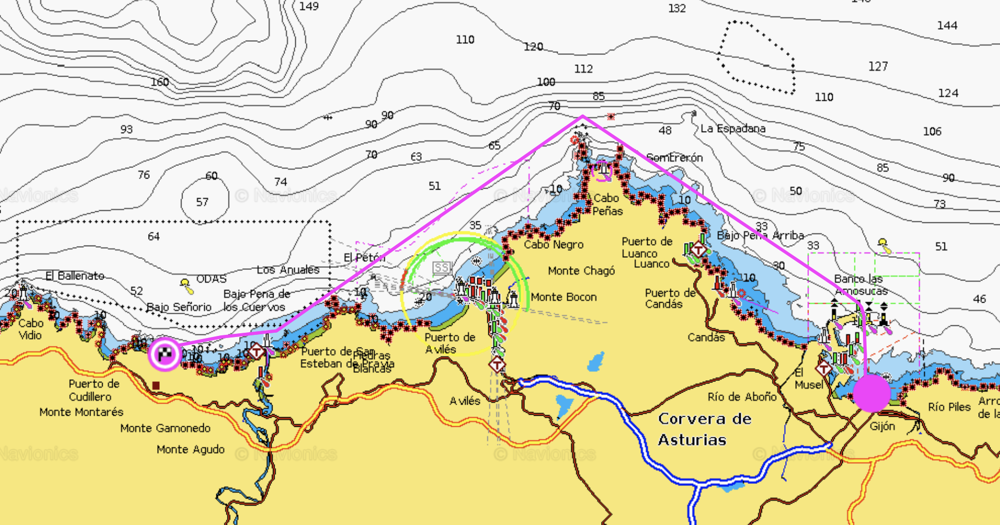
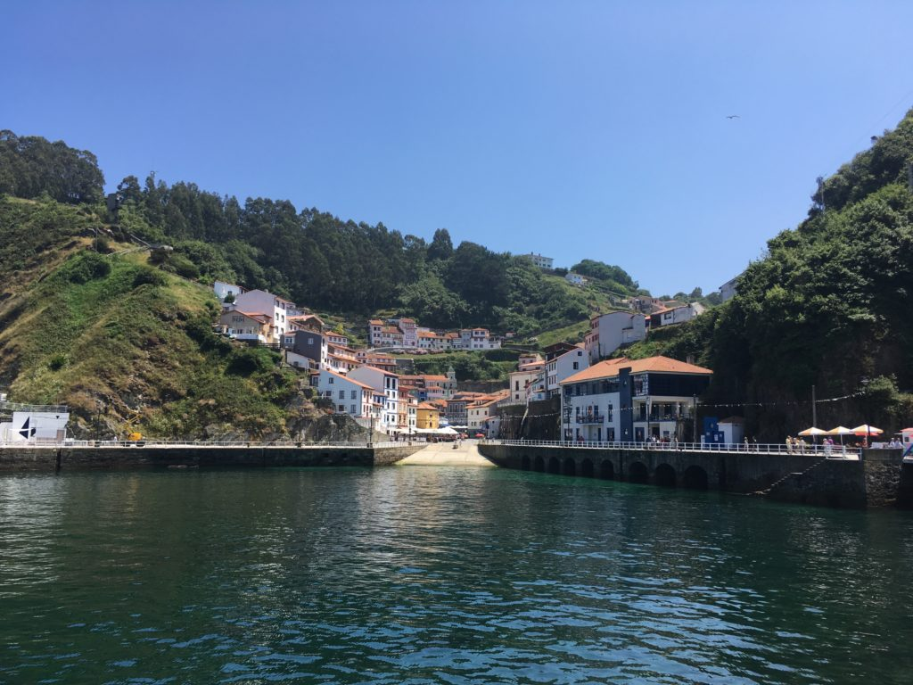
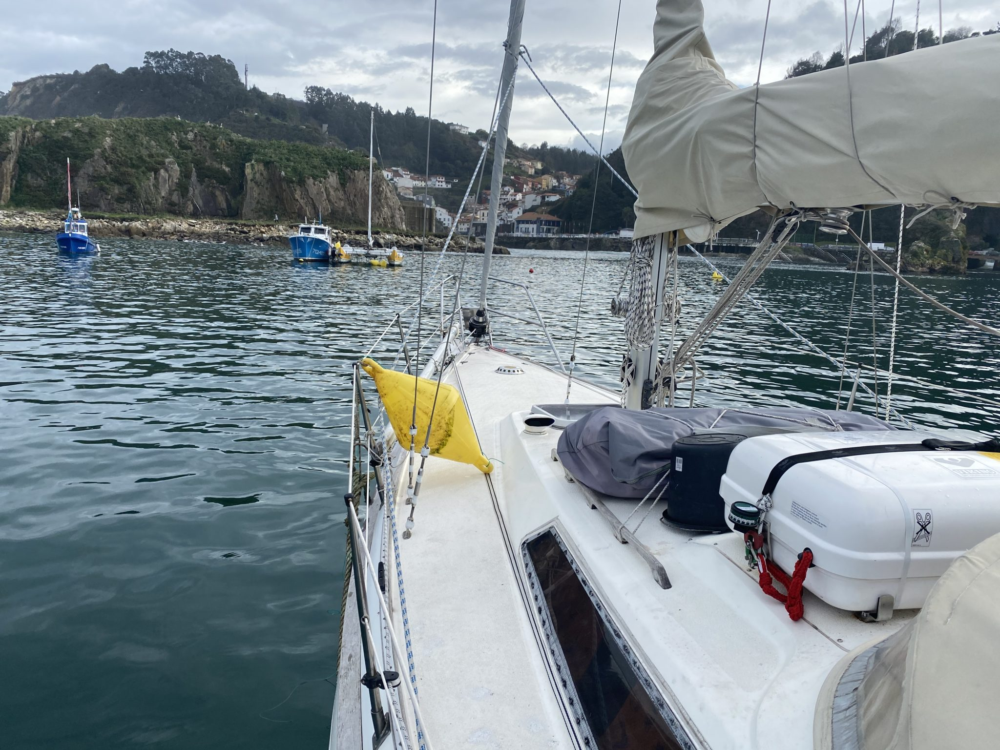
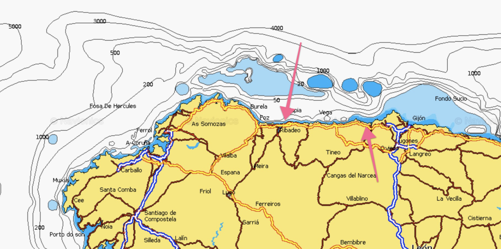

After almost 4 months tied to a pontoon in Gijon we broke the moorings and headed west. Our first stop was “just around the corner”. We did however plan a slightly longer trip but the weather wasn’t on our side so we took a pitstop at Cudillero about 30nm (50km) from Gijon.

Cudillero is one of those Spanish postcard villages, a small village hidden along the coastline. The harbour is well protected however it is a bit tricky to enter and if you’ve got wind and/or swell from the north you should go elsewhere, the entrance of the harbour is just plain dangerous and stupid.

Beside from being tricky to enter, the “marina” only got buoys for mooring and you have to put the buoy on deck and use the mooring lines that it’s connected to, this is probably the most stupid (and dirtiest) system we ever encountered.

Even if the first day of sailing 2021 wasn’t the best we could ask for with a lot of rain and almost no wind at all it still feels good to be on our way again. Tomorrow we’ll do a 41nm jump to Ribadeo where we’ll stay for a few days.

