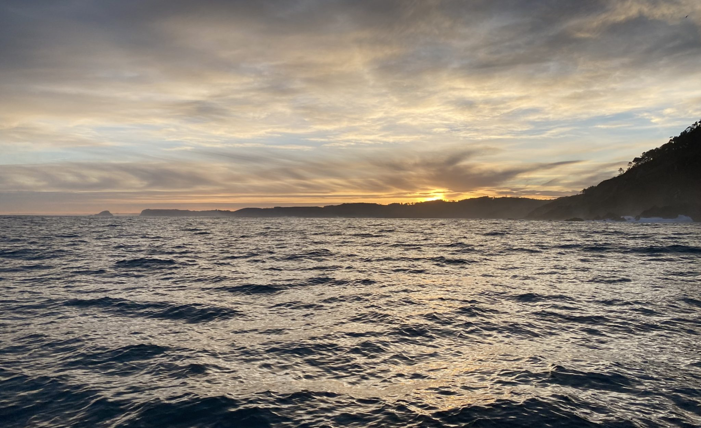
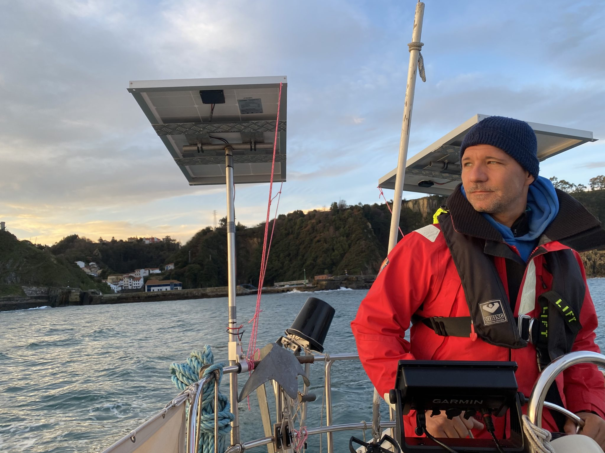
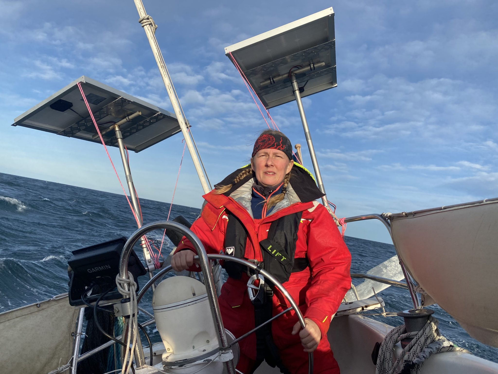
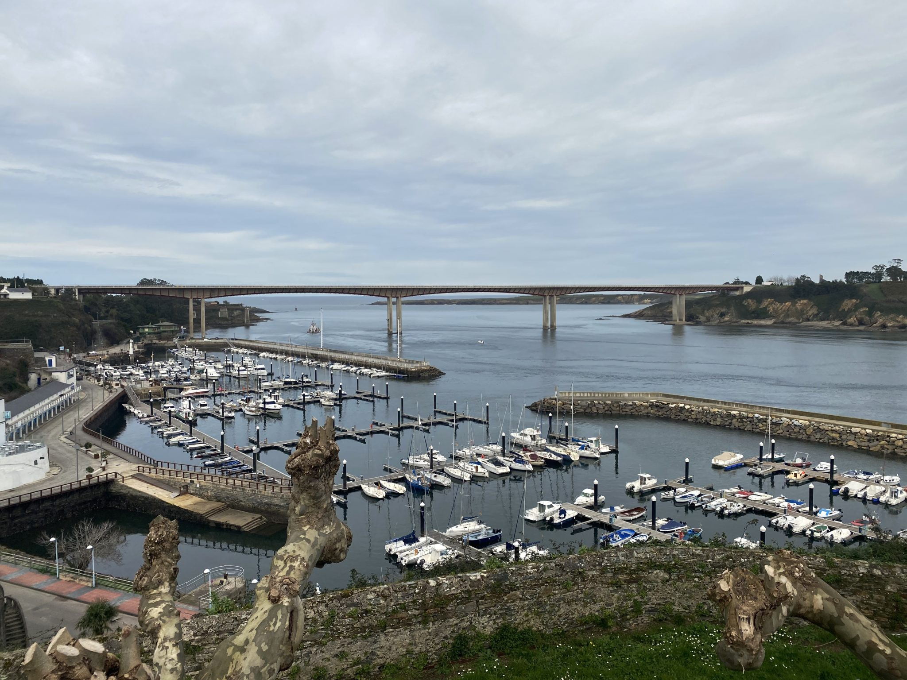

*Sunrise outside the small harbour of Cudilero*

At sunrise Sunday morning it was time to leave Cudillero and head for Ribadeo. In Reeds Nautical Almanac it says that before leaving Cudillero go to the breakwater and take a look outside to assess the swell to make sure it’s safe to leave. That is really good advice since it’s impossible to see what is out there from inside the enclosed harbour. And if the sea is a bit rough you can get in bad trouble on the way out. However it’s difficult to do if you don’t have a dinghy since there is no other way to get to shore from the mooring buoy. We chose to trust the weather forecast and our own judgment instead. The swell was going to be from the same direction as when we entered the day before but it was going to be less swell according to the forecast. After we entered we consciously listened to the sound of the ocean on the outside and that was good because in the morning it was quite loud and if we hadn’t noticed that it was the same the day before maybe we wouldn’t have dared to leave. There was not much wind but the little wind we had in the morning was to our advantage should the engine decide to overheat or break down on the way out. We had everything prepared to be able to quickly pull out the genoa in case we should need to. We motored out without any problems but it’s always good to think everything through and prepare for the worst case scenario.

*The sunrise was far more interesting than the exit of the harbour*

The day turned out to be a really nice day with no rain and a lot of sun. We even had to put some sunscreen on. The forecast said almost no wind but after a few hours we could set sails and turn off the engine and we got some good sailing for about 5 nm before the wind died on us and it was time to go back to motoring again.

When we thought that we had about an hour and a half left the swell almost disappeared but instead we started to get small annoying waves against us and our speed dropped from between 4-5 knots down to 2-3 knots. The wind picked up a bit and it was time to set sails again. While we were hoisting the main sail the wind picked up even more so Tony hoisted it with the reef in straight from the beginning and that was a wise decision. We also reefed the genoa and managed get quite good speed, about 5-6 knots.

<iframe width="560" height="315" src="https://www.youtube.com/embed/85PgtQ-N6zs?si=FObTBj0-FBHuj3_Y" title="YouTube video player" frameborder="0" allow="accelerometer; autoplay; clipboard-write; encrypted-media; gyroscope; picture-in-picture; web-share" allowfullscreen></iframe>

However the wind had changed direction so we could no longer head straight for Ribadeo so we had to beat against the wind that was alternating between 15-25 knots/s. We got some massive showers from the waves colliding with the bow and then splashing over us but surprisingly the water wasn’t cold at all. We were about 4 nm from Ribadeo if we would have been able to head straight for the goal and had an hour left to sunset and also to high water. After that it was going to start to get dark and the tidal current was going to turn against us on the approach to the marina. We tacked a few times and after about an hour the wind gradually settled down again and the waves were gone. We quickly took down the sails and started the engine and was able to head straight for Ribadeo again with surprisingly good speed. We managed to get there about half an hour after sunset but it wasn’t totally dark yet which we were happy about, it’s always a bit trickier to enter a new marina when it’s dark.

*Mia having a blast, and some showers...*

Before the wind picked up, in our minds, we were almost already in the marina. The remaining distance was so short and we’d started planning what to have for dinner when we got there. Then suddenly the wind picked up and changed everything. There and then when it happened we didn’t know how many hours it was going to take us to get there. But we were still in a good mood and luckily this time we only got delayed about 45 minutes. Mia was at the helm and was on the edge of her comfort zone heeling over 40 degrees at times but it ended up being a good but totally draining experience. Both of us were actually quite tired after two days of sailing and we were eager to get a good nights sleep.

*Ribadeo marina with the bay of Biscay in the background. Can you find our boat?*

On Monday late morning we went up to the marina office to check in. We had emailed them before we left Gijon to make sure that the would accept us since both the city Gijon and the region Asturias that we left and Galicia which is the region where Ribadeo is have a perimeter lockdown. We got a reply that said “No problem, you are very welcome”. Today, Tuesday, we got a visit from a customs guy and he did the normal customs things like asking about out last harbour and the next harbour and wrote down our boat data and passport data and took some pictures of the boat. Not a singel question about why we moved between two regions that are both in lockdown. It seems to be that the perimeter lockdown dosen’t apply to boats, at least not private boats. However it’s difficult to find that information in writing somewhere. I guess, to be sure to not get into trouble we will keep emailing the marinas we plan to visit and ask if they will accept us before we go there.