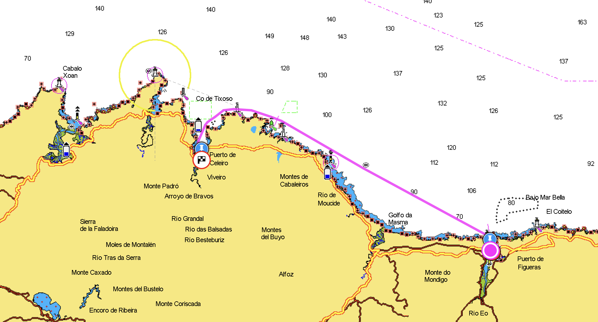
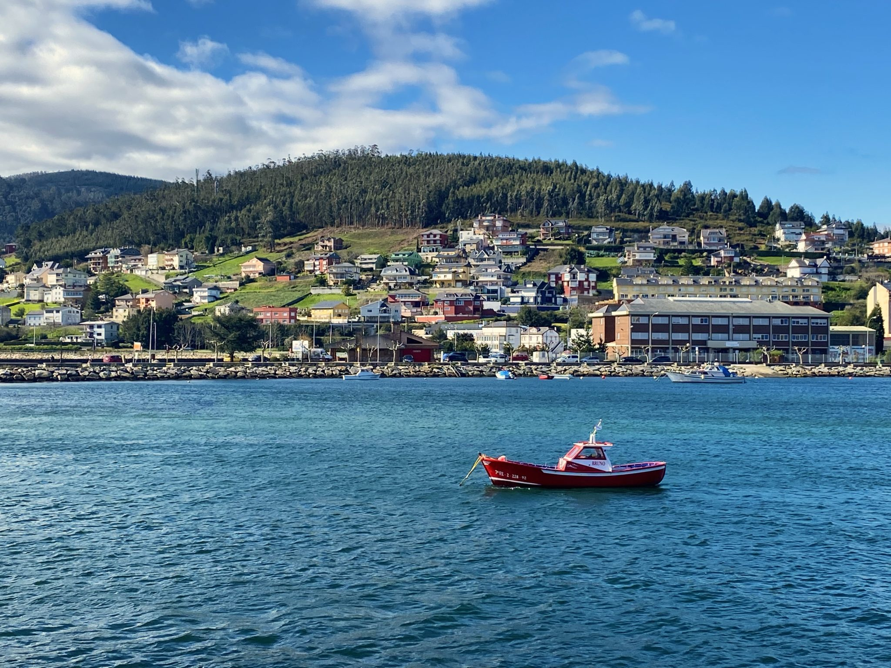
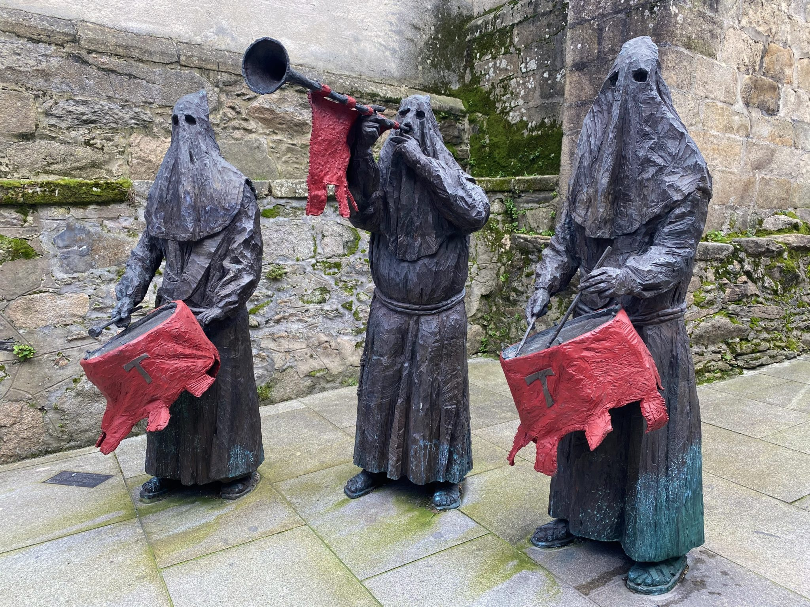

After a really windy weekend we decided to leave Ribadeo on the Monday morning. When we went to the harbour office to pay we got a nice surprise. We ended up only having to pay for five nights instead of the eight we actually stayed, it pays to be nice. 🙂 On Sunday evening the wind had calmed down a bit but instead the swell had increased to about 2,6 m and the harbour in Ribadeo is not very well protected from swell so we ended up bouncing around like a pinball all night. We’ve developed quite some mooring skills so that there is no hard pulls on the lines and we haven’t been too concerned about it moving around a little as long as we can avoid the hard pulls. But the movement this night was really bad. I even think the boat moved around more than when we are out sailing. We didn’t sleep very well because of that but it was also difficult not to think about if we would even be able to get out of the harbour and the ria with that amount of swell. The forecast said that the swell was going to decrease to 2,3-2,4 m in the morning. That is only 20-30 cm less, how big difference could it make? But the morning came and it actually was a little bit calmer. Just before 8:30 we untied and said goodbye to Ribadeo. And then we almost turned around again. Looking at the exit out of the Ria de Ribadeo from a distance it looked like there was breaking waves covering the entire exit to the open sea. But luckily it was only an illusion, when we got closer there was plenty of space with only swell and no breaking waves.

For once we got some really good sailing and it lasted for about 18 nm which is more than half the distance to Viveiro and we were really happy about that. Our experience along the northern coast of Spain has in general been that there is either too much or too little wind. When it’s too much wind we don’t want to be out there and when it is to little wind it’s still possible to move to the next place if the sea is relatively calm but it’s quite tedious to motor for hours and hours, especially with our one cylinder, 12 horsepower engine. At 4 pm we arrived to Viveiro and after trying to reach them on the VHF with no success we moored at the pontoon behind the Guardia Civil which according to Reed’s Nautical Almanac is the visitors pontoon. The pontoon itself was quite dirty with something that looked like used toilet paper scattered on it and there was some kind of outlet into the water just next to the pontoon that either let out really dirty water or maybe it was just the circulation of the dirty water in the harbour (the water in the harbours usually is quite gross) that made it sort of disgusting. But when we got hold of Fernando, the harbour master, by phone instead of VHF he told us that we could move and choose any free spot on the first two pontoons in the harbour.

The Viveiro harbour is really well protected and we had the calmest night in a long time and after a day at sea we slept like babies. The harbour is close to supermarkets and the town center. The biggest impression of this place so far is the mountains and the nature surrounding the town.

*Nice view from the marina area in Viveiro*

The harbour master is a fun character and he is a good source of information when it comes to the local sailing and weather conditions, quite often the person working in a harbour office is just an administrator and not a boat person. But it is really nice when we come across someone that knows what it’s all about that can give us some inside information about the area we are in. The only downside with this place apart from all the covid-19 restrictions is that the wifi sucks.

*Los Heraldos del Encuentro*

Los Heraldos del Encuentro – we did not really understand what the sign next to these guys said because it was in Spanish and Google Translate didn’t manage to make sense of it but they have something to do with the Good Friday and nothing at all with Ku Klux Klan
Our plan was to stay in Viveiro for three nights but we ended up staying eight nights before we left. Once again we got a discount when we paid for our stay, instead of eight nights we only paid for seven.