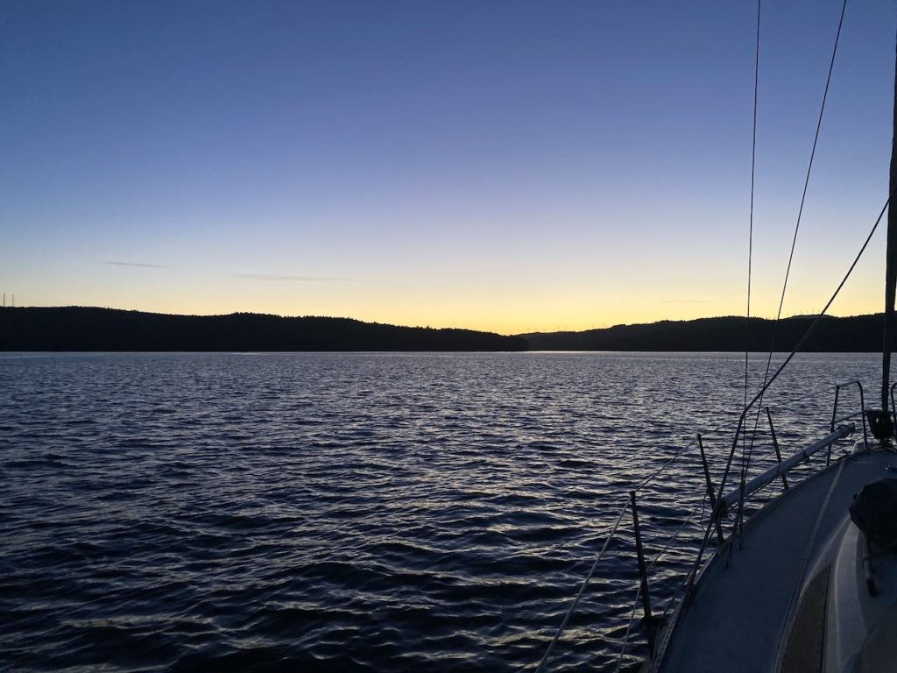

We left marina Camariñas under a lot calmer conditions than we expected looking at the weather forecast the night before. Of course you want enough wind to be able to sail but it can be magical when you motor out of a marina at dawn and everything around is just calm and quiet and you can watch the sun rise and the day wake up. This particular morning was even more magical since we were followed by a pod of dolphins. They joined us just outside of the marina and followed us almost all the way out to the open sea.

It’s difficult with the weather forecasts in this area since you have to take the effect of the mountains and the rias into account as well and we haven’t quite figured that out completely yet. And sometimes of course the forecast is just wrong. We had expected a lot more wind than we got in the beginning of the day. Beyond left Carmariñas a short while after us and we kept in contact over the VHF during the day. They decided to go a bit further off shore to try to find some more wind but we stayed closer to shore and eventually the wind picked up enough to turn the engine off and get some good sailing. The sun was out all day and it was really warm and we had to peal off some of our layers of clothing. Tony even changed to his shorts. The last 4-5 nm approaching the marina got a bit chilly since we had to beat against the wind to get there. That is something that I (Mia) still need to get used to, being so close to the goal but having to spend hours to get there. It’s a natural part of the everyday life of sailing but when we get that close to a marina I get restless and just want to get there as fast as possible.

Camariñas to Muros

The marina in Muros is nice and calm and Pedro that runs the marina is a bit of a character in a positive way. He seems to really like his job. One big plus is the showers, for once it’s not “push button” showers, they have normal taps and you can adjust the temperature and the pressure as you like. Muros is a cute little village that you can “do” in a day or two*. (\* Note from Tony: More like 25 minutes….)

After two nights in Muros Karin and Richard on Beyond left for Ria de Vigo and an anchorage there. Our plan was to leave the same morning but we didn’t sleep very well during the night and it felt like it was a bit too windy for us. We got reports from Beyond during the day and for a while they had gust up to 18 m/s. The sea was still quite calm which makes it a bit easier but we were happy with our decision to stay in the marina.

We have been talking back and forth about whether to stick around and explore the different rias in Galicia for a while or if we should keep going south as soon as possible. On the one hand we want to get as far south as possible and into the Mediterranean as soon as possible since we got a signed contract on our “new” boat that we are picking up in Greece. Because of that we are of course eager to get to Greece. But on the other hand Greece is in lock down due to the situation with COVID-19 and according to the latest news their plan is to open up again on the 14th of May. We could get to Portugal in a few days but Portugal has a lot more restrictions due to COVID-19 than Spain, for an example they have a curfew from 1 pm on the weekend. But we don’t really have a problem being confined to the boat in the afternoons on the weekend. If we want to walk around and explore things we can do that on weekdays. That’s the beauty with our new lifestyle. To be honest it feels like we are slowly but surely getting closer to a decision to keep heading south without unnecessary detours.
