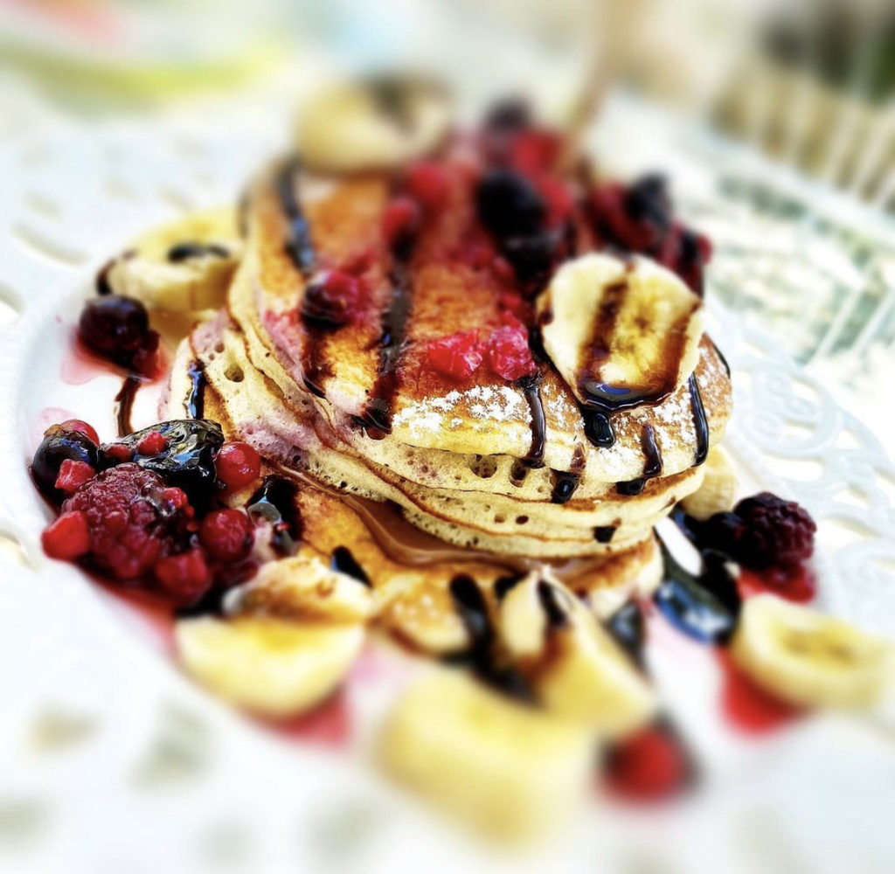
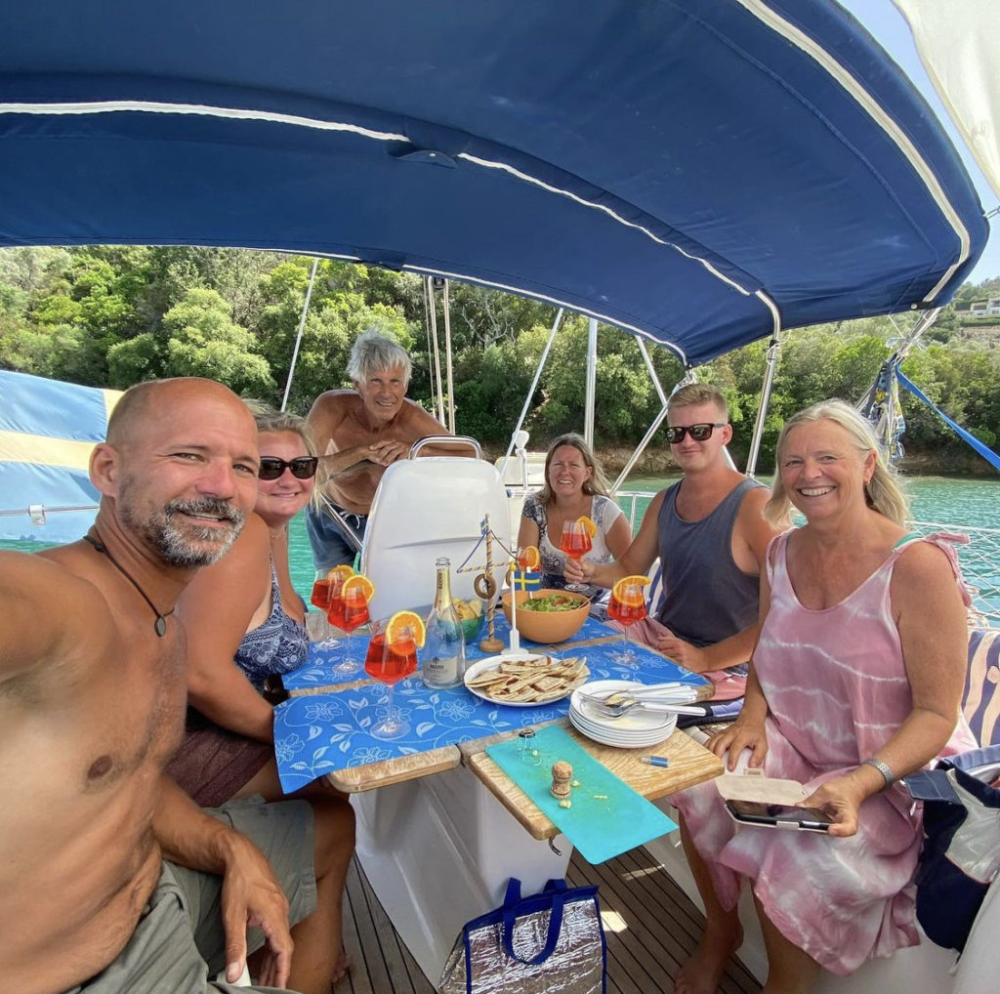
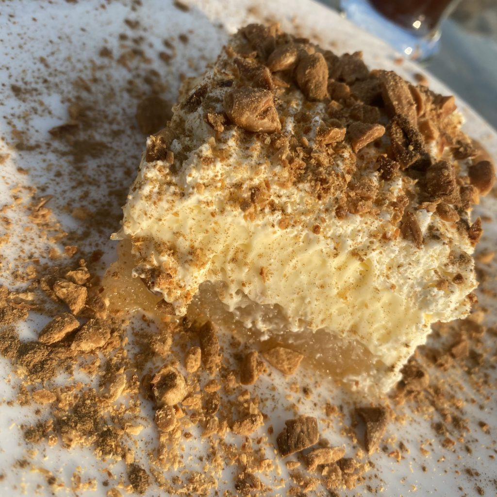
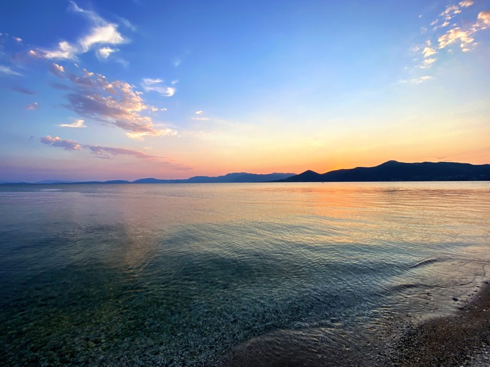
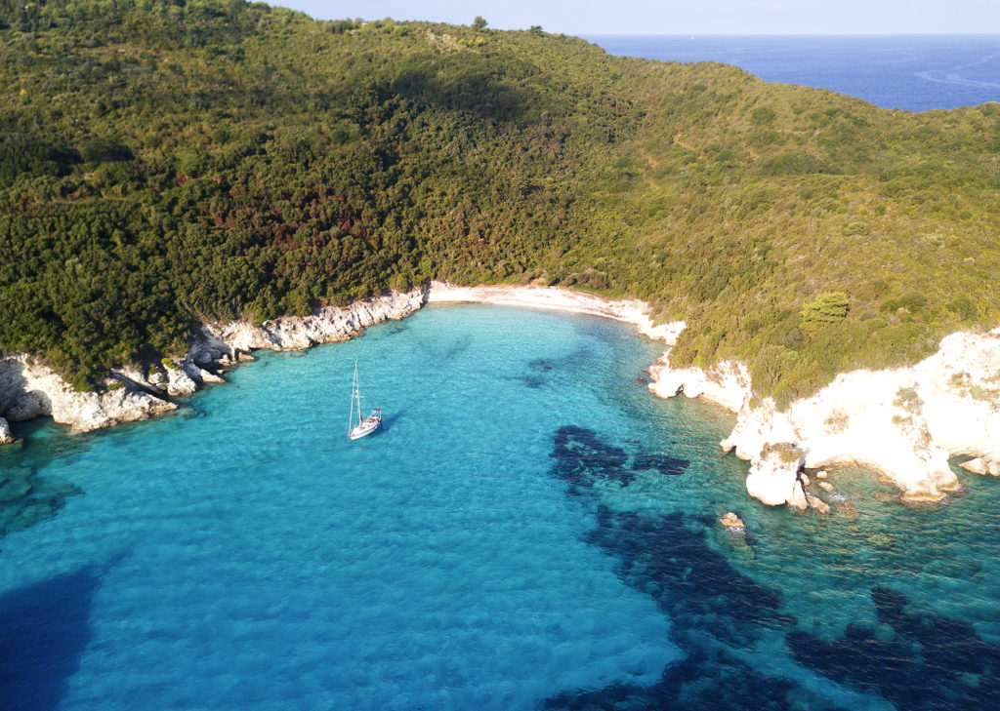
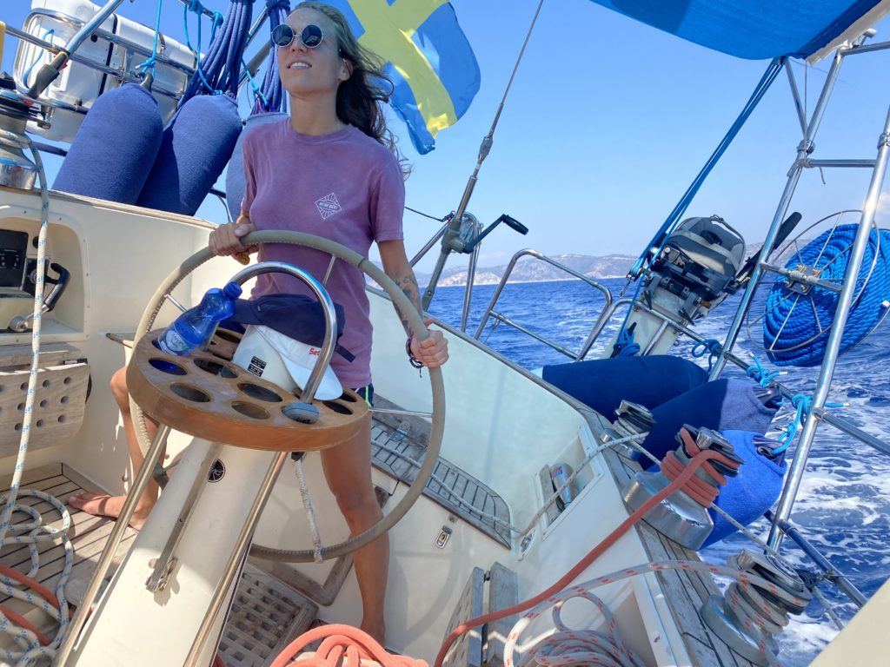
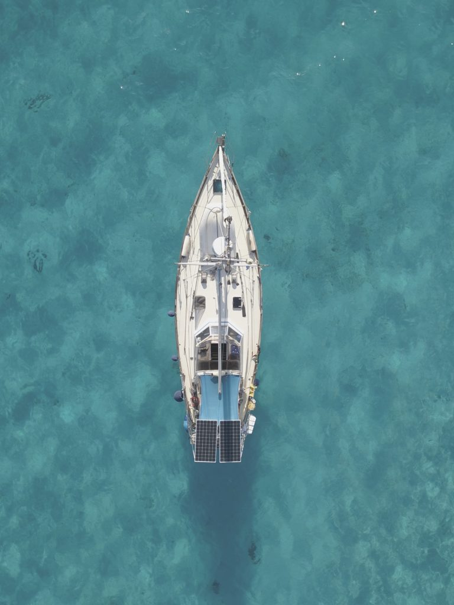

What the heck happened with Trull and Co during 2021?

Well, that’s a darn good question, Trull and her crew just disappeared in thin air, or at least from https://yachting.earth. Not a word, no nothing except some strange sunny posts on [Instagram](https://instagram.com/yachting.earth) from another country and boat than Trull (if you follow us there).

As you already might have guessed there has been a ton of changes during the last year and this is our attempt to somehow get back on track.

Anyway, once upon a time…  
Everything started with Tony’s father, when we reached the North Sea after the Kiel canal, dropping him a text with a link to a 50 foot something steel Colin Archer that was up for sale. He explained that when we reach the Mediterranean he wasn’t interested in sailing his old small boat, he wanted to sail something new and bigger and this Colin Archer was for sure a “slightly” bigger boat than Trull so he thought it would be a nice upgrade for him, I mean us…

Needless to say, we didn’t buy the CA but that didn’t stop Tony’s father to keep sending ads to other boats and about 500 ads later when we reached northern Spain and Gijon one of the boats spoke to us. We found Freya a Swedish Malö 116 located in Greece. Unfortunately, we had a small problem seeing her due to Covid so after an obscene amount of emails with her current owner we decided to kill the piggy bank and make a down payment. After that it was more or less downhill, we just had to set sail and sneak across the border into Portugal, back to Spain through Orca (killer whale) infested waters, through the Mediterranean, around Italy and up to Greece in a few months during the lockdown. How hard could it be? 🙂

The interesting part of the story was that it wasn’t that hard at all, we left Gijon in February heading to la Coruna and further south still during lockdown but apparently that didn’t apply to foreign boats. It’s about here we lost contact with the world, mostly because we sailed a lot from anchorage to anchorage and bounced in and out of marinas while trying to figure out how to get to Greece and our new boat and not least what to do with our beloved Trull that was up for sale at the moment. What would we do if someone bought her right there and then? Long story a lot shorter, eventually we ended up in Portimão, southern Portugal, where we stopped and tried to figure out our next move. Since both Italy and Greece was under some sort of super Covid lockdown so we didn’t want to take any chances and sail there and try to get into the country, after all, sailing a few weeks straight and having to turn around wasn’t our cup of tea so we ended up staying in Portimão for about 6 weeks till Greece reopened their borders.

During that time we found a buyer of Trull, a Swede and a Russian guy who lived in Portugal had been trying to find a nice looking B31 in Sweden for a few years to buy and sail down to Portugal and Portimão. I don’t think I have to say that the transaction went like a charm, they looked at Trull on day 1, day 2 we got the down payment of 50% and on day 3 they paid the rest. We stayed on the boat for another 3 weeks till we left for Greece and Freya.

Freya’s home at the time was Ionian Marina just 5 minutes by car from Preveza airport so the trip was super easy besides that we first had to go to Schiphol from Faro before we could get on our flight to Preveza. Usually, this wouldn’t be a major problem but this time we had about 90kg of extra luggage with us, you know the most important things, toothbrush, passport, life jackets, VHF, some “don’t leave home without them”-tools and some other of our can’t live or sail without it stuff, that we had to run between our gates with.

We were lucky enough that one of our friends had his boat in the Ionian marina that we could stay on instead of finding a hotel. We were even luckier when we found out that our friends’ boat was located next to Freya. What are the odds of that on a yard with thousands of boats?

When we met Freya that late June evening the first thing that struck us was how big she was compared to Trull. Not big big but crazy super big! (boats usually looks way bigger than they are from underneath when they are on dry land ).

The next few days were spent talking with Joachim and Birgitte, her current owners, having a surveyor checking her out and reviewing some of the findings (more about that later) and last but not least giving her an extra layer of coating before launching. It was for sure a few busy, and super crazy hot, days before she was ready to go back into the water where she belongs.

<iframe title="Bottom coating" width="640" height="360" src="https://www.youtube.com/embed/9iBM4NK3gwI?feature=oembed" frameborder="0" allow="accelerometer; autoplay; clipboard-write; encrypted-media; gyroscope; picture-in-picture" allowfullscreen=""></iframe>

*If it only went that fast…*

When she finally got off the hard we had a beautiful test sail in true Ionian summer spirit. We spent the day in the light, warm and super nice winds outside of Preveza before we dropped off and waved goodbye to Joachim and Birgitte and took aim at our anchorage for our first night on Freya. The next few weeks were spent digging through the boat to clean out everything we didn’t need and at the same time learn as much about her as we possibly could to create a project plan of all the things that needs to be done within the next year.

The summer was then spent investigating nice anchorages, cute towns, great restaurants and of course coffee shops and bars across the west coast of Greece from Corfu in the north to Kefalonia in the south.

<i>Western Greece</i>

During our ~walk-about~ sail-about this summer we found quite a lot of gems in the area, some of our Ionian favourite spots are;

-   Café di Paris (Lefkas/Nidri), great place in Nidri if you are up for a cocktail or two, they’ve got stunning waffles, pizza, burger etc. We spent an obscene amount of time there during the summer. If you go there say hi to Panos (the owner) from us.

-   Θεα Cafe Bar (Lefkas/Nidri), small and sweet coffee place with an amazing view. About 40 minutes by foot from Nidri but well worth the time and the steps. Their pancakes are to die for even if they are a biiiit expensive.

<i>Sometimes pancakes are the only thing you need</i>

-   Midsummer bay, this is the place where Swedes, us included, spend their Midsummer if they are in the area. Calm bay with no cellular reception what so ever, the only thing there is to do is chilling and enjoying life. The bay next door has got two small restaurants, aim for the on the right that’s the best one. They also sell ice for your cocktails.

<i>Midsummer with newfound friends, the crew from Freya, BaraVara and Columbina</i>

-   Stavros Pontoon (Sivota/Lefkas). Super friendly and helpful staff and a nice and cozy restaurant with a view over the “marina”, we might have spent a few to many evenings here. Great place to recharge both yourself and the boat, it’s free to stay at their pontoon if you dine at the restaurant, water, shower and electricity is included.

-   Palairos Yacht Club (Palarios/mainland), okey this is the place to go if you are into ekmek cake. Sweet Jesus they know how to make this delicious cake variant of bread pudding from heaven or more accurately from Turkey. Moore next to the beach, jump into the dinghy and beach it just next to the Yacht Club. The amazing sunset is included in the price.

<i>Ekmek cake at Palairos Yacht Club</i>

<i>Sunset at Palairos Yacht Club</i>

-   Panorama, indian restaurant (Palarios/mainland), if you still are up for food after your ekmek cake then Panorama is the place to aim for. It’s the place with the green sunshades. We and a, eumm, few friends (17 of us) dropped by and had dinner and not one of us was dissatisfied with the food. Go there, eat a lot of food and be happy that you didn’t pick the place next door.

-   Pera Pigadi, super clear water and a great stopover either at the quay or at anchor. Great place for snorkelling with lots and lots of fish to enjoy.

<iframe title="Pera Pigadi" width="640" height="480" src="https://www.youtube.com/embed/wRAn3qsWJI0?feature=oembed" frameborder="0" allow="accelerometer; autoplay; clipboard-write; encrypted-media; gyroscope; picture-in-picture" allowfullscreen=""></iframe>

-   Corfu town. If you are into strolling around among turists and shop for ugly t-shirts with “I <3 Greece” on the chest this is the place, oooooor if you drag yourself to the outskirts of the old town where you find great coffee shops and nice bars. Totally worth a visit. Drop your anchor in the bay next to the fort and you are good to go.

-   Just south of Corfu you’ll find two small island Paxos and Antipaxos, when we dropped by the bay was empty and it felt like we had the entire island for ourselves.

<i>Antipaxos</i>

Besides the places above we’ve visited a ton of other great places, the entire Ionian is jam-packed with them. The only thing you need is a lot of time or a lot of diesel since you can’t really rely on the wind in the area. Sometimes there’s a lovely 30 knots breeze perfect for sailing and the other minute there’s nothing. But since the only thing we have an unlimited supply of is time we didn’t mind cruising around here at all. 🙂

<i>Rebecka at the helm, Poseidon keep your head down!! 🙂</i>

When the summer was about to end our grand master plan was to sail west back to Spain and hook up with some friends that we met on our way south from Sweden but the circumstances (other friends and crappy weather) made us decide to stay in Greece for some time so we ended up in Messolongi, a small town on the mainland that doesn’t need tourism to survive which means that everything is a lot cheaper than the “regular” tourist places and best of all, nothing closes down during winter. More or less everything can be found in the area so it’s a perfect place to stay to finalise some of those boat projects that are still pending…

So now you know what the heck happened. 🙂

<i>Freya from above</i>
