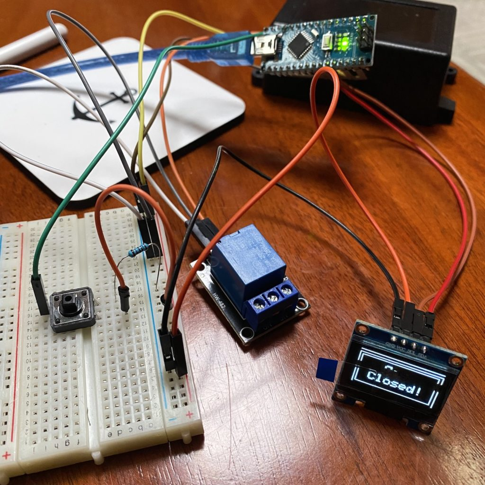
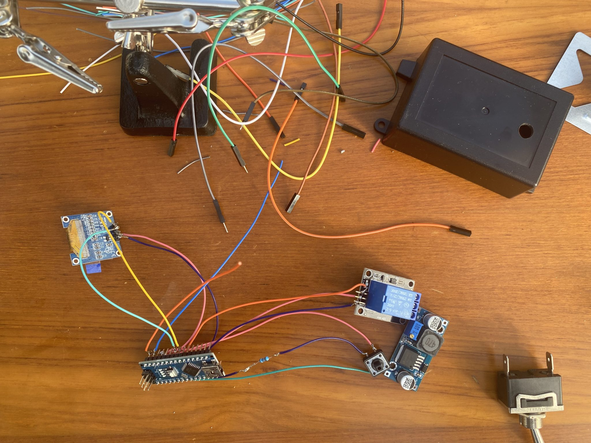
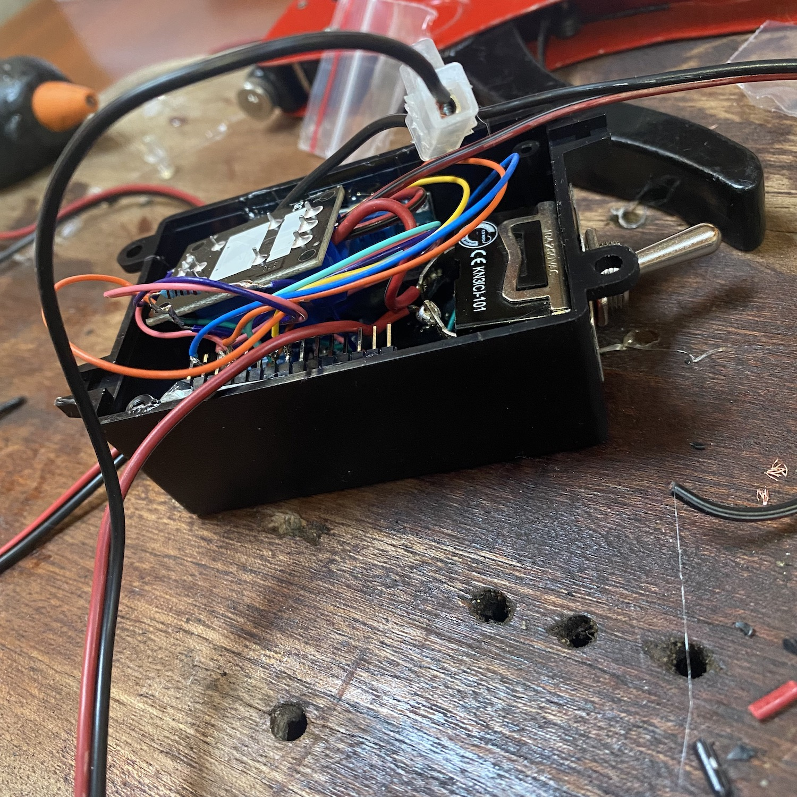

How many times have we forgotten to turn off the gas after cooking? The appropriate answer would be never but the honest one is almost every time. We cook, we eat, we do the dishes and hit the sofa. And right about that time, we look at each other and, “did you turn off the gas”? Crap… And it’s of course raining and it’s cold and it’s just not fun at all to climb out there to turn that nob.

The solution is of course to get one of those gas solenoids that allow you to close the gas remotely. Put one in the gas locker and connect it with a switch inside of the boat and you are good to go. Enable the gas with a flick of a finger without getting out. #perfect


The problem with those devices in my opinion is that you can still forget to turn them off and then the entire idea loses its point. So the grand master plan for the weekend was to build something cheap and foolproof. So the shopping spree ended with the following (yes I’m a sucker for AZ-Delivery even if they bumped their prices lately).

- Solenoid from Amazon – 22€ – [Link](https://www.amazon.de/-/en/U-S-Solid-12-Solenoid-Valve/dp/B01NBUFFEG?pd_rd_w=RTdDW&pf_rd_p=2e346047-29a4-42f6-a72d-de1e5e50b712&pf_rd_r=JBS0C5Y5NGTWWXE7VSHW&pd_rd_r=76d23c19-3add-419c-842e-7fdefab42f9e&pd_rd_wg=InLsk&pd_rd_i=B01NBUFFEG&psc=1&ref_=pd_bap_d_rp_1_t)
- Arduino Nano from AZ-Delivery – 7,50€ – [Link](https://www.az-delivery.de/en/products/nano-v3-0-pro)
- 0,96″ OLED I2C Display from AZ – 4€ – [Link](https://www.az-delivery.de/en/collections/displays/products/0-96zolldisplay?variant=26462709385)
- DC-DC power supply step down module from AZ – 2,30€ – [Link](https://www.az-delivery.de/en/products/lm2596s-dc-dc-step-down-modul-1)
- Single-channel relay 5V from AZ – 2€ – [Link](https://www.az-delivery.de/en/products/relais-modul?variant=8138392076384)
- Box from Kjell&Co – 0,5€ (got a pretty good deal on that one) – [Link](https://www.kjell.com/se/produkter/el-verktyg/elektronik/elektroniklador/ventilerad-inbyggnadslada-38x65-mm-p89041)

I also got myself an MQ-2 Gas Sensor – 5€- Link – that will be added in version 2.0 of the switch.

Some quick and dirty code that display if the solenoid is open or closed and the countdown till it’s closed if we “buy” time by pressing the small button. For those of you, that understands geek you’ll soon find some useless lines below with a small “easter egg”. Without those, the code can be cut in half.

````
#include <Wire.h>
#include <Adafruit_GFX.h>
#include <Adafruit_SSD1306.h>

#define SCREEN_WIDTH 128
#define SCREEN_HEIGHT 64

Adafruit_SSD1306 display(SCREEN_WIDTH, SCREEN_HEIGHT, &Wire, -1);

  const int RELAY_PIN = 2;
  const int BUTTON_PIN = 3;

  int buttonState = NULL;
  int lastState = NULL;
  int mc = 0;
void setup() {
  pinMode(RELAY_PIN, OUTPUT);
  pinMode(BUTTON_PIN, INPUT);
  Serial.begin(115200);

  if(!display.begin(SSD1306_SWITCHCAPVCC, 0x3C)) {
    for(;;);
  }
  delay(2000);

}
void time2goM(int tid2go,int s)
{
  display.clearDisplay();
  display.setTextSize(2);
  display.setTextColor(WHITE);

  display.setCursor(37, 3);
  display.print("Timer");
  display.drawLine(30, 19, 100, 19, WHITE);

  display.setTextSize(4);
  if (tid2go<100 && tid2go>9) {
      display.setCursor(40, 30);
    } else {
      display.setCursor(57, 30);
    }
      
  display.print(tid2go);

  display.setTextSize(2);
  display.setCursor(95,43);
  display.print(s);

  display.display();
}

void time2goS(int tid2go)
{
  display.clearDisplay();
  display.setTextSize(2);
  display.setTextColor(WHITE);

  display.setCursor(37, 3);
  display.drawLine(30, 19, 100, 19, WHITE);
  display.print("Timer");

  display.setTextSize(4);
  if(tid2go>9) {
      display.setCursor(45, 30);
    } else {
      display.setCursor(55, 30);
    }
  display.print(tid2go);

  display.display();
}

void maxTime(int mc) {
  display.clearDisplay();
  display.setTextColor(WHITE);
  
  if(mc<3) {
  display.drawRect(4, 4, display.width()-4, display.height()-4, WHITE);
  display.drawRect(8, 8, 115, 52, WHITE);
  display.setTextSize(2);
  display.setCursor(20, 16);
  display.print("Max time");
  display.setCursor(27, 36);
  display.print("60 min!");
  display.display();
  delay(1500);
  } else if (mc>2 && mc<5){
  display.setTextSize(1);
  display.setCursor(1, 1);
  display.write("Hey I said max 60 minIs it really that hard to understand how this thingie works? Is it? Really? Really? I probably going to break myself if you continue clicking!");
  display.display();
  delay(5000);
  } else {
  display.setTextSize(2);
  display.setCursor(10, 1);
  display.write("Screw you! I'm going home!");
  display.display();
  delay(50000);
  }
  }

void endTime() {
  display.clearDisplay();
  display.drawRect(4, 4, display.width()-4, display.height()-4, WHITE);
  display.drawRect(8, 8, 115, 52, WHITE);
  display.setTextSize(2);
  display.setTextColor(WHITE);
  display.setCursor(45, 15);
  display.print("Gas");
  display.setCursor(25, 35);
  display.print("Closed!");
  display.display(); 
  }

void loop() {
buttonState = digitalRead(BUTTON_PIN);

if(buttonState == HIGH && lastState == LOW) {
            
  lastState = buttonState;

  for(int m = 14; m > -1; m--) {
    for (int s = 59; s >= 0; s--) {
      delay(1000);
      digitalWrite(RELAY_PIN, HIGH);
          
      buttonState = digitalRead(BUTTON_PIN);
      
      if(buttonState == HIGH && lastState == LOW) {
        m += 15;
        if(m>59){
          mc += 1;
          m = 59;
          maxTime(mc);
          }
      }
      
      lastState = buttonState;
        
      if(m<1) {
        time2goS(s);

      } else {
        time2goM(m,s);
      }
    }
  }
}
  digitalWrite(RELAY_PIN, LOW);
  endTime();  
}
````

Since I’m not a super geek it took some trial and error to get everything up and running so about 18 cups of coffee later the timer was ready and did what it was supposed to.



Besides connecting the button to pin D3 and the relay to pin D2 the display got connected according to its specifications. The 10K ohm pull-down resistor to the ground takes care of strange behaviour (erratic on/off) from the floating input.

When the setup was tested the only thing that was left was to solder the components together and squeeze everything into the, a bit too small, box.

 | 

Surprisingly everything worked just fine with no short circuits even after the lid was in place. 🙂

Some takeaways from the project, use a bigger box or make the device decentralised to save space.

Version 2.0 will have a slightly bigger box and a gas detector that will close the solenoid if gas is detected where it’s not supposed to be.

<iframe width="560" height="315" src="https://www.youtube.com/embed/ytOiE5R33U0?si=bf2MndypCW1c6r_g" title="YouTube video player" frameborder="0" allow="accelerometer; autoplay; clipboard-write; encrypted-media; gyroscope; picture-in-picture; web-share" allowfullscreen></iframe>
