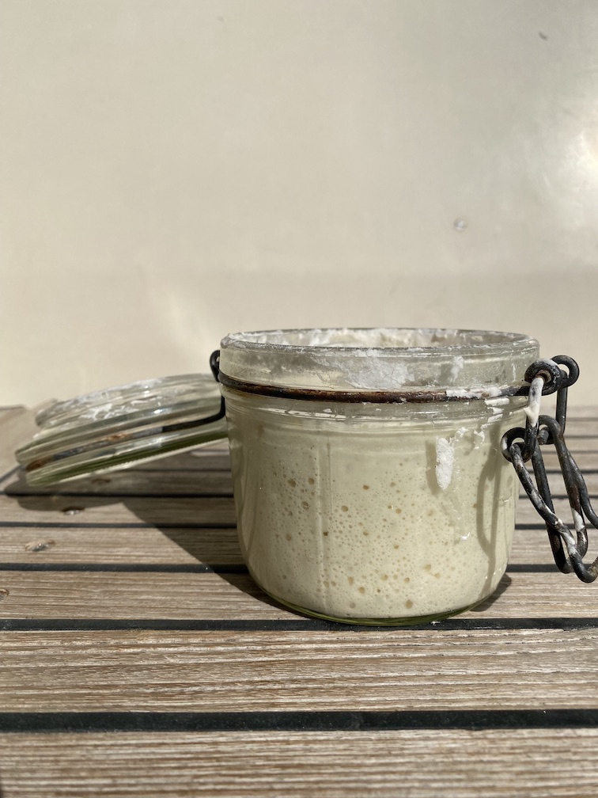
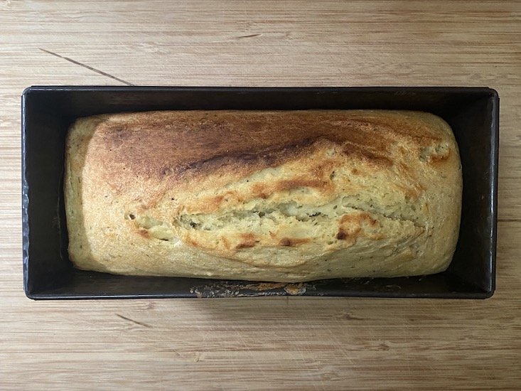
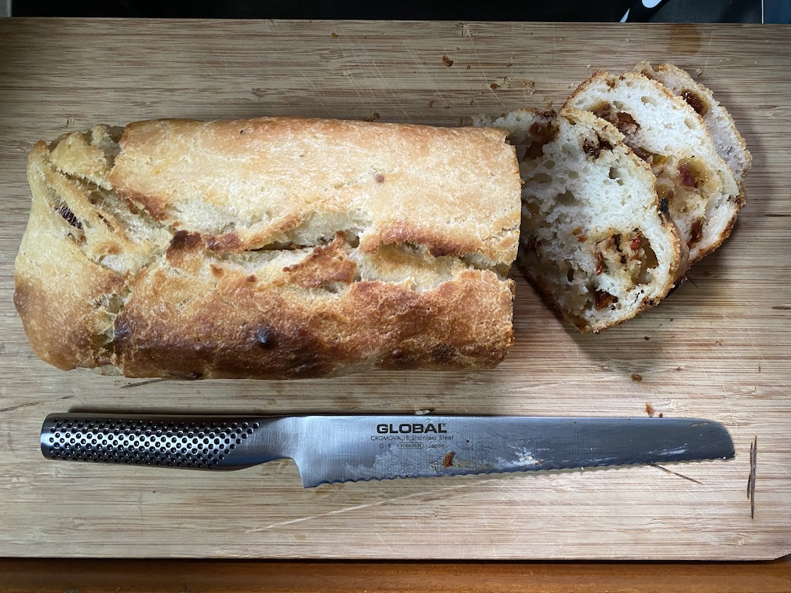

På sista tiden har kaptenen lagt sig till med en ny hobby, han har börjat baka både bröd och kakor med Herman här i skutan. Nu funderar ni som har lite bättre koll på oss såklart vem tusan Herman är, Herman är en liten burk fylld med surdegsgrund som numera har flyttat in i vår kyl. Det bästa Herman vet är när han matas med mjöl och vatten ett par gånger i veckan när det är bakdags.

Nu är det ju så att Herman är lite av en diva och måste matas minst en gång i veckan varken man bakar eller ej för att han inte ska tjura ihop, efter att han vuxit till sig får man antingen baka något gott, bröd, kakor, pannkakor, våfflor, kanel & chokladbullar eller helt enkelt slänga överskottet. Då vi inte slänger mat på Freya har det därför blivit en hel del bakande på sista tiden.

Herman några timmar efter matning

I regel bakas det helt vanligt surdegsbröd (som är lite båtanpassat), brödet görs av Herman, mjöl, vatten, salt och lite socker så det är inte något vidare avancerat, receptet hittar du lite längre ner. Självklart går det peta i lite frön, oliver, tomat eller något annat gott för den som känner sig manad att spexa till det hela lite (se steg 6).

Surdegsbröd direkt från ugnen

Om du känner suget av att baka bröd på samma sätt som på SY Freya så går det till såhär:

Först ser du till att ha följande hemma:

- 550 gram mjöl
- 12 gram salt
- 20 gram socker
- Fungerande vattenkran (de flesta hushåll har en)
- Surdegsbas, har du ingen så håll ett öga här på sidan så dyker det snart upp hur du gör en.

1: På förmiddagen dagen innan du ska baka bröd matas ”Herman” med 50 gram vatten (1/2dl) och 50 gram (1dl) mjöl. Här på Freya använder vi vanligt vetemjöl men det sägs att det ska går bra med lite grövre mjöl också. Här får du prova dig fram om andan och lusten faller på.

Matningen görs så enkelt som det bara går, ös i mjöl och vatten i burken som Herman bor i och blanda det hela till en slät och fin smet. Efter 3-5 timmar i rumstemperatur (inte i solen) har Herman vuxit till sig och är ca 3 gånger så stor som vanligt (Herman gillar att bli matad och lägger på sig ganska fort).

2: När Herman har växt till sig så sleva över honom i en skål med 5 deciliter vatten där du löst upp 2 teskedar (10-12 gram) salt och 1 matsked (18-20 gram) socker, rör runt tills Herman är helt upplöst och vattnet ser ut som mjölk.

3: Blanda den numera upplösta Herman med 500gram mjöl och blanda runt ordentligt till en fin smet utan klumpar (här brukar jag köra med en helt vanlig slickepott). Det är kladdigt som tusan och kommer att sluta med att du har en klibbig/kladdig smet som är lite borderline till flytande. Det är helt och hållet i sin ordning. Degen jäser det inte några hysteriska mängder så om du har en skål som är minst dubbelt så stor som mjölet du öser i så bör det räcka fint.

4: Täck med en handduk och låt jäsa i ett par timmar vänd sedan runt smeten ordentligt, med den där slickepotten, och täck igen. Gör samma sak igen, runtvändandet av degen, fast en gång i timmen i ytterligare tre gånger medans degen jäser till sig och blir både större och mindre kladdig. Den kommer aldrig bli ”okladdig” så motstå frestelsen att ösa i mer mjöl för att göra degen fin och degig.

*Här ska jag vara ärlig och säga att jag i regel hoppar över vändandet i alla fall så länge degen håller sig i bunken, det är ingen raketforskning så du hittar säkert ett bra sätt som passar dig.*

5: Steg 5 är ett valfritt steg, här brukar jag blanda i lite av varje. Favoriten just nu är soltorkade tomater i olja som klipps i små bitar (mindre än 5mm i diameter) samtidigt som jag slår i ca 0.5 deciliter olivolja eller oljan som tomaterna ligger i. Vänd runt allt en hisklig massa så att det hela blandar sig fint i degen. Det går såklart fint med oliver, fetaost eller någon variant av fågelfrön som hittas på brödhyllorna i butikerna. Ta det som du gillar helt enkelt. Är det torra saker du stoppar i är det lättare att göra det innan steg 3.

*Steg 6 och 7 går fint att hoppa över, dock får brödet lite mer "surdegssmak" om det får kalljäsa över natten.*

6: Stoppa bunken i en plastpåse och ställ in i kylen och låt stå över natten.

7: På morgonen dag 2 klär du en brödform med bakplåtspapper och öser sedan i degen. Formen behöver vara i alla fall så stor så att den tillåter brödet att växa 50% (för dig som sov på matematiken i nian så betyder det behöver vara minst 2-3 cm kvar upp till kanten på en vanlig brödform) om du vill vara helt på den säkra sidan.

8: Här på Freya drivs ugnen på gas så det betyder att vi inte förvärmer den innan brödet åker in men sen i sin tur är ugnen stor som en skokartong så den blir varm ganska fort ändå. Vi sätter den på ca 180-200 grader och har brödet inne i 60 minuter. Om det börjar få lite för mycket färg på toppen lägger vi en bit aluminiumfolie över tills den där timmen gått.

9: Plocka ut brödet och låt svalna på galler för att få den där goa krispiga utsidan. När brödet svalnat kan du förvara det antingen insvept i en handduk eller i en plastpåse. Ta vad du har liggandes, om du har olja i brödet (se steg 6) så kan det ligga upp mot en vecka utan att bli torrt och tråkigt.

Knådigare än så gör vi det inte här ombord och gott blir det.

Så här såg sista baket ut.

Surdegsbröd med soltorkade tomater alá SY Freya
