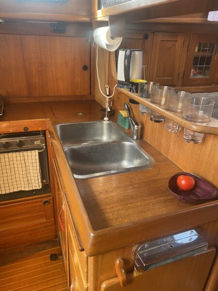
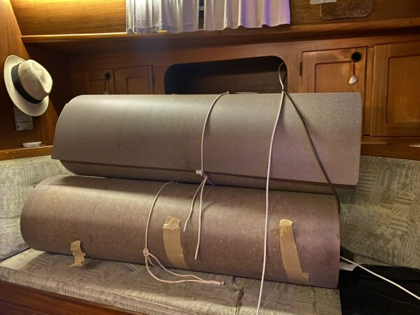
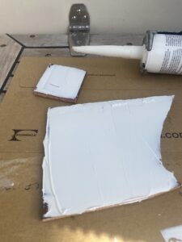
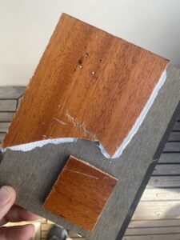
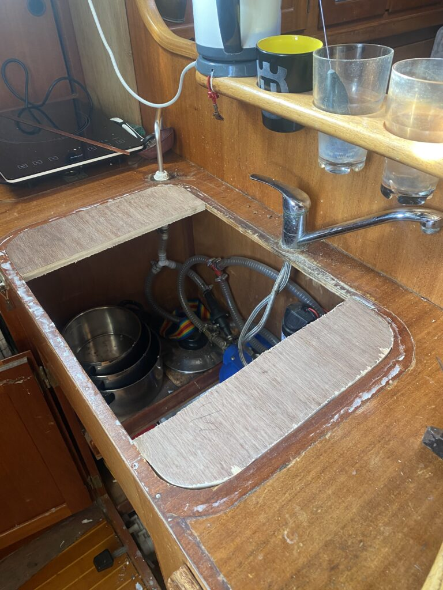
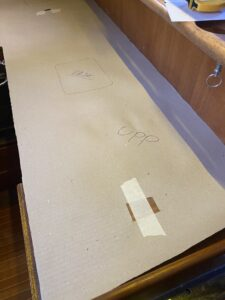
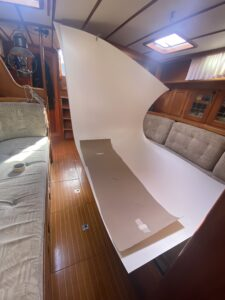
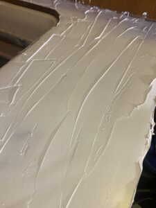
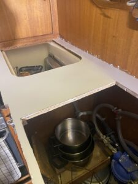
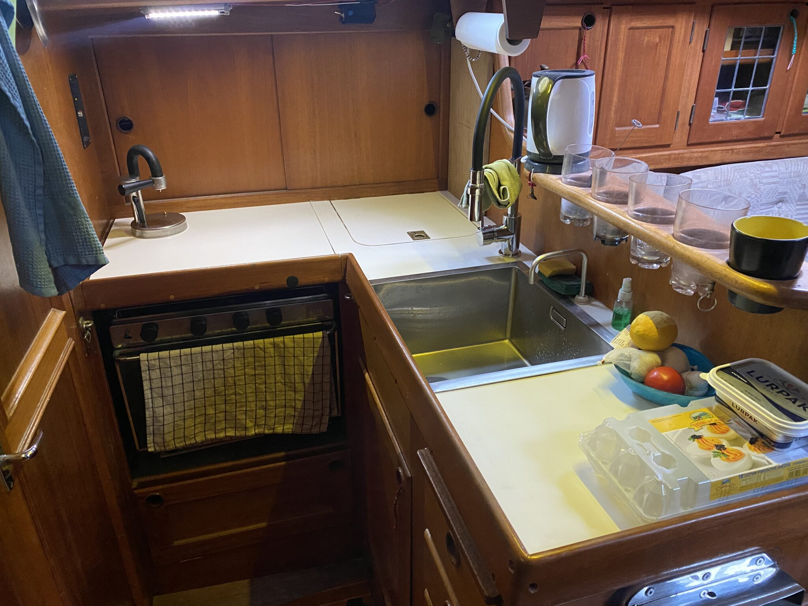

Vi har länge funderat på att piffa till köket i Freya då det sett sina bästa dagar, det kanske inte ser så illa ut i sig men då man bor ombord på heltid kan det bli lite mörkt och trist när det första man ser när man kommer ombord är ett pentry i mahogny.

Pentry Freya 1984 – 2023

Så sagt och gjort började vi leta efter lämpliga lösningar och efter att ha funderat på allt från kofot till ny båt kom vi fram till att laminatskivor från Formica skulle kunna göra susen. Vi beställde en handfull med provbitar och efter en del övervägande kom vi fram till att Virrvar kunde vara trevligt, tyvärr var just det mönstret slut hos leverantören så vi beställde Polarvit som var alternativ två på listan.

Efter många mail fram och tillbaks med Formicas återförsäljare på Sicilien som inte kunde mer än “Hello” på engelska slutade det hela med att vi, på italienska, lyckades beställa tre vita skivor (de ska även räcka till att piffa toaletten/badrummet) för 160€ + 50€ i frakt som efter någon vecka låg så fint i båten och tog plats.

Rullade Formica skivor

Då den tidigare yrkesrollen inte var möbelsnickare var det en hel del funderingar på lämpliga sätt att både få gigantiska laminatskivor att bli mindre och i rätt form i en hyfsat liten båt och inte nog med det hur tusan de senare monteras? Efter en drös med tester med bågfilsblad, sticksåg med och utan tejpade laminatkanter så landade valet på en liten batteridriven vinkelslip med diamantklinga. Den skar laminatet som smör utan att flisa kanterna. Jag hade gärna kapat laminatet utanför på bryggan men kombinationen av lite för mycket vind och stora otympliga skivor gjorde att jag valde att damma ner skutan istället. Var inte alls sugen på att kitesurfa i marinan och vi har ju trotts allt damsugare ombord så det fick bli att damma “lite” <— Lite är en underdrift med råge….

<iframe width="560" height="315" src="https://www.youtube.com/embed/CvqSDX3j8O0?si=_ah6ccohQXs5IlK_" title="YouTube video player" frameborder="0" allow="accelerometer; autoplay; clipboard-write; encrypted-media; gyroscope; picture-in-picture; web-share" allowfullscreen></iframe>

För fastsättning valdes Biltemas Multibond (inte Multibond Rapid!) som inte hugger direkt men i stort sett biter på allt som finns. Testade med att både lägga strängar på ett par brädbitar och trycka dit ett par beställda provbitar av laminatet med gummiroller och att spackla ut limmet i olika tjocklekar. Det som passade bäst på Freya var att spackla ut limmet tunnt, det bet precis lika bra som ett tjockt lager lim fast det gick åt betydligt mindre. Efter limmet torkat testades att skada laminatet med både tappade knivar, kastruller och ett och annat hammarslag utan framgång vilket få ses som en vinst i val av laminat och metod. Ett tips är att beställa ett gäng olika provbitar från Formica även om de inte behövs för att välja laminat, de är perfekta att testa att såga, limma, böja, skruva eller slagtesta ytan på utan att behöva använda den “riktiga” skivan.

 | 

Test av lim

<iframe width="560" height="315" src="https://www.youtube.com/embed/kMSIpj_KKXI?si=CPYt_4R3npPp4A9x" title="YouTube video player" frameborder="0" allow="accelerometer; autoplay; clipboard-write; encrypted-media; gyroscope; picture-in-picture; web-share" allowfullscreen></iframe>

Eftersom den nya vasken var något mindre än den tidigare då vi valt att gå mot en något större enkelho för att kunna diska större grytor och ungspannor istället för två mindre som den gamla fick det gamla hålet byggas igen en aning innan ytan kunde ruggas upp, spacklas och slipas inför limmandet av laminatet.

Justering av bänk

Efter att bänken var snickrad sågad och klar var det bara att rulla ut papp och rita mallen, tydligen är laminat lite besvärligt att lappa så man bara får en chans att såga. Planen var att kapa så lite som möjligt och göra skivan nåååågot större än vad bänken där det går för att använda en överhandsfräs till att fixa till kanterna.

 | 

Det tar sig

Efter att det tillkapade laminatet passats in är det bara lite lim som saknas sen börjar det likna ett kök igen. Hela ytan spacklades med lim, ut mot kanterna var det extra noga för att att säkerställa vidhäftning. Ska vara ärlig och säga att ett visst stresspåslag dök upp när limmet spacklades på även om tidigare test visat att det var gott om tid innan det började torka. Det märktes framför allt på slutet då det blev lite mycket lim på sina ställen. När skivan hamnade på sin plats var det enkelt att efterjustera den så att alla kanter hamnade där de skulle innan den trycktes på plats ordentligt och rollades för att jämna ut och säkerställa anläggningen mot limmet under.

 | 

På tok för mycket lim men det blev bra ändå när laminatet kom på plats
Efter att laminatet kom på plats var det bara att installera den nya kranen, vasken och laminera luckan till kylen och täckskivan till spisen så var det hela klart. Det hela tog nog en vecka med några timmars faktiskt jobb var dag och massor av funderande på hur saker skulle göras för att bli så bra som möjligt. Självklart finns det säkert betydligt smartare och bättre sätt att göra det hela på men i det stora hela blev det hela helt ok.

Pentry Freya 2023 –

Prislappen på det hela landade på ca 250€ vilket i skrivandets stund är ca 2800kr vilket få ses som en helt ok investering för att få ett “nytt” kök.

- Laminatskiva 50€
- Ny vask 119€
- Ny kran 70€
- Lim 5€

Verktygen som användes utan inbördes ordning var:

- Vinkelslip med diamantklinga
- Överhandsfräs
- Kofot
- Spackelspade