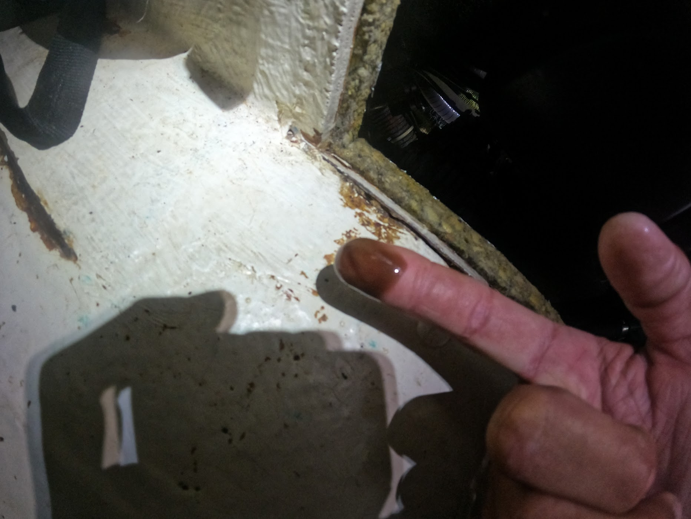
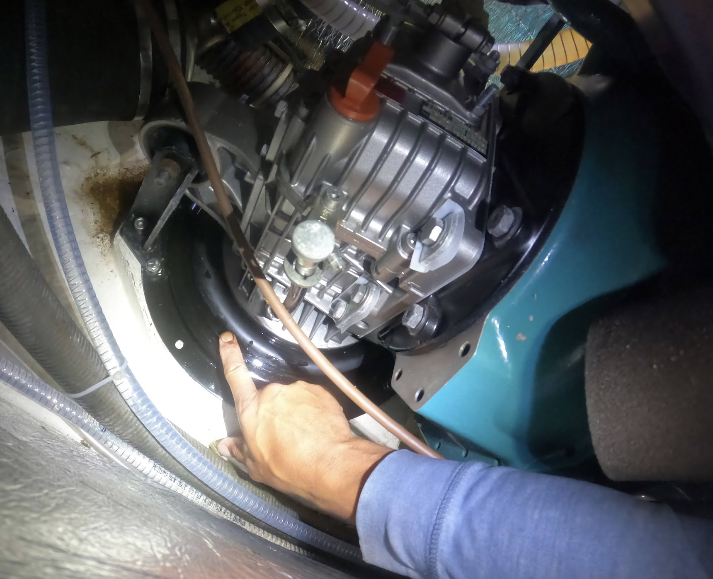
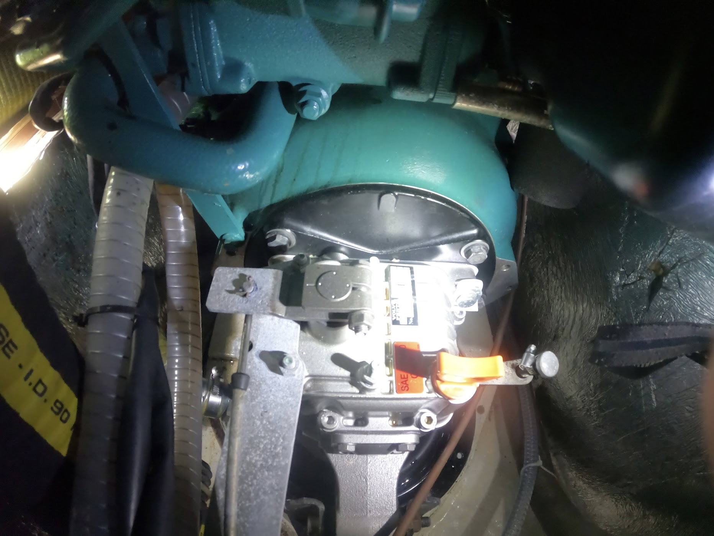
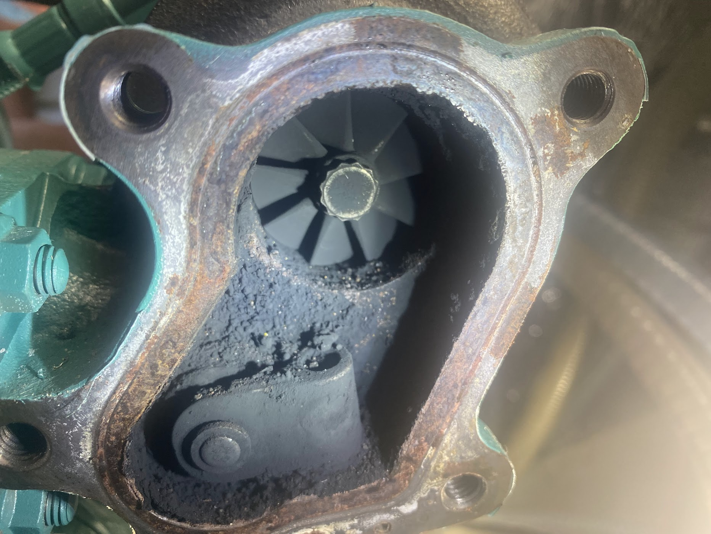
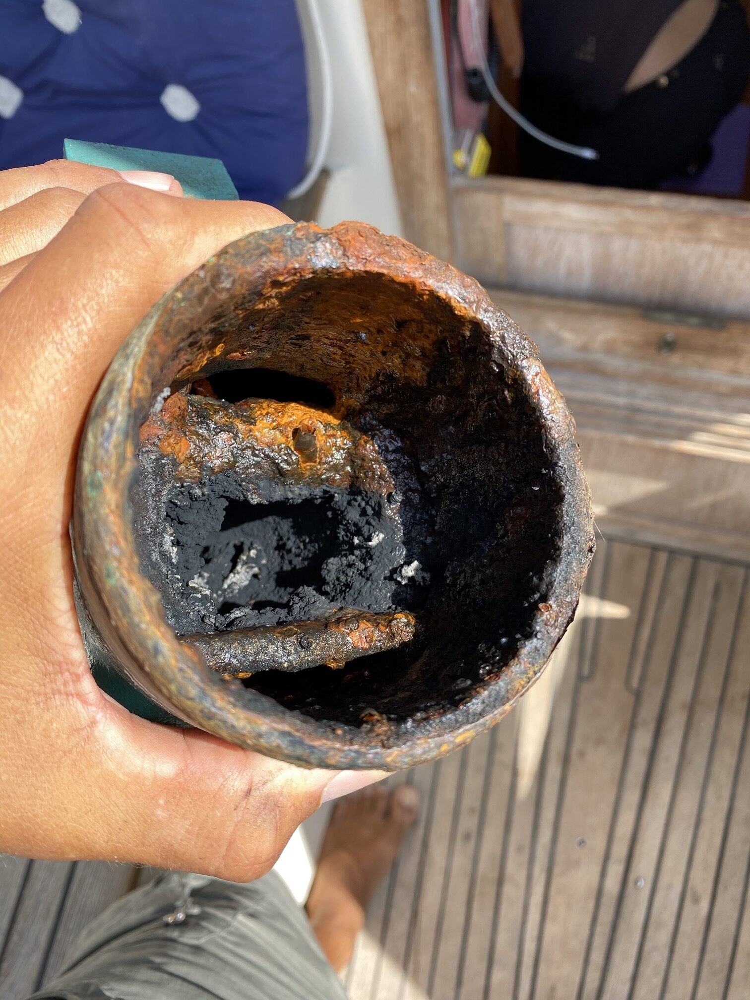
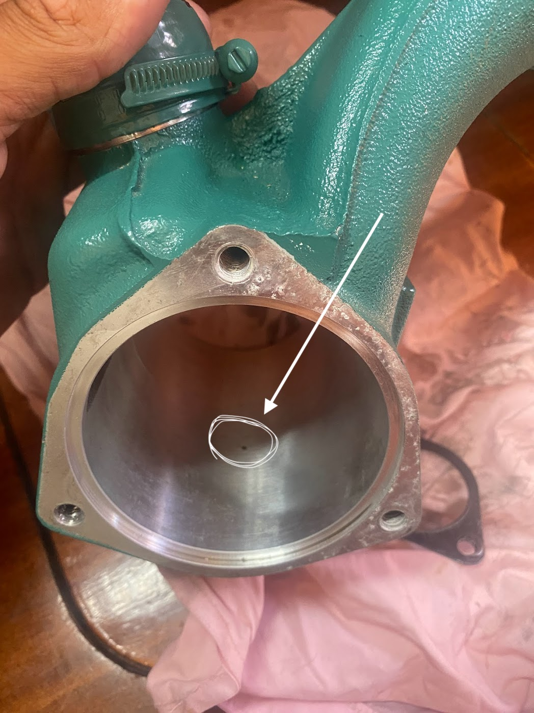
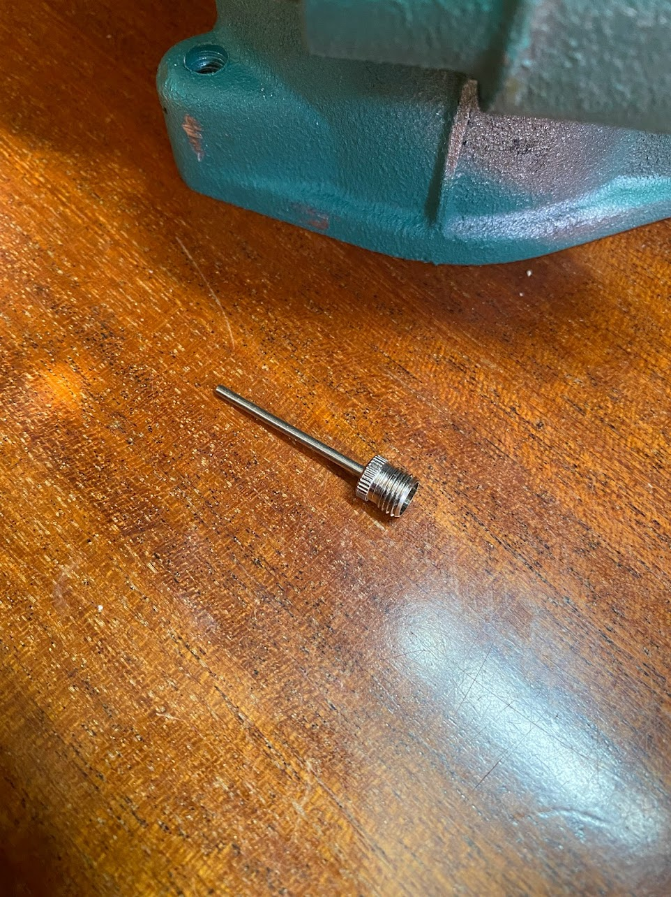
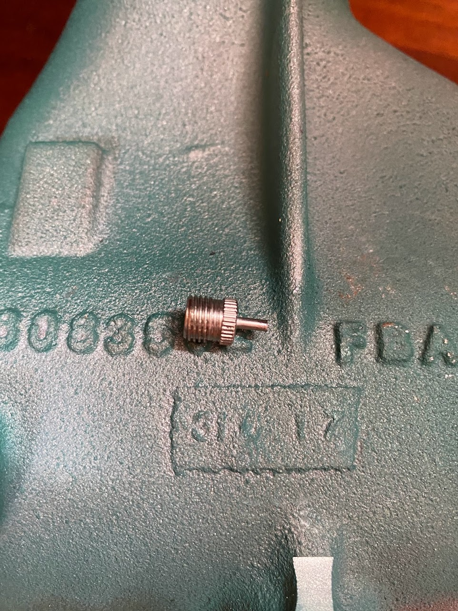
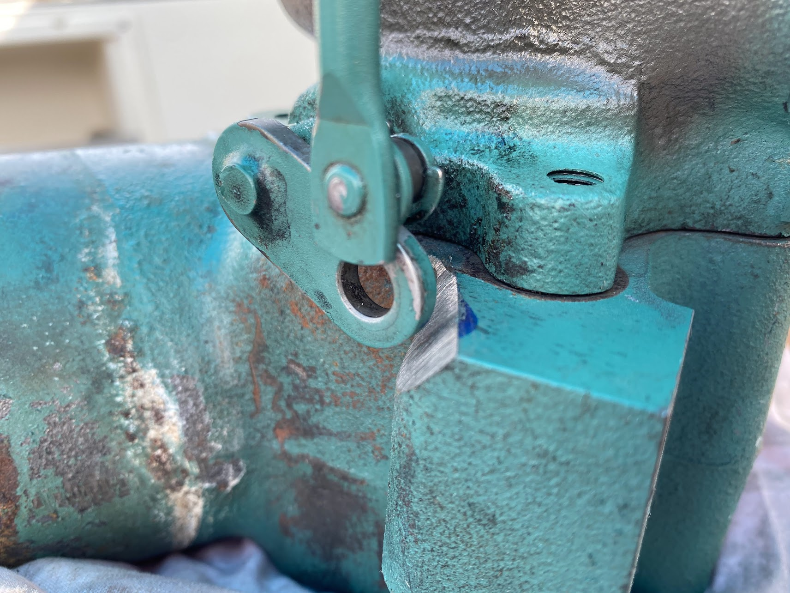

Ombord Freya tycker vi inte om att använda motorn mer än nödvändigt hon är ju trots allt en segelbåt och sådana ska seglas men ibland får man inte som man vill och då är det skönt att ha en motor som fungerar och som är i ordning.

Motorn i Freya är en nästan ny (några hundra timmar gammal) Volvo Penta D2-75, för er som inte är så bevandrade inom marina motorer så är det en 75 hästars rak, färskvattenkyld, 4 cylindrig motor med insprutning och turbo. D2-75 är en helt okey motor även om jag personligen gärna hade varit utan turbo vilket den här texten kommer handla om.

Det där med att ha en motor som fungerar och är i ordning betyder att järnklumpen kräver både regelbunden tillsyn och service med allt vad det betyder.

Om du är ägare till en Volvo Penta D2-75’a så är det nu det intressanta börjar och skulle det vara så att du inte äger en båtmotor med turbo och intercooler så är jag säker på att resterande text kommer vara urtrist så varför inte läsa lite om gott bröd här istället >> Kaptenen bakar

Ah, du är fortfarande kvar. Vid tillsynen hittade vi olja på bälgen till S-drevet, det var inte några mängder men det var på tok för mycket för att kunna avskrivas som spill vid service så det var tvunget att komma från motorn på ett eller annat vis.

 | 

Malö 116, båten vi seglar, har ett hyfsat stort motorrum men då D2-75 är en hyfsat stor motor betyder det att så fort något ska göras med motorn är det som att jobba i en byrålåda passande i ett mindre dockhus. Efter att monterat bort luftburken gick det klämma in en arm bakom motorn för att känna efter mer olja och med telefonens kamera knipa några bilder varav nedanstående är en av dem.

Den skarpsynte ser genast spåren av olja på ovansidan av svänghjulskåpan vilket i sann Sherlock Holmes andra betyder att det är något längre upp som läcker olja. På just Volvo Penta D2-75 sitter turbo och intercooler på baksidan av motorn, strax över svänghjulskåpan…

Då jag inte hade en blekaste aning om hur de tidigare ägarna kört motorn samtidigt som jag var ganska säker på att de förlitat sig helt och håller på auktoriserade Volvo Penta verkstäder (de hade ju fortfarande garanti på motorn) med allt var det betyder kunde jag inte vara säker på att turbo och avgasknä (där avgaserna blandas med kylvatten) inte var igensatt med koks från att gått på för låga varv så det blev kort och gott till att demontera kalaset då varken turbons eller avgasknäts insida ingår i den auktoriserade servicen. Tur nog satt det hela bara med en handfull bultar så svordomarna blev inte så många som väntat.

Turbon såg inte så illa ut, det enda var dumpventilen som gick lite väl trögt pga sotet. Efter en snabb rengöring så såg den både ut och fungerade som när den var ny.

**OBS! Om du som läser det här funderar på att rengöra din turbo var lika försiktig med turbons fläktblad som du skulle vara om du byggde korthus eller desarmerade en bomb. De är känsliga med massor av precision (de snurrar mellan 60000 och 300000 varv per minut beroende på motor) vilket gör den dyr!!**

Värre var det med avgasknät, den var igenmurad av koks och elände vilket är ganska vanligt på den här modellen av avgasknä då inloppet till kylvattnet kommer lite för tidigt så att avgaserna kyls ner för effektivt vilket i sin tur skapar lite oreda och service behov. Det finns “kopior” i rostfritt där den som designat knät tänkt till som inte slår igen på något år och att de är rostfria får man på köpet. 🙂

På bilden ovan har en del av koksen redan pillats bort.

Aningens förbryllande då varken sotet i turbon eller den något igensatta knät kunde vara orsak till oljan så det enda som återstod att kontrollera var intercoolern som sitter mellan turbo och motorn.

Vi närmar oss nu problemet och för att förstå varför saker ser ut som det gör behöver vi känna till lite om hur en turbo och en intercooler fungerar.

Turbon har som primär uppgift att trycka in mer syre i motorn än vad den klara av att suga i sig på egen hand, dvs turbon komprimerar luft (ökar dess densitet) så att mer syre kommer in och kan förbrännas i motorn. Detta är såklart bra för motorn prestanda men vad som inte är så bra är att turbon även tillför massa värme till luften/syret som ska förbrännas både för att den är hiskligt varm i sig själv (turbo drivs av motorns avgaser) och på grund av att när luft komprimeras rör sig molekylerna snabbare vilket i sin tur ökar temperaturen (kompressionsvärme) och värme gör att luften expanderar vilket är lite kontra produktivt i det hela. För att stilla den inre nörden så är energin som frigörs lika stor som energin som går åt till att komprimera luften.

Så för att lösa det hela med för varm luft stoppar tillverkarna in en intercooler vars uppgift är att kyla ner den av turbon komprimerade luften för att öka dess densitet, vilket i sin tur gör att mer syre kan pressas in motorn per cykel i förbränningen. Det i sin tur gör att motorn blir effektivare och kan leverera mer mer effekt (hästkrafter).

Problemet med att öka densiteten på vanlig luft är att den alltid innehåller en del fukt och den fukten komma bilda kondens på kylflänsarna i intercoolern och för att bli av med kondensen har Volvo, eller vem det nu är som designat intercoolern, helt enkelt valt att borra ett litet hål i botten av intercoolern och låta kondensen droppa ner och helt enkelt blåsas ut från motorn av turbons tyck.

I det stora hela är det en smart och enkel lösning **MEN** det är inte bara luft som kommer in i intercoolern utan även en liten liten mängd olja som sugs/tryck ut från turbons små lager. Den oljan hamnar precis som kondensen i botten på intercoolern men istället för att blåsas ut och avdunsta i motorrummet så rinner den sakta ner längs baksidan på motorn och skitar ner allt i sin väg.

Det är nu man ställer sig frågan; “Hur svårt och dyrt skulle det vara för Volvo att koppla på en liten slang och leda olja till ett kärl istället för att trycka ut den i motorrummet?”

Eftersom du läst såhär långt anar jag att du är lite intresserad av en lösning och den kommer i form av en 19,90kr bollpumpsnål från >> [Biltema](https://www.biltema.se/fritid/sport/fotboll/fotbollar/nalar-till-bollpump-2000034188) eller liknande varuhus.

Såga av nålen så att den inte sticker ut på insidan av intercoolern, fäst den med lämpligt klet (silikon, packningsmassa eller något annat som tål värme och tätar), koppla på en slang och dra den till en flaska som monteras där du lätt kommer åt. Jag drog slangen till framsidan av motorn så ser jag flaskan var gång jag öppnar till motorn.

Lite drygt 150 timmar senare har flaskan samlat upp i runda slängar 1 dl olja som annars skulle hamnat i motorrummet. Det enda tråkiga är att det är mer eller mindre omöjligt att montera nålen och slangen utan att demontera intercoolern men det positiva är att det inte krävs några speciella verktyg och att det bara tar en halv dag (inklusive fika) att göra det.

I det stora hela är D2-75 en finfin motor om den hanteras som det är tänk, den är inte tänkt att gå på låga varv i dagar i sträck den ska inte heller användas för att ladda batterier på tomgång mer än nödvändigt. Det går såklart men se till att bränna ur den ordentligt relativt regelbundet, vi gör det mer eller mindre var gång vi använder motorn. Med bränna ur menar jag massor av varv (max eller nära på) i 10-15 minuter beroende på hur länge vi kört och på vilket varvtal.

**Bonus 1!**

Enligt manualen (sidan 52, den har du läst eller hur?!) så ska turbons dumpventil motioneras en aning när motorn inte används på länge. Det gör man genom att vrida den fram och tillbaks max 15 grader med med en fast nyckel. Problemet här är att den som designade avgaskröken inte pratat med den som designade turbon så på avgaskröken sitter där en liten klack som hindrar dumpventilen från att öppna mer än några grader. Så när du ändå har avgaskröken borta kan du lika gärna passa på och slipa ner den där klacken lite så att dumpventilen går att motionera enligt manualen.

**Bonus 2:**

Om du som läser den här texten skulle råka vara ägare till en D2-75’a så kan det vara bra att känna till att motorn är mer eller mindre en vanlig Perkins 404 och den i sin tur är en Shibaura N844L, de 2 sistnämnda används flitigt i traktorer. Nu passar såklart alla delar inte då D2-75’an har konverterats till marint bruk när det kommer till kylsystemet men oljefilter, turbo och många andra delar är exakt samma som “Volvo original” vilket betyder att det finns ganska mycket pengar att spara på att använda originaldelarna från Perkins eller Shibaura istället för de som Volvo slängt på sin logo och höjt priset på med 500%.

----

Volvo, Volvo, dear “oil-leaking” Volvo!
On board Freya, we don’t like to use the engine more than necessary. After all, she is a sailboat, and such boats are meant to be sailed. But sometimes we don’t get what we want, and then it’s nice to have a functioning engine that is in good condition.

The engine in Freya is nearly new (a few hundred hours old) Volvo Penta D2-75. For those who are not well-versed in marine engines, it is a 75-horsepower, straight, freshwater-cooled, 4-cylinder engine with injection and turbo. The D2-75 is a decent engine, although personally, I would have preferred it without a turbo, which is the topic of this text.

Having a functioning and well-maintained engine means that the iron lump requires regular inspection and service, with all that it entails.

If you are the owner of a Volvo Penta D2-75, this is where it gets interesting. And if you don’t own a boat engine with a turbo and an intercooler, I’m sure the rest of the text will be extremely boring. So why not read about good bread here instead >> Captain Bakes.

Ah, you’re still here. During the inspection, we found oil on the bellows of the stern drive. It wasn’t a large amount, but it was far too much to be dismissed as spillage during service, so it had to come from the engine in one way or another.

 | 

Malö 116, the boat we sail, has a fairly large engine room, but since the D2-75 is a fairly large engine, it means that whenever something needs to be done with the engine, it feels like working in a drawer fitting in a smaller dollhouse. After removing the air filter housing, I managed to squeeze my arm behind the engine to check for more oil and took a few pictures with the phone’s camera, one of which is shown below.

The keen-eyed immediately spots the traces of oil on the top of the flywheel housing, which, in true Sherlock Holmes fashion, means that there is a leak higher up. On the Volvo Penta D2-75 specifically, the turbo and intercooler are located at the back of the engine, just above the flywheel housing…

Since I had no clue about how the previous owners had driven the engine, while being fairly certain that they relied entirely on authorized Volvo Penta workshops (after all, they still had a warranty on the engine), I couldn’t be sure that the turbo and exhaust manifold weren’t clogged with carbon deposits from running at too low RPMs. So, in short, it came down to dismantling it. Fortunately, it was held together with just a handful of bolts, so the curses weren’t as numerous as expected.

The turbo didn’t look too bad, the only issue was the waste gate, which was a bit sluggish due to the soot. After a quick cleaning, it looked like new.

NOTE! If you are planning to clean your turbo, be as careful with the blades of turbofan as you would be if you were building a house of cards or disarming a bomb. They are delicate and expensive!

The exhaust manifold was worse; it was clogged with carbon buildup, which is quite common in this model of exhaust manifold because the coolant inlet comes a little too early, causing the exhaust gases to cool down too efficiently, resulting in some disorder and the need for servicing. There are “copies” available in stainless steel where the designer of the manifold has thought ahead, ensuring they won’t clog for years, and the fact that they are stainless steel is an added benefit. 🙂

In the picture above, a some of the carbon buildup has already been removed.

Slightly perplexing since neither the soot in the turbo nor the somewhat clogged exhaust pipe could be the cause of the oil, so the only thing left to check was the intercooler located between the turbo and the engine.

We are now getting closer to the problem, and in order to understand why things look the way they do, we need to know a little about how a turbo and an intercooler work.

The primary task of the turbo is to force more air into the engine than it can naturally intake on its own. In other words, the turbo compresses the air (increases its density) so that more oxygen enters and can be burned in the engine. This is, of course, beneficial for the engine’s performance. However, what is not so good is that the turbo also adds a lot of heat to the air/oxygen that will be burned, both because it is extremely hot itself (the turbo is driven by the engine’s exhaust gases) and because when air is compressed, the molecules move faster, which in turn increases the temperature (heat of compression). To satisfy the inner nerd, the energy released is equal to the energy required to compress the air.

The intercooler’s task is to cool down the air that has been compressed by the turbo in order to increase its density, which in turn allows more oxygen to be squeezed into the engine per combustion cycle. This, in turn, makes the engine more efficient and capable of delivering more power (horsepower).

The problem with increasing the density of regular air is that it always contains some moisture and that moisture can form condensation on the fins of the intercooler. To get rid of the condensation, Volvo, or whoever designed the intercooler, simply chose to drill a small hole in the bottom of the intercooler and let the condensation drip down and be blown out of the engine by the turbo’s force.

Overall, it’s a smart and simple solution, BUT it’s not just air that enters the intercooler, there’s also a small amount of oil that is sucked/pressed from the small bearings in the turbo. That oil ends up, just like the condensation, at the bottom of the intercooler, but instead of evaporating after being blown out in the engine compartment, it slowly drips down the back of the engine, making a mess of everything in its way.

So the question is; ‘How difficult and expensive would it be for Volvo to connect a small hose and direct the oil into a container instead of pushing it out into the engine compartment?’

Since you’ve read this far, I suspect you’re somewhat interested in a solution, and it comes in the form of a 19.90 SEK ball pump needle from >> [Biltema](https://www.biltema.se/fritid/sport/fotboll/fotbollar/nalar-till-bollpump-2000034188) or a similar department store.

Cut off the needle so that it doesn’t stick out on the inside of the intercooler, secure it with a suitable adhesive (silicone, gasket compound, or something else that can withstand heat and seal), attach a hose, and run it to a bottle that is mounted where you can easily access it. I ran the hose to the front of the engine so that I see the bottle every time I open the engine cover.

About 150 hours later, the bottle collected roughly 1 dl of oil that would otherwise have ended up in the engine compartment. The only downside is that it’s more or less impossible to install the needle and hose without disassembling the intercooler. However, the positive side is that no special tools are required, and it only takes half a day (including breaks) to do it.

All in all, the D2-75 is a great engine if handled as intended. It’s not meant to run at low speeds for days on end, nor should it be used to charge batteries at idle more than necessary. Of course, it’s possible, but make sure to properly burn it out relatively regularly. We do it almost every time we use the engine. By burning it out, I mean revving it up (close to the maximum) for 10-15 minutes, depending on how long we’ve been running and at what RPM.

**Bonus 1!**

According to the manual (page 52, you have read it haven’t you?), the turbo’s dump valve should be exercised a bit when the engine is not used for a long time. This is done by turning it back and forth a maximum of 15 degrees using a wrench. The problem here is that the person who designed the exhaust manifold didn’t talk to the person who designed the turbo, so there’s a small tab on the exhaust manifold that prevents the blow-off valve from opening more than a few degrees. So while you have the exhaust manifold off, you might as well take the opportunity to file down that tab a bit, allowing the blow-off valve to be exercised according to the manual.

**Bonus 2:**

If you happen to be the owner of a D2-75, it may be good to know that the engine is more or less a regular Perkins 404, which in turn is a Shibaura N844L. The last two mentioned engines are commonly used in tractors. Of course, not all parts fit perfectly since the D2-75 has been converted for marine use when it comes to the cooling system. However, the oil filter, turbo, and many other parts are exactly the same as “Volvo original,” which means that there is quite a lot of money to save by using the original parts from Perkins or Shibaura instead of those Volvo branded and priced with a 500% markup.

