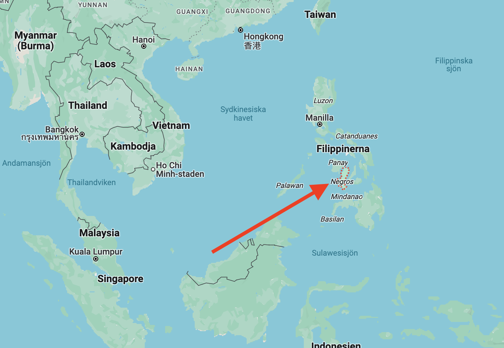
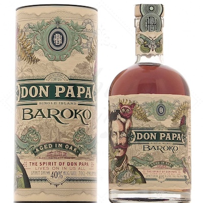

---
categories:
  - Segling
title: Vår nya favoritrom
tags:
  - mat
  - dryck
image: don-papa-baroko.jpg
created: 2023-12-31T12:27:00
updated: 2024-05-03T10:55
published: true
---

Fick smaka en ny rom* hos grannbåten, Don Papa Baroko. Lite otippat hörde den hemma på ön Negros på Filippinerna. Då ön mer eller mindre skapades av en vulkan en gång i tiden så är sockerrören rommen är gjord av extra söta.

Rommen* som är lagrad i 3 år är söt med massor av smak av vanilj, honung, citrus och torkade frukter och massa kryddor. Nästan lite söt efterrätt över det hela. 

Den skarpsynta har säkert noterat den lilla asterisken bakom *Rom* ovan, den är där för att en tjänsteman vid EU-parlamentet vid något tillfälle inte tyckte att en rom får ha mer än 20 gram tillsatt socker i EU. Det gjorde att Don Papa fick göra en liten rockad i sitt sortiment så den tidigare rommen Don Papa fick byta namn till Don Papa Barocko samtidigt som den klassades om till "lagrad sockerrörssprit" för att göra alla glada. Sockerhalten ligger fortfarande på 30 gram/liter och den tidigare och alla är glada.

Men mest glada är vi för vi har hittat en ny favorit oavsett vad den kallas.

Flaskan hittar man i Sverige på [Systembolaget](https://www.systembolaget.se/produkt/sprit/don-papa-5319301/) där den inte är vidare dyr (strax över 400kr), utanför Sverige beställs den via Amazon för €33kr. 

