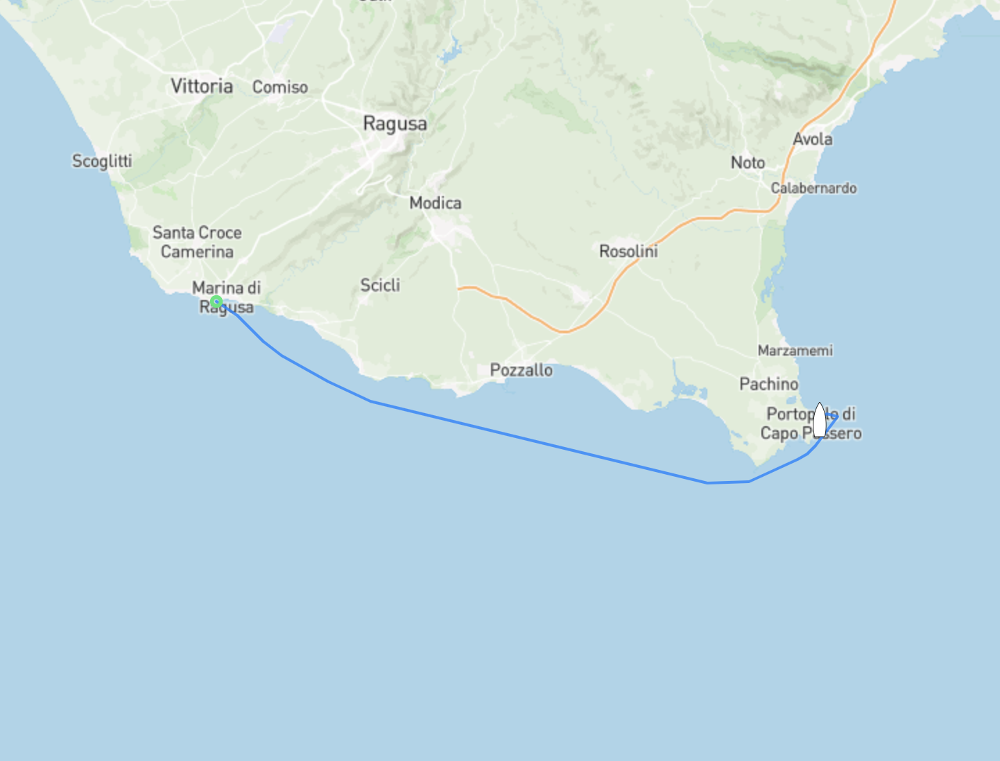

Säsongen 2024 börjar bra...
Efter att vi hissat vårt nya storsegel så märkte vi att något var galet, den genomgående vajern som håller rullprofilen på plats har lossnat. Det betyder att vi behöver plocka ner och laga profilen som seglet rullas kring innan vi kan använda vårt nya segel, tur att vi har en masthead riggad båt som seglar fint med bara genuan, vårt försegel. 

Med lite tur kan vi lösa det hela utan att lyfta av masten. Vi börjar med att lämna Marina di Ragusa för att inte riskera bli kvar när vintersäsongen tar slut och de börjar ta betalt per dag för oss. Nu ställer vi siktet på ankringsviken i Siracusa för att ta ner segel och undersöka skadan närmre.

Även om det inte är så långt till Siracusa tar vi det hela i två steg, ett litet kort skutt runt hörnan där vi provar att ligga för ankar en natt.

Ja just det #1, en av våra stora vinschar kastade in handsken dagen innan vi skulle kasta loss. Säkert den tröstlösa ökensanden som blåst upp från Sahara hela vintern. Det tog bara tre timmar att fixa, tur att Mia är inkörd på att vinschservice.

Ja just det #2, [Moon](/moon/) gillade såklart inte första turen. Han blev sjösjuk för första gången i sitt liv och kräktes som sig bör och efter det låg och tjurade tills vi kom fram. 

Idag blev det 34nm till Portopalo di Capo Passero, imorgon smiter vi till Syracusa och med lite tur blåser det med så att vi kan segla lite.

