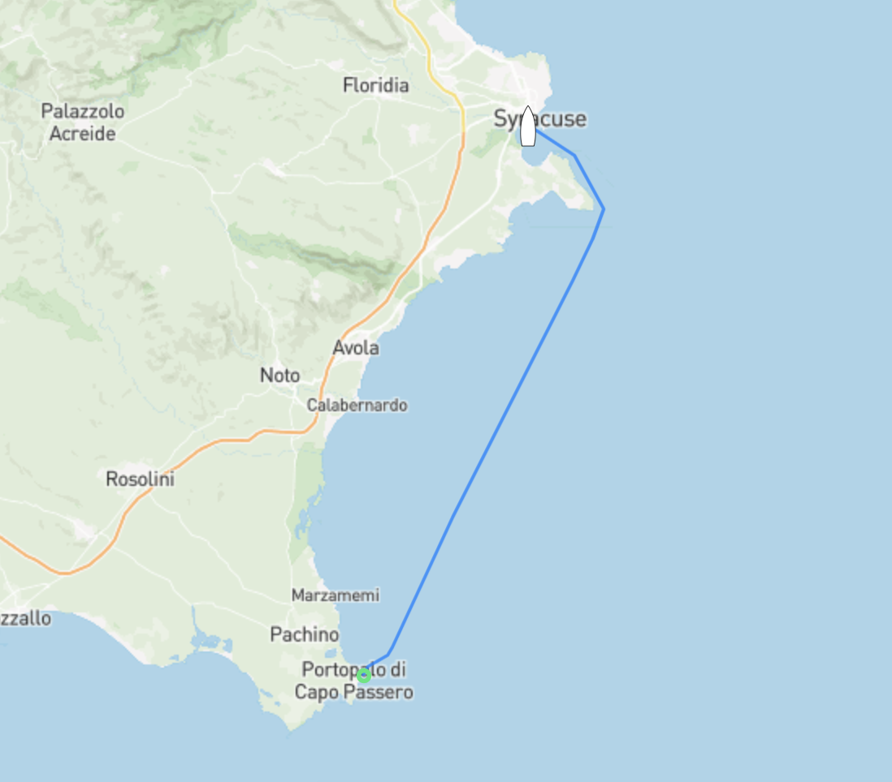

Första natten på ankar gick betydligt bättre än de senaste dagarna, lugnt, stilla och hur skönt som helst. Skönt att något fungerade första dagen. Efter att väntat in vinden som kom fram mot lunch kunde vi sätta segel och ta oss mot Siracusa. Skön slör de första timmarna tills vinden mojnade lagom tills vi hade ett par timmar kvar, tur att motorn var nyservad och pigg. Som vanligt kom vinden tillbaks lagom tills vi skulle ankra. Det har aldrig hänt förut...

Imorgon tar vi ner storseglet och försöker lista ut vad som gått galet på riktigt. Mer om det lite längre fram.

