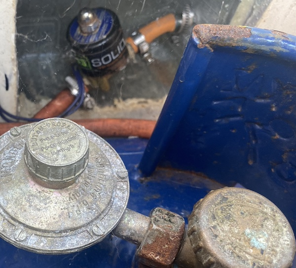

Det där med gas kan vara lite lurigt om man inte håller koll. Vi seglar som tidigare nämt en Malö 116 från 1984 (40 år gammal båt), vi har ett separat gasförråd i aktern med dränering i botten om flaskan skulle läcka och dragna kopparrör från lådan till spisen precis som många andra båtar. I det hela en helt vanlig standardlösning som hittas på drösvis med båtar, tills man tittar lite närmre på det hela, skrapar lite på ytan och tar sig en funderare på hur det verkligen ser ut.

När vi tittar närmre på Freya så har hon ett separat förvaringsutrymme stort nog för P11 flaskor i sittbrunnen, det dräneras överbord som sig bör med en slang som löper ut en bit över vattenytan, i vissa länder ska den slangen vara 1" (ca 2,5cm i diameter) eller större i Sverige är det 19mm i innermått, dränering minst 75mm över vattenlinjen och minst 50 cm från något luftintag som gäller. På Freya uppfylls 2 av kraven då vi ännu inte bytt genomföringen till en större då vår från 1984 bara är strax över 10mm. Med lite sunt förnuft känns det som ett mindre problem då hålet räcker gott och väl att dränera ut ev gas som skulle kunna läcka från flaskan om övertrycksventilen skulle lösa ut pga värmen[^1] där vi håller hus. Skulle det läcka så pass mycket så att det inte räcker med ett 10mm hål så kommer överflödet ut i sittbrunnen där självlänsarna på 2x2" tar vid om vi inte skulle känna doften. Näst vi ställer damen på land kommer genomföringen i vilket fall bytas men fram tills dess får den nuvarande installationen duga.

Så långt ser det helt ok ut om man har någon form av grundkunskaper i att värdera risker så gaspaniken får stilla sig ett par rader till...

Det var dock lite värre med den inplastade kopparledningen som förutom att den gick ut genom **botten** på gaslådan genom en halvtaskigt silicontätad genomföring var inplastad längs med skrovet hela vägen fram till pentryt, det gjorde den helt sonika omöjlig att kontrollera för korrosion. Nu kan vi slå på paniken i läge 3 på skalan 1-5 där 5 är på gränsen till full psykos.

Självklart beslutade vi oss för att byta röret vilket visade sig var i grevens tid då det räckte med ett kort litet ryck i röret för att det skulle brista och gå helt av, än en gång 40år sätter sina spår på saker och ting.

Det hela slutade med att botten av lådan fick en ny botten av 5mm Corian som vi hade liggandes, skivan tätades med epoxispackel. På så vis fick vi en ny större avrinning i lådan och kunde flytta utloppet för gasledningen till lådans övre kant där den är skyddad samtidigt som ett fack för solenoiden (mer om den här --> [2022-02-06-weekend-project-gas-solenoid-timer](Yachting/blog/2022-02-06-weekend-project-gas-solenoid-timer/2022-02-06-weekend-project-gas-solenoid-timer.md) ) byggdes med hjälp av en fruktlåda och lite glasfiber.

*Skulle man vara petig hade det nog varit mer estetiskt korrekt att montera solenoiden i ett fäste men då skulle slangen bli betydligt besvärligare att komma åt då vi behöver byta slang samtidigt som vi byter regulator när vår reservgasflaska behöver användas lite då och då. Det kan vara en historia för sig så för tillfället har vi tagit ett aktivt beslut att monteringen är som den är och att det finns viktigare saker att fokusera på.* 

Gasledningen drog sedan öppet och väl synlig strax under rufftaket i akterkojen för att avslutas med en fysisk avstängningskran som kan användas i reserv om något skulle gå galet med solenoiden.

Vi valde att montera den fysiska kranen i akterkojen precis bakom skottet vid spisen så att vi inte behöver krypa längs durken vid en ev brinnande spis för att stänga av gasen. När dörren till akterkojen öppnas blockerar den spisen och skyddar den som ska stänga gasen från ev lågor. Vi passade även på att montera en aluminium skiva mot skottet på spissidan, skivan fyller tre funktioner:

- Den täcker ett fult hål i skottet 
- Den är brandsäker
- Den gör det lätt att rengöra stänk från matlagningen

Då tidigare ägare hade 2 gasvärmare installerade i båten passade vi även på att kasta ut alla gamla gasledningar och kranar som även de var monterade på slingan som var kopplad till vårt pentry. Kranarna till de avklippta rören var bara stängda så det var verkligen hög tid att rensa ut det hela.

Så här med facit i hand borde det hela gjorts betydligt tidigare med tanke på statusen på röret som brast när vi ryckte lite i det, de gamla kopplingarna tätade fint och var märkta men det är ren galenskap att ha en sådan installation kvar så länge som den förmodligen suttit där.

Systemet ser numera ut enligt följande med några mindre justeringar som står på agendan att åtgärda när tillfället ges.

