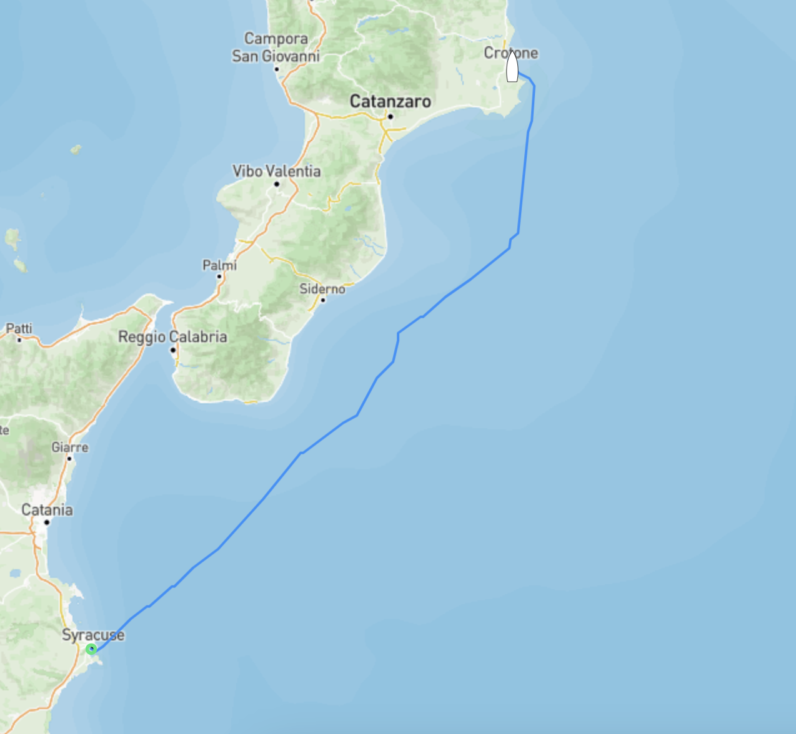
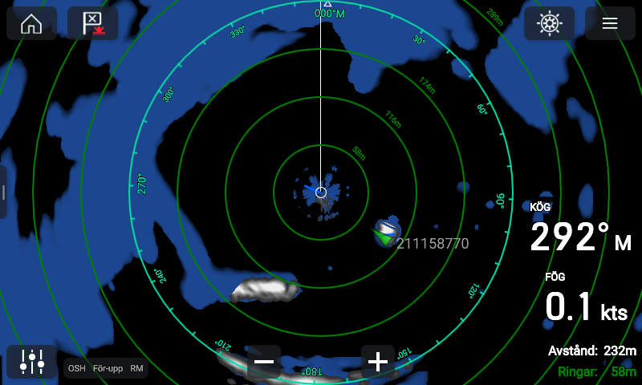
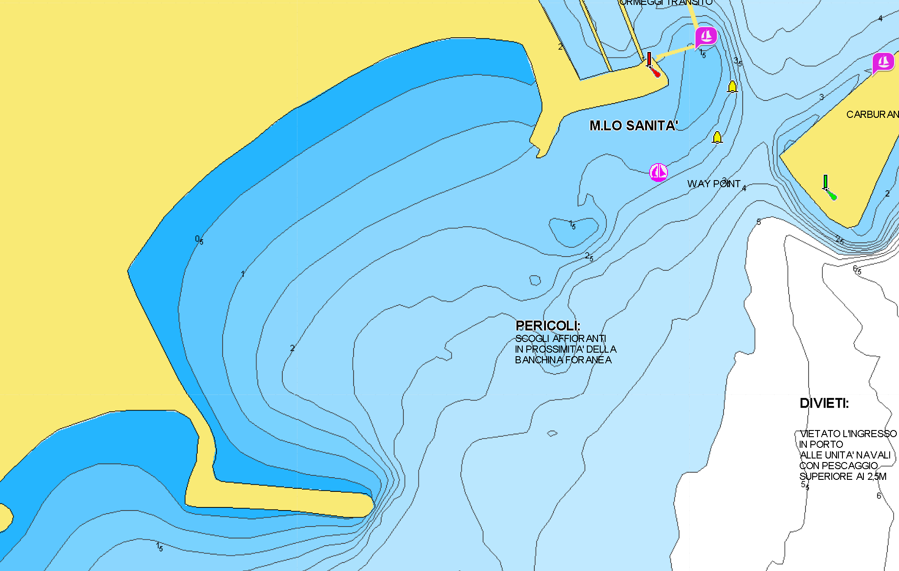

Efter mer eller mindre en vecka i Siracusa kom det efterlängtade väderfönstret vi väntat på, nästan 4 dagar med lagom av vind från syd. Vår plan var att åka med vädret hela vägen till Brindisi strax norr om Italiens "klack".

Självklart blev det inte så då vinden valde att kasta in handsken efter ett och ett halvt dygn i höjd med Crotone där vi valde att stanna. Nu var det inte hela världen då varken Freya eller matroserna riktigt har fått ordning på sina rutiner och sjöben.

Förutom att vara en helt vanlig Italiensk stad har Crotone ett ganska unikt varv, i alla fall för att vara här i Italien, där man som båtägare får arbeta på sin egen båt när den väl ligger på land. Antingen är det så att det finns en regel som varvet i Crotone inte bryr sig om eller så har mer eller mindre samtliga varv (alla som vi känner till) i Italien gått bildat någon form av kartell där de endast tillåter sin egna personal att arbeta på båtar. Just idag spelar det inte oss någon större roll men vi passade såklart på att smita förbi varvet och kika in då vi förr eller senare behöver lyfta Freya.

Vår plan var att ankra strax söder om marinan och krypa så nära land vi bara vågar för att komma undan den nord/nordostliga vinden och vågorna som ska komma de närmsta dagarna tillsammans med både regn och åska. När vi närmade oss låg det såklart redan en båt på "vår" utsedda plats och i mörkret är det alltid lite extra spännande att bedöma avstånd.

Det är bland annat vid sådana här tillfällen som radarn kommer till sin rätt. På bilden nedan ser man tydligt vågbrytaren strax söder om oss och den gröna blippen som är båten som "stal" vår plats strax utanför oss. Med hjälp av radarn var det en barnlek att smyga in och lägga oss 150 m från stranden (170 om vi ska vara petiga) med lagom svängrum åt alla håll.

Ekolodet skvallrade om att det var 2,5 meter djupt där vi ankrade och strax över 2,1 meter där det var som grundast om vi skulle vända aktern in mot stranden, hela 25 cm tillgodo! :)

Sjökortet över samma plats

När vi utsövda och på glatt humör dagen efter tittade närmre på det kommande vädret tog vi en runda in till marinan och prutade oss till en billig plats då vi inte alls var sugna på att ligga och rulla på ankringen de kommande dagarna då dyningar och vågor skulle smyga runt udden oavsett hur långt in mot stranden vi skulle ta oss. 30€ per natt var en billig peng för att få sova gott ett par nätter.