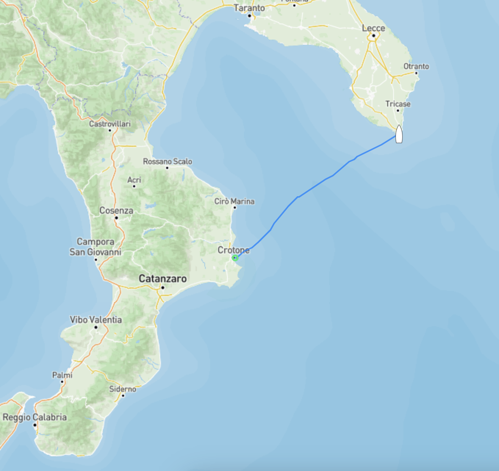
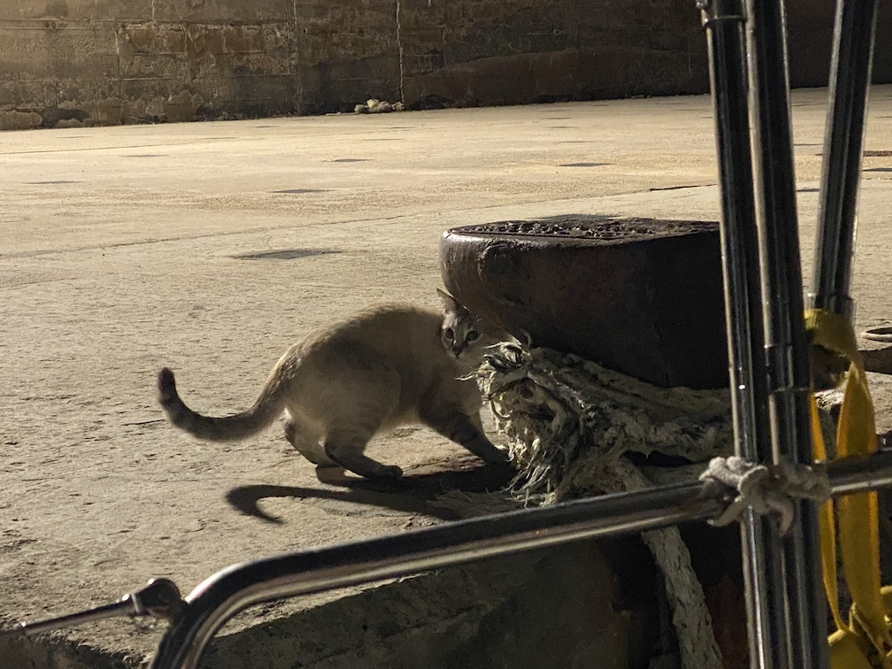

Efter att ha spenderat några dagar i [Crotone](../../../2024/05/07/Crotone-istallet-for-Brindisi.html) för att vänta ut "rätt" väder beslutade vi oss för att segla norrut då det var det minst dåliga av våra alternativ. Antingen ligga kvar och riskera att fastna då en lite för frisk Sirocco var på väg eller ta sikte norrut mot Santa Maria Di Lueca med hjälp av den för tillfället NW vinden.

*Siroccon är en afrikansk sydlig vind i den här delen av Medelhavet som iofs kan vara praktisk att använda när man ska norrut men den kan blåsa på ganska duktigt vilket i sig kan vara lite besvärligt.*

Efter en 16 timmar låååång (72Nm/133km) kryssbog med 10-15m/s vind hittade vi fram till stadskajen i Santa Maria Di Leuca där vi förtöjde långsides bland flyktingbåtar och några andra lång & längeseglare. Självklart gillade Moon miljöombytet då han bara vågar sig iland när vi ligger långsides. Till en början höll han sig nära båten precis som han brukar då han inte var så tuff men allt eftersom tiden (och dagarna) gick vågade han sig längre och längre bort i skydd av mörkret. Utan att överdriva märktes det tydligt att han var ute och rände hela nätterna då han var helt utslagen om dagarna. Roligt att se att han får vara "vanlig" katt ibland och inte bara jaga flugor och mygg ombord.

Det där med flyktingbåtar som jag nämnde ovan är tråkigt nog en ganska vanlig syn i den här delen av Medelhavet. Det är stulna båtar, vanligtvis "plastic fantasic" båtar av typen Bavaria och andra liknande massproduktionsbåtar runt 45fot. De fylls till bredden med folk (en 46fots/14m Bavaria fick vi veta hade haft närmare 45 personer ombord) som vill fly norrut från Afrika, båtarna seglas eller motoreras sedan till Grekland eller Italien där skepparen sedan överger båten en bit från land och låter folket ombord ta sig iland bäst de kan. Ibland ropar de först ett Mayday för att myndigheterna i landet de är på väg mot ska komma ut och rädda folket ombord, myndigheterna är såklart inte vidare imponerade av att hjälpa dem så i regel fiskas människorna upp av andra länders SAR (Search And Rescue) båtar i området. Båtarna lämpas sedan av vid stadskajer lite varstans där de sedan blir liggande tills de skrotas. Självklart plundras båtarna på allt av värde antingen av andra båtar eller den lokala skeppshandeln (som självklart aldrig skulle erkänna det men som samtidigt säljer extremt billiga prylar av märket Bavaria...).