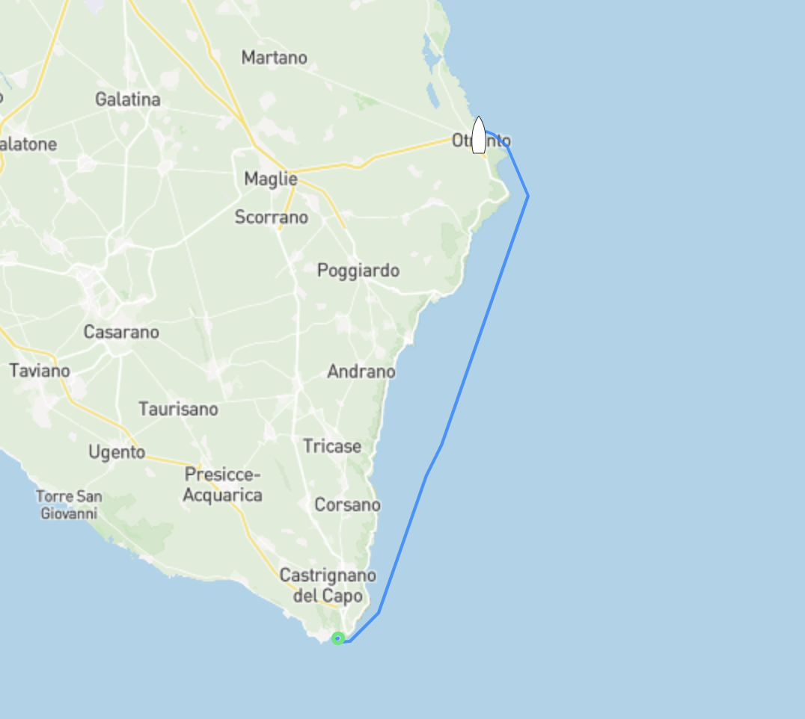

Vår initiala plan om att ta oss till Brindisi börjar så sakta ändras tillsammans med väderprognoserna som trillar in några gånger per dag. Som det ser ut nu ska skulle vi utan några problem kunna ta oss till Brindisi som ligger ett par dagars segling norrut längs den italienska östkusten men sen verkar det som att vi kommer bli fast där då den sydliga vinden kommer ta slut om någon veckas tid. Vår plan är nu att fortsätta norrut med ett kort hopp till byn Otrando för att sedan åka med den sydliga vinden rakt norrut direkt till Dubrovnik i Kroatien.

Även om Otranto verkar vara en trevlig liten by valde vi att inte stanna mer än på ankringen utanför då vi hittat en spricka i aluminiumprofilen som håller vårt storsegel på plats. Då vindarna de kommande dagarna är sydliga och vi ska gå rakt norrut passar det oss fint att inte använda storen och bara segla med vår genua (förseglet) då Malön är masthead-riggad. Förenklat betyder det att förseglet är det stora och mer drivande seglet på båten, i vårt fall är förseglet nästan 20m2 större än "storseglet". Extremt logiskt...

Gällande den där sprickan i profilen, vi kommer såklart behöva byta den nedersta delen av profilen men då vi inte är vidare intresserade av att ligga och vänta på att Reckmann ska skicka en ny till oss blir det en Mc Guyver lösning med hjälp av rostfria plåtar ombord som byggs ihop till en extender då sprickan tack och lov är precis vid infästningen av hydralmotorn och profilen. Förmodligen en gamal stressfraktur som börjat växa till sig. Även om det är trist så var det en hisklig tur att det upptäcktes då ett profilbrott skulle resultera i att seglet skulle rullats ut och att vi skulle vara tvungna att plocka ner det den vanliga vägen vilket i sig inte är ett problem men enligt Murphys lag så hade det såklart skett när det  blåst som mest och då hade det inte varit fullt lika simpelt att hantera.

Uppdatering följer.