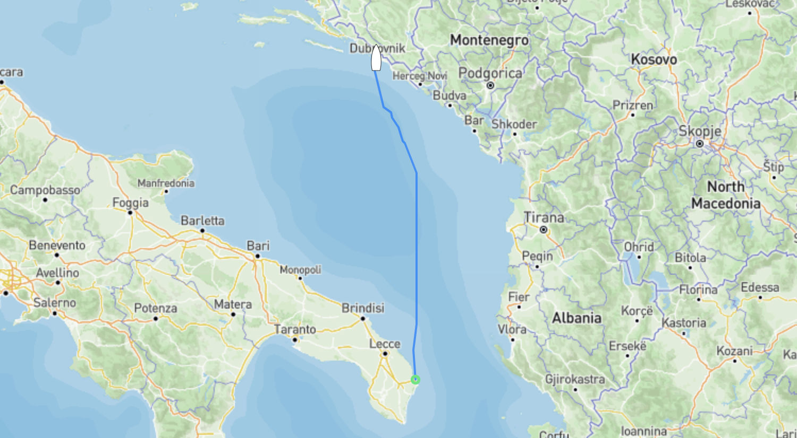

Överseglingen från Italien till Kroatien gick mer eller mindre som väntat. Plattläns med stadig sydlig vind mellan 20 och strax under 40 knop, bortsett från ett f--bannat j--la rullande pga medföljande sjö som haft både lång och god tid på sig att bygga till sig gick det hela som en dans. Vi var glada att vi skapp ha vinden i nosen då det hade varit långt från så "trevligt" som vi hade det.

Freya tågade på fint med Sarah vid rodret. Sarah står för **S**elf **A**djusting **R**eliable **A**utomatic **H**elm och är vår autopilot. Det fina med "henne" är att hon har massa sensorer som mäter allt från hur mycket det lutar, hur branta vågorna är (genom att mäta hur mycket stäven på båten pekar upp eller ner), båtens rotation, rodervinkel, vinden, hastigheten och såklart kursen. Det gör att hon håller spåret extremt väl även i dåligt väder och när vågorna börjar bygga. Det gjorde att vi kunde sitta inne hela resan utom när vi behövde justera segelsättningen (läs reva).

Överfarten som var 158 nm/292 km tog strax under 30 timmar, man får inte ha bråttom när man seglar. :)

När vi lämnade Italien var det sol och vackert väder vilket sakta ändrade sig under natten till åska och ösregn när vi närmade oss den kroatiska sidan. 

Tyvärr kastade kameran in handduken på grund av vädret men det korta klippet nedan ger en liten hint om det väder Kroatien välkomnade oss med. :)

    <video width="480" height="854" controls="controls">
      <source src="rain.mp4" type="video/mp4">
    </video>

När vi väl hittat fram gick det hela lite lättare då Kroatien numera är med i både EU och Schengen gick inklareringen som en dans, det enda vi behövde göra var att svänga förbi hamnkaptenen i Dubrovnik och betala båtskatten för 2024 vilket i Freyas fall landade på 63€ sen var allt klappat och klart. Om du som läser det här råkar vara på väg åt samma håll, tänk på att inte ge dina förtöjningslinor till grabbarna som hjälper dig att lägga till utanför hamnkontoret/polisen, det kostar dig 20€. Vi skötte såklart tilläggningen själva.