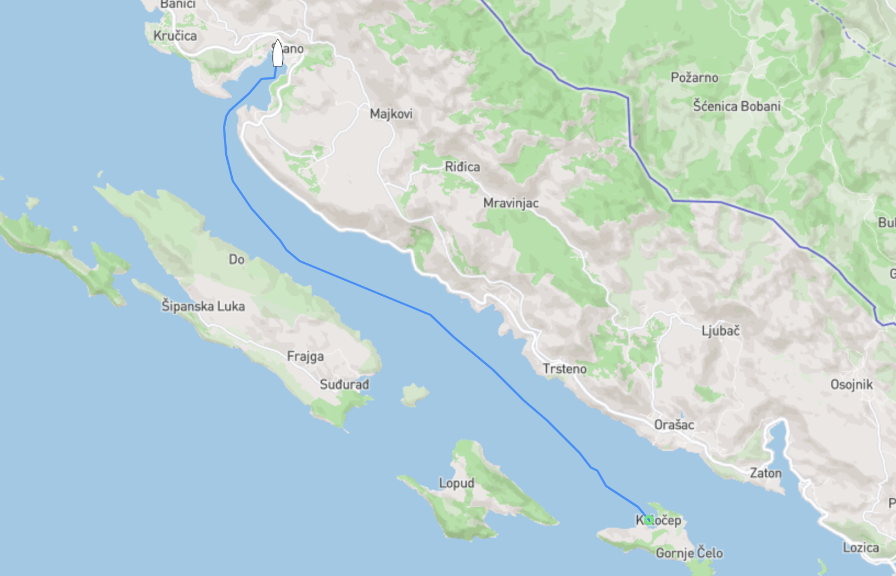
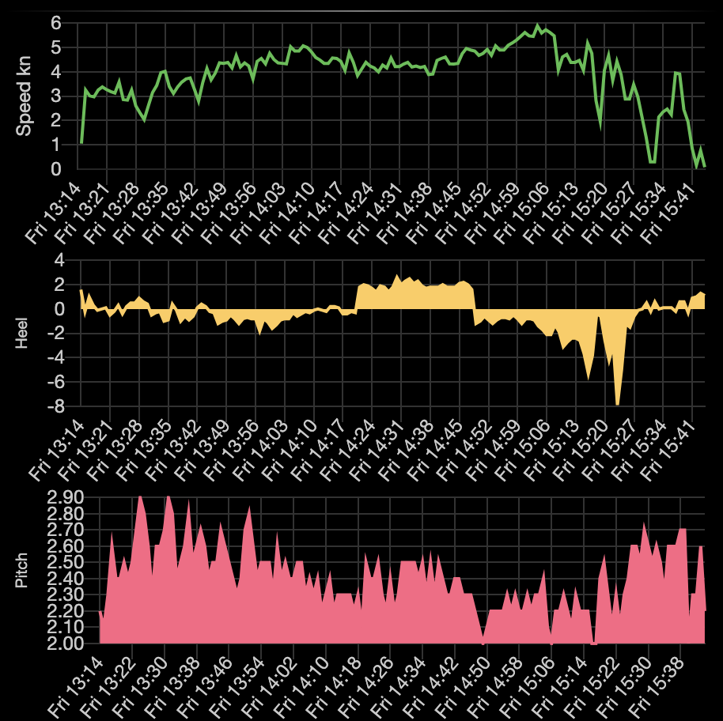

Efter ett par nätter på ankringen strax utanför Dubrovnik (vid byn/ön Kolocep som tydligen uttalas Kolotjep) kände vi att det var läge att ta oss vidare vi ska ju trots allt norrut till Venedig och då kan man ju inte sitta fast hur länge som helst på samma ställe, allra minst om det stället inte är något vidare att sitta fast på. Läs ganska trist ankringsvik med massa turbåtar som kör ut och in dagarna i ända.

Vi satte segel och tog oss med ryslig fart (se nedan) det stora och långa klivet till Slano som låg hela 2 timmar och knappt 10 nm norrut. Slano visade sig vara en typisk kroatisk by, hur vi nu kan veta det efter att ha spenderat hela 2 nätter i Kroatien utan att gå i land? Om antagandet nu stämmer så gillar vi nog Kroatien i alla fall, de få personer vi träffade när vi var i land var trevliga och priserna var inte så farliga som vi tidigare fått höra från andra som varit här. Det är nog som med storfiskaren, lite skarvande här och där för att göra det hela lite mer intressant.

Det vi (läs Tony) gillade bäst i byn var den lokala restaurangen/pizzerian som både hade billig öl, supergod pizza (bättre än Italien), trevlig personal och grymt snabbt wifi. Skulle du råka vakna i Slano en vacker dag se till att svänga förbi Maestral som ligger mitt i "byn", lätt värt ett besök.

Gällande den där rysliga farten jag nämnde tidigare, det är nästan som att åka berg-och-dalbana när det svartnar för ögonen. 🤣

