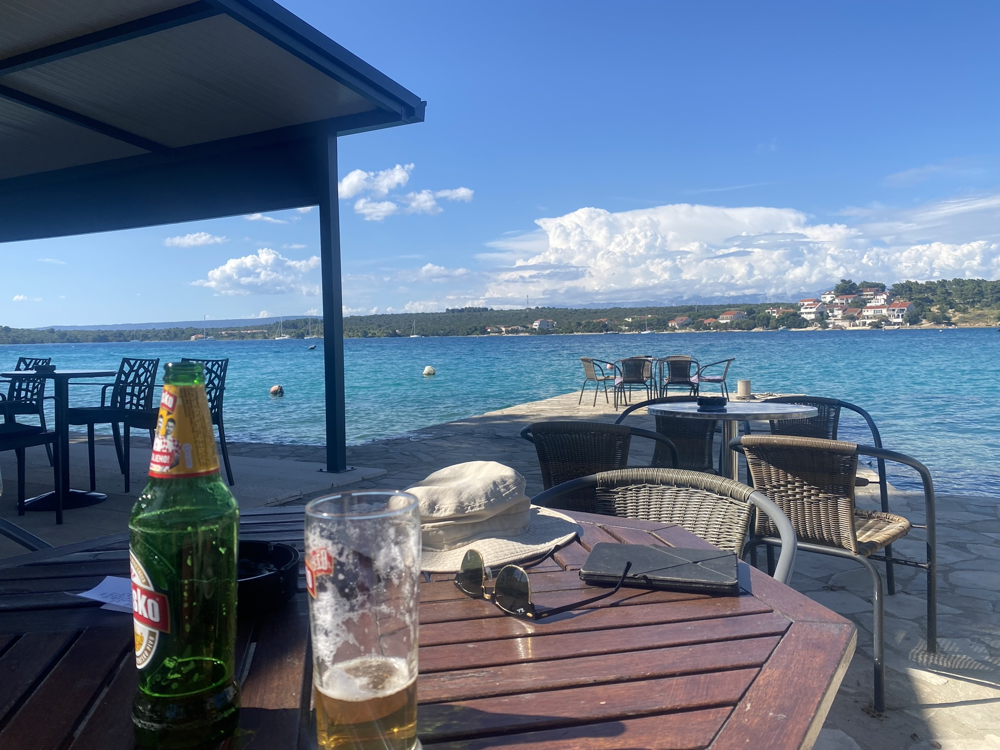
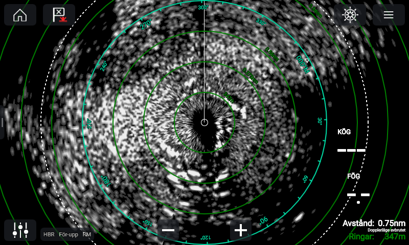
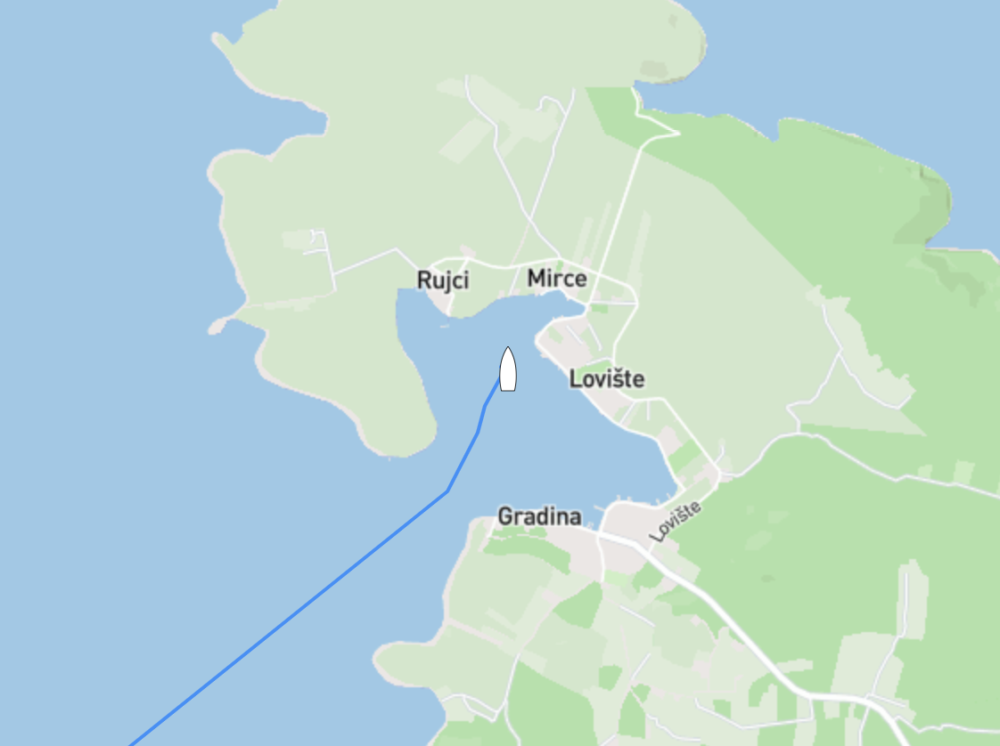

Efter vårt pitstop i Žuljana på vår väg från Slano hittade vi en skyddad vik precis vid byn Lovište, då det både var en säker och trevlig ankring valde vi att stanna några extra dagar då det var lite halvtråkigt väder på ingång samtidigt som vi hade en del projekt att ta hand om.

"Byn" i sig var inte mycket att hurra för, en liten och överprisad matbutik med ett sortiment som skulle få en cuban med ransoneringskort att bli besviken, vad vi däremot hittade längs strandpromenaden var en trevlig restaurang/pub med helt klart humana priser, det blev både en och två öl den eftermiddagen.

Förutom att ge levern träningsvärk passade vi även på att laga ljuddämparen som börjat läcka (igen). Det var iofs ett år sedan sist men dåliga svetsfogar, tunt gods, och saltvatten blandat med avgaser och vibrationer sätter sina spår. Efter en hel drös med svordomar var ljuddämparen både bortplockad, slipad, lagad med kemisk metall och monterad. Kemisk metall är något som jag för övrigt rekommenderar att alla ska ha en burk i skafferiet!

Jag nämnde att vi stannade lite längre då vi hade halvtråkigt väder på ingång. Vi fick både en hel massa vind och ganska rejält med regn en av nätterna. När det är natt och busväder brukar vi ha radarn igång för att se andra båtar vad som händer runt oss då det händer både lite titt som tätt att ankare släpper och båtar börjar dragga när det friskar i.  Bilden ovan är radarskärmen när det öste ner som bäst, i vanliga fall kan man se både land och båtar som vita "blobbar" men just den här natten gick det sådär. I snöröken på bilden döljer sig minst 5 båtar och en en hel del "vik" (bilden nedan) runt oss. Nätter som denna är det skönt att man gjort hemläxan och både ankrat långt från andra båtar med både snubber och massor av kätting ute.

