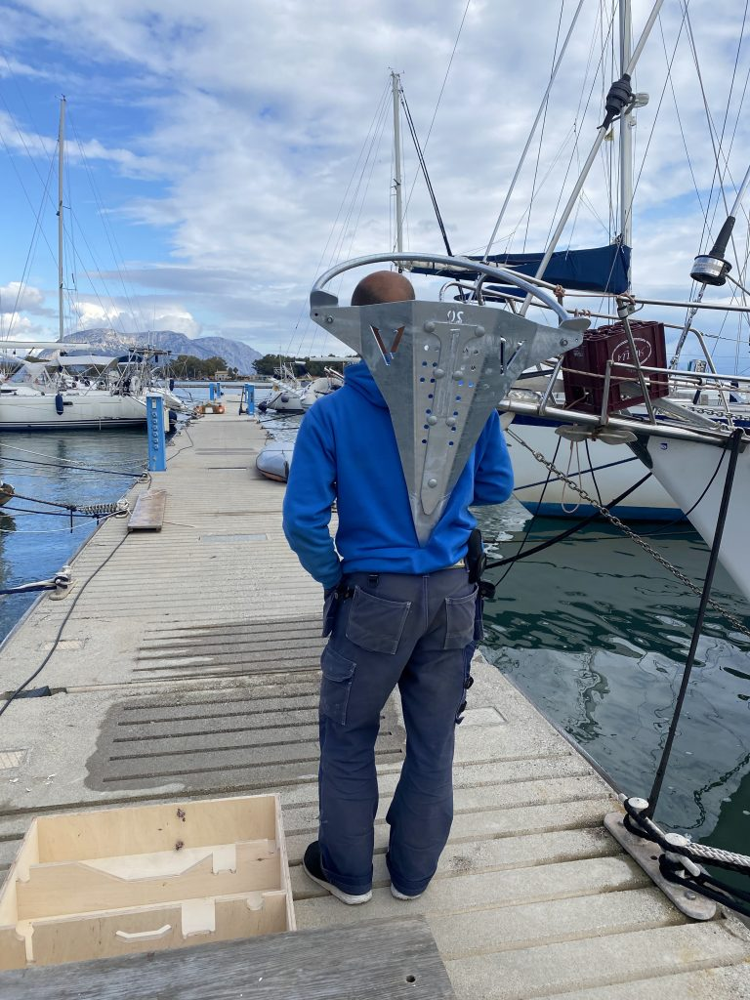
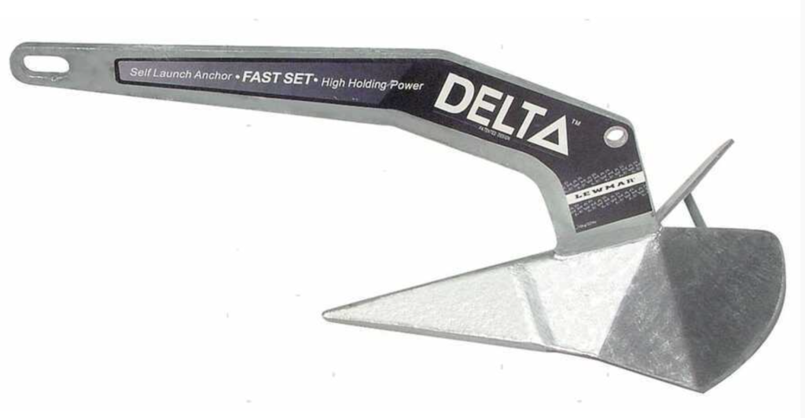

Nämn ordet ankring eller ankare till vilken grupp av båtfolk som helst oavsett om det är motor eller segelbåtar som ligger varmt om hjärtat så tar det inte lång stund innan diskussionen spårar ur då alla har sin extremt fasta övertygelse om vad som är rätt och riktigt när det gäller vad som verkligen får en båt att sitta fast. Personligen brukar jag nicka, humma igenkännande och mer eller mindre hålla med när ämnet tas upp då jag sedan länge tröttnat på diskussionerna. Det är kanske därför jag skriver den här texten, för att få ner mina tankar om hur vi på Freya hanterar det heta ämnet utan att behöva riskera få ett blått öga på kuppen.

Så med det ur världen tar vi oss raskt till ämnet, ankring alá SY Freya.

Till att börja med behöver vi reda ut vad vi anser distinktionen av ankring är och vad syftet med just ankringen är. På Freya ser vi tre orsaker till att ankra, _nödankring_, _kort paus ankring_ och _längre stopp ankring_.

Vi börjar med vad vi anser ankring är och sedan tar vi det hela i alfabetisk ordning (mest för att kunna börja någonstans) och tar en kort titt på "kort paus ankring" och jobbar oss sedan vidare till "längre stopp ankring" och slutligen "nödankring".

## Vad är ankring

**Användandet av någon form av medhavd broms för att bromsa eller förhindra båtens förflyttning.** Medhavd är en nödvändig detalj då om "bomsen" sitter fast på land eller i en bojsten är det enligt mig inte ankring utan förtöjning och i vissa fall vill man kanske bara bromsa båtens framfart utan att förhindra den helt och hållet som till exempel vid användandet av drivankare eller i en nödsituation då man är glad att köpa sig några extra minuter för att få igång motorn eller vad situationen nu kräver. När båtens förflyttning hindras närmar vi oss den klassiska ankringen som vi känner den, när båten ska sitta fast en kortare eller längre tid för att vi ska kunna ägna oss åt annat än att förflytta båten. Det tar mig osökt till första typen av ankring, kort paus ankring.

## Kort paus ankring

Vad "kort paus ankring" är ganska självförklarande, vi lägger i ankaret för att ta en kortare paus i vårt framförande av båten. Det kan handla om att äta lunch bakom en holme, bada eller bara njuta av omgivningen. Vad det också betyder, i alla fall för oss, är att vi inte alltid skulle vilja välja samma plats om vi skulle göra en "längre stopp ankring" vi skulle inte heller lämna båten obevakad, det vill säga vi är kvar ombord och håller oss vakna och att riskanalysen vi gör inför vår ankringar inte är lika noggrann.

Då vi är kvar ombord och vakna är det inte lika noga att båten sitter helt fast som när vi gör en "längre stopp ankringen" så skulle det vara halvtaskig botten med heltäckande sjögräs eller snålt med plats så att vi inte lan lägga ut så mycket kätting som normalt vill lägger vi inte så stor vikt på det hela då vi ändå bara ska vara på plats ett litet kort tag så om vi skulle dragga (båten flyttas sig oplanerat) lite gör det inte så mycket då vi lätt kan hantera situationen ad-hoc.

Självklart backar vi fast ankaret men kanske inte lika hårt och länge som vanligt vi sätter sällan en snubber (fjädrande tamp för att minska belastningen på ankaret vid snabb förändringar i vind och sjö) vid kort paus ankring. Jag skriver sällan då det faktiskt händer att vi sätter snubber i alla fall om ankringsplatsen är "skumpig"…

## Längre stopp ankring

Längre stopp ankring är det vi gör när vi ska ankra över natten eller lämna båten. Det vill säga tillfällen då vi verkligen vill att båten ska sitta fast och inte får för sig att oplanerat förflytta sig utan vårt medgivande.

Här är vi lite omständiga, kanske till och med för omständiga, men vi sover gott och det är i vår bok det som räknas allra helst då vi aldrig (**peppar peppar**) behövt ankra om mitt i natten för att ankaret släppt och vi draggat.

### Planering

Vid längre stopp ankringar väljer vi alltid ankringsplats med omsorg innan vi ens väljer att gå dit.

Här är några av parametrarna som vi tittar på.

- Är det stenbotten? Platsen går bort.
- Sjögräs? Platsen går bort. '*
- Trång vik populär bland charterbåtar? Platsen går i regel bort men inte nödvändigt.
- Skräp på botten i form av gamla konstruktioner eller annat ankare och kätting kan fastna i? Platsen går bort.
- Sand eller lerbotten? Gärna!
- Gott om plats? Gärna!
- 7-15 meter djupt? Gärna! **
- Skyddad från dyningar? Gärna men inte nödvändigt.

- * Om det inte finns information om att det finns plättar med sand eller lera.

** Vi har inga som helst problem med att ankra längst in i vikar på extremt grunt vatten, det grundaste vi ankrat på var i en vik där vi hade 20cm under kölen men ska vi ligga länge föredrar vi lite djupare då vikten på kättingen får tillfälle att jobba.

När vi väljer en ankringsplats för längre stopp ankring har vi alltid minst ett extra alternativ, gärna två om det skulle falla sig så att platsen vi är på väg till är full eller om Murphys lag (lagen om all jävlighet) slår till av någon annan anledning.

När vi undersöker en potentiell ankringsplats har vi alltid flera källor av information, i skrivandets stund tittar vi i regel på;

- Navily för att se rapporterad botten, information om vind och vågor samt hur andra upplevt ankringen.
- Noforeignland för att se NASAs bilder över ankringen samt om det finns något annat att veta om ankringen som användarna på Navily missat eller inte tagit upp.
- Våra sjökort både Navionics och de i vår Raymarine plotter för att se om det finns några markeringar som inte tidigare nämnts.
- Samtliga vädermodeller vi kan få fatt i både i Windy och lokala källor som rapporterar väder för det området vi befinner oss i för att bilda oss en uppfattning om det är en bra idé att ankra där vi valt eller ej.

Det kan låta omständigt men för oss tar det inte många minuter att gå igenom det hela och i vår bok är tiden väl investerad om vi slipper stiga upp mitt i natten för att vågor eller dyningar smyger runt udden eller för att vinden ökar på ett sätt vi inte var förberedda på. Självklart kan saker hända men planerar man för att ankra i kuling och har en plan färdig om vinden vänder 90 grader åt något håll så blir man inte lika överraskad om det skulle hända.

### På plats

Vi har efter hundratals, om inte över tusen, ankringar lärt oss att vi inte är oroliga över att vårt ankare ska släppa, det vi oroar oss över är att någon annans ankare släpper och att de draggar antingen på oss eller över vår kätting och tar med sig både vårt ankare och oss dit de är på väg.

Det kan verka lite nedlåtande men efter att sett båtar med skeppare komma in på en ankring, släppa ankaret när de fortfarande gör god fart framåt, köra över kättingen tills båten stannar, släppa ut lite kätting till för att sedan anse att de sitter fast gör lite ont i hjärtat. Sen har vi såklart de som kommer in på ankringen och släpper ut 2 gånger djupet utan att backa fast nämnvärt för att sedan hoppa i dingen för att åka in till tavernan längre in i viken. Såklart sker det hela under högljudda diskussioner från akter till stäv. Ni som varit ute ett tag känner igen situationen. Den sortens ankringar bättrar såklart inte på vår syn på skeppare som kanske borde öppna läroboken en runda till… Det finns såklart den andra sorten med men för oss räcker det med en charter h.., jag menar icke påläst skeppare, för att förstöra nattsömnen om det vill sig illa.

### Själva ankringen

När vi hittat en plats som fyller våra kriterier för en bra ankringsplats som samtidigt är så långt bort från ovan nämnda skeppare* som det är möjligt tassar vi runt och kikar med ekolodet på hur botten i området ser ut så att vi slipper överraskningar. När vi är säkra på att djupet stämmer går vi upp mot vinden (om där är någon**) för att sedan sänka ankaret. Är det djupt börjar vi släppa ut ankaret tidigare så att när vi väl är på plats där vi valt att lägga ankaret behöver inte båten vara still så länge på samma plats när ankaret sänks ner och då vår kätting är märkt vid var tionde meter upp till 60 meter (vi har 80 meter) är det enkelt för den av oss som släpper ut ankaret att planera. Det gör det även lättare att markera positionen för ankringen i våra ankringsappar.

När ankaret tagit i botten markerar den som står på fördäck platsen i ankringsappen vi använder i telefonen, vi markerar även platsen med hjälp av vår "Sailserver" som vi har ombord för att kunna hålla ett öga på Freya om vi lämnar henne ensam.

_När den här texten publiceras har vi även börjat testa att använda ankringsfunktionen i vår Raymarine plotter som i kombination med ekolodet räknar ut svajradie etc, i det stora hela verkar funktionen vara helt ok i alla fall för kortare ankringar då vi inte har instumenten igång när vi ligger still länge om det inte är riktigt dåligt vänder på ingång såklart._

Vi backar även lite sakta åt det hållet vinden blåser (om vi inte blåser tillräckligt för att flytta båten utan motor) samtidigt som vald kättinglängd sakta matas ut. Blåser det matar vi inte ut kättingen snabbare än att båten håller sig någorlunda i vindögat, skulle kättingen matas ut snabbare faller båten gärna av och vindfånget ökar vilket medför onödig belastning både på ankarrulle, ankarspel och även ankaret innan det backats fast ordentligt och fått avlastare/snubber kopplat.

-* Det är lätt att urskilja dem allra helst då vi vi seglar på sydligare breddgrader och numera valt att dra alla märkta charterbåtar och dess skeppare över samma kam (framförallt under "silly season"). Sorry om du som läser det här brukar chartra båtar och är en hejare på ankring, du har statistiken mot dig och hamnar tyvärr tills motsatsen bevisats bland de övriga.

-** Skulle det inte vara någon vind väljer vi att att backa fast mot det hållet vinden senare kommer se till att vi kommer ligga.

### Handsignaler

Vi ropar eller skriker inte till varandra när vi ankrar, vi har sedan dag ett anammat handsignaler för att kommunicera mellan rosman och den som arbetar på fördäck. Handsignalerna är en mix av vanligt teckenspråk med några extra tecken på hur kättingen känns när vi backar fast ankaret. Nu tänker du kanske "Hur tusan gör de när de ankrar i mörker?", då tänder vi däcksbelysningen. Den underlättar inte bara arbetet på fördäck det gör även att vi har en chans att se botten under ankringen.

-- Lägg till bilder / film på hur signalerna ser ut.

Beroende på vind, botten och hur stor plats vi har till förfogande så lägger vi initialt ut 3 till 6 gånger djupet.

_Där vi ligger just nu är det 8 meter djupt och med snubber har vi 62 meter ute, det ger en ungefärlig belastning på 287daN (ca292kg) och en dragvinkel på ankaret på 1,6 grader med Freyas ca 10m2 vindfång vid 40 knops (8 BFT) vind vilket gör att vi sover gott även när Boran friskar i, även om Freya seglar runt i 0.2knop (50 joule i rörelseenergi) pga vindbyar och de små vindvågor som kommer uppstå i viken. Skulle vi istället kört med 3 gånger djupet + 10meter som många väljer när det är lite grundare skulle belastning och dragvinkel varit 1384daN (ca 1411kg) och 15.8 grader vilket vem som helst med sunt förnuft inser är suboptimalt…_

När vi fått ut rätt längd kätting kopplar vi på vår avlastare innan vi backar fast ankaret då vi inte vill belasta vårt ankarspel i onödan.

*Lite kuriosa: Många bryr sig inte något vidare om den lilla detaljen utan väljer att backa fast sitt ankare med enbart ankarspelet som mothåll, det är ganska vanligt bland samma gäng att enbart använda ankarspelet för att ta upp kätting och ankare även om vinden friskar i istället för att motorera lite sakta framåt för att underlätta för ankarspelet .

Som vi ser på det så är ankarspelet till för att hantera vikten av ankare och kätting när det ska sänkas eller lyftas. Oavsett storlek på ankare och hur grov kättingen är den vikten obetydlig mot belastningen från båten när spelet inte avlastas antingen med avlastare vid fastbackning eller framdrift med motorn vid upptagning av ankaret när vinden friskar i.

Ankaret backas sedan fast med långsam ökning av motorvarv för att ankaret ska få en chans att gräva ner sig ordentligt innan maxbelastning. Om det är ett "längre stopp ankring" vi gör så ökar vi varvtalet till ca 2500 rpm (vår motor är en VP D2-75) det varvet håll sedan i ca 20-30 sekunder. Under backningen har den på fördäck en hand på kättingen för att känna ev vibrationer som fortplantar sig via kättingen om ankaret kryper på botten. Både rorsman och den på fördäck letar även upp ensmärken på land som används för att säkerställa att båten inte flyttar sig under processen.

När vi är säkra på att ankaret sitter som planerat hänger vi på vår snubber, avlastaren får sitta kvar som en säkerhet om snubbern av någon anledning skulle fallera.

Ankarlanternan tänds (vi glömmer alltid att tända den om vi inte gör det direkt) och ankringen betraktas som klar.

### Snubber och avlastare

Jag nämnde lite om snubber och avlastare tidigare, om jag tar det i omvänd tråkighetsordning och börjar med avlastaren först.

#### Avlastare

Vi använder avlastaren till två saker, när vi backar fast och som säkerhet om något skulle gå fel med vår snubber när vinden friskar i. Avlastaren består av en kättingkrok med två öglor av Dyneema som fästs i knaparna på fördäck.

-- Bild på avlastare

#### Snubber

Kärt barn har många namn eller i det här fallet är det kanske tvärt om, massor av kära barn har samma namn. Jag har sett hur många varianter av "snubbers" som helst under åren, en del är säkert bra (eller i alla fall okey'ish) medans flertalet bör falla i kategorin avlastare ovan. Självklart har jag sett ett och annan som faktiskt skulle göra sitt jobb om det kommer till kritan men de tillhör tyvärr en försvinnande liten del.

Vad snubbern är och ska vara är en flexande lina mellan kätting och båt för att ta upp rörelseenergin i vågor och vindbyar när kättingen inte längre har någon relevant svikt kvar av sin vikt på grund av vindstyrkan, en rörelseenergi som utan snubber skulle påverka ankaret.

_Här kan du läsa mer om avlastare och snubber: [Länk](https://www.manjo.se/client/my-next-boat/module/snubber/)_

-- Bild på slak vs rak kätting

Vår snubber är en treslagen 16mm tamp där vi mätt upp 18% töjning vid 8 BFT (40.2knop) genom att simulera en belastning på 263daN via winch och dragvåg. Belastningstestet gjordes genom att mäta töjningen vid 29,2daN som motsvarar den belastning som Freya utsätts för vid 13,4 (40,2 / 3) knops vind. I vårt fall töjde sig vår 3m långa tamp 6cm vilket motsvarar 2% vid belastningen. Då kraften i vinden ökar i kvadrat multiplicerades töjningen 6cm med 9 (3^2) vilket i sin tur gav våra 54cm (6cm x 9) och 18%. Då vi inte har tillverkarens exakta värden använder vi uppgifter från Leros på en liknande tamp i polyestersilke, det är inte optimalt men det ger i alla fall en fingervisning.

-- Bild på vår snubber

Vår snubbern fästs i kättingen med en för ändamålet egendesignad softschakel, i båten sitter linan som kan justeras i längd mellan inget och 18 meter fast i en av knaparna i stäven, för att draget ska fördelas när Freya svajar i byarna på ankringen har vi en kortare tamp i den andra knapen som sedan görs fast i den långa linan (snubbern) med en vantstek. Det ger oss möjlighet att lätt kunna justera längden på vår snubber om så behövs.

Den huvudsakliga anledningen till att vi använder en softschakel för att fästa vår snubber istället för en krok är att vi har varit med om att krokar lossnar från kättingen. Om Murphy skulle vara framme så skulle vi kunna skära av antingen linan eller vår softschakel med kniven (tandad för att kunna skära lina bättre) som vi har på pullpit.

När vi ändå är inne på snubbers passar jag på att fortsätta med att titta lite närmre på mitt tidigare exempel från när vi väntade på att Kroatiska boran skulle komma på besök.

Först lite repetition och en varning!

_Vi börjar med varningen: Texten nedan innehåller en hel del beräkningar baserade på de formler som Alain Poiraud tar upp i boken "The Complete Anchoring Handbook"._

Vi väntade oss runt 40 knop vind på ankringen och då Freya med sina 12m har ett vindfång på ca 10m2 (skrovet förifrån + mast och annat som genererar vindfång förifrån) när hon är ankrad, vindfånget genererar en kraft på 260daN (265kg) som ankaret behöver hantera. Om vi skulle välja att ankra med en kätting som är 3 x djupet (8m) + 10m (34m kätting) så ger det mer eller mindre samma belastning på ankaret (266daN) med en dragvinkel på 12,4 grader vid statisk belastning utan rörelse. Räknar vi med en rörelse på 0,2 knop (vilket är ganska lågt vid 40 knops vind) och vår vikt i kranen på 10ton blir siffrorna istället 1384daN på ankaret med en dragvinkel på 15,8 grader.

Nu ankrar Freya såklart inte på det viset, vi lägger ut betydligt mer kätting för att både minska dragvinkeln och belastningen på ankaret genom att använda svikten i kättingen innan den sträcks upp. Så i vårt fall ger våra 62m kätting en belastning på låga 380daN (388kg) på ankaret och då är 0.2 knop rörelse inräknat!

Men inte nöjer vi oss med det, vi hänger såklart på vår snubber som vi med ett enkelt handgrepp kan justera från allt mellan ett par meter till hela 18 meter, med en flex på 18% vid 8BFT(som är väl i överkant på vad som är hälsosamt för tampen) ger det oss hela 1,8m stretch när vi har 10m snubber ute, 3,2m om vi släpper ut hela. Rörelseenergin som våra 1,8m tar upp minskar lasten på ankaret till 288daN (294kg) det är hela 25% (24.2% om vi ska vara petiga) samtidigt som dragvinkeln minskar till 1,6 grader!

Grafen nedan visar belastningen på Freyas ankare med och utan snubber vid 40 knops vind, 8 meters djup och 60meter kätting. Snubbern i det här fallet är 10 meter lång och flexar 1.8m

![[belastning_pa_ankare.png]]!

Siffrorna och mätningarna ovan talar sitt tydliga språk, använd en grym snubber, ankra lagom djupt med rätt mängd kätting så att den har möjlighet att använda sin vikt för att ta upp energin så behöver inte ankaret belastas i onödan.

## Nödankring

När vi tittar på nödankring finns det massor av scenarions som kan trigga en nödankring. Det kan vara att båten driver mot land efter ett motor eller rigghaveri. Här kan ett ankare köpa värdefull tid så att du kan tänka i lugn och ro för att få igång motorn eller få ombord eller klippa riggen om det skulle behövas. Det kan även ge sjöräddningen tid att hinna fram för att hjälpa dig innan situationen försämras och blir svårare att lösa.

Sjukdom eller skada, du eller den som är med dig kanske inte klarar av att hantera båten och ni behöver vänta på hjälp. Det kan vara bättre att ankra på ett dåligt ställe än att låta båten gå mot ett riktigt dåligt ställe.,

Det kan vara att du överraskas av ett tillfälligt oväder med extremt dålig sikt på en plats där det kan vara svårt att navigera, då kan du dra handbromsen och stanna upp tills fronten passerar.

_Lite kuriosa: Just detta hände oss på väg in mot marinan i Stellendam Holland där en åskfront kom ikapp oss. Massivt regn och hagel tillsammans med för mycket vind gjorde att sikten försämrades så pass mycket att vi inte längre kunde se farleden. Vår dåvarande motor på 12hk klarade inte av att hantera vinden vilket gjorde situationen minst sagt nervös. Nu hade vi tur och fronten passerade nästan lika fort som den kom men istället för att kämpa mot vinden skulle vi släppt i ankaret och väntat 15min istället för att riskera att gå på grund i den pga lågvatten trånga inseglingen._

### Drivankare

Ett drivankare har som uppgift att sänka farten på båten genom att släpa något bakom (eller framför i vissa fall). Detta är något extremt och inte något som en vanlig nöjesseglare ens behöver fundera på i min värld. Det är självklart något som tillverkaren av dem vurmar för men hur ofta hamnar en nöjesbåt i så hårt väder att ett drivankare behöver läggas ut?

Det finns flera parametrar att både ta ställning till och att öva på när det gäller drivankare. Några punkter att ta med dig är:

- Håller fästpunkterna på din båt för att lägga ut ett drivankare? Det är extrema krafter som ska hanteras.
- Vad passar din båt och besättning bäst, att lägga ut ankaret i aktern för att bromsa farten och fortfarande kunna styra utför branta vågor eller i stäven för att rida ut stormen och låta vågorna bryta över däck?
- Vilken sorts drivankare passar din båt? Ska det vara strutar, en skärm eller kanske ett stort bildäck? Det sistnämnda funderar även bra som ryckdämpare eller fender om det skulle behövas..
- Var ska drivankaret förvaras?
- Hur läggs det ut? Inte bara öppna väskan och kasta i det utan, fästpunkter, hanfot etc.
- Hur tar du in det? Går det koppla till en vinsch, isf hur?

Samtliga punkter ovan behöver du och besättningen öva på båten innan vågorna växer mot 15m samtidigt som havsytan rivs upp till vitt skum av den dånande vinden.

Tillhör du den lilla grupp av seglare som planerar att färdas långt i vatten där riktiga oväder, kan inträffa rekommenderar jag dig att läsa boken "Hårt väder till havs" av Adlard Coles uppdaterad av Peter Bruce den är en guldgruva som tar upp allt du behöver veta.

### Prylar ombord Freya som har en ankring att göra

Är det något människor i regel gillar så är det prylar. Vi fyller alla skrymslen vi kan hitta med dem, det är saker vi måste ha, det är saker vi vill ha och det är saker vi aldrig behöver men som vi hört att man bara mååååste ha. Så vad har vi ombord på Freya som är relevant när det gäller ankring. Om vi böjar med det mest uppenbara, våra ankare.

#### Huvudankare

Vårt huvudankare som hänger i stäven är ett Viking 20kg, ankaret var vi tvungna att tjata oss till då tillverkaren inte alls var sugen på att sälja ett så stort ankare till oss. Han ansåg att 10 eller 15kg var fullt tillräckligt då det vi köpte enligt dem var anpassat till båtar på runt 20 ton och inte de 10 som Freya väger. Nu är det såkart inte några extra 5kg som gör att ankaret håller bättre utan den betydligt större arean på ett 20kg mot ett 10 eller 15kg som gör att ankaret håller bättre.

Än en gång, vissa säger att ett stort ankare inte går att backa fast lika bra som ett mindre. Det har vi naturligtvis testat med vårt ankare och båt och självklart är det beroende på botten men är det sand/lera så kan vi utan problem backa fast vårt ankare så att det gräver ner sig som det är tänkt. Så vi kör vidare med vårt överdimensionerade ankare och fortsätter sova gott.

#### Reservankare

Tidigare hade vi även vårt gamla huvudankare som reserv, ett Delta på 32kg som satt ordentligt fastbultat i segelförrådet på fördäck. Ett stort, tungt och vasst ankare behöver sitta fast när det inte används annars kan det skada både båten om de ombord om vågor och vind skulle hitta på något oväntat med skutan. Vårt Delta har när du läser detta fått en ny ägare både då vi ansåg att ett smidigt extraankare är fullt tillräckligt. Visst ett Delta är kanske bättre än vårt Vetus nedan men skulle vårt huvudankare förloras kan vi klara oss med vårt Vetus tills vi får fatt i ett nytt huvudankare istället för att släpa runt på stor 32kg klump i segelförrådet bara som reserv.

#### Extraankare

Ibland behöver vi lägga ut ett akterankare för att ligga i en viss riktning även om vinden tycker annat. Till det använder vi ett demonterbart 15kg Vetus av aluminium som i det stora hela är ett 15kg Fortress. Ankaret är demonterat och ligger undanstuvat i båten men kan monteras utan några större problem på under 10min om det skulle behövas.

-- Bild på ankare

### Snubber och avlastare

Båda har jag gått igenom ovan, vi har även en "dagsnubber" som mer är till för att få tyst på kättingen samtidigt som ankarrullen i stäven avlastas. Den flexar minimalt så bör mer klassas som en förstorad avlastare.

#### Ankarvikt

Om det skulle behövas har vi en 24kg kettlebell som när den inte används vid träning kan extraknäcka som kättingvikt. Då vi tränar lite för lite med den och inte har någon glädje av den vid ankring kommer den med största sannolikhet leta reda på en ny ägare inom kort.

#### Ankarkrok

En liten smidig krok som används för att lyfta av eventuella kättingar som lagts över vår när vi blir tvingade att ankra mot kajer där charterbåtar kan dyka upp.

-- Bild på krok

#### Kätting

I stäven har vi 80m 8mm rostfri kätting som löper genom ett 1200W Lofrans ankarspel.

-- Bild på kätting

#### Tamp

Vi har lite blandade tampar som används när vi behöver lägga akterankare eller binda mot land. Vi har minst 2 tampar som flyter som är runt 40m långa sen ligger det såklart några rullar med tamp som inte flyter som är minst lika långa undanstuvade om det skulle behövas.

-- Bild på spoolar

## Bonus

### Vänd båten

Om du ligger för ankar i en vik under en extremt varm sommardag då det inte fläktar något nämnvärt kan det underlätta att vända båten på stället. Det görs enklast genom att fästa en tamp, vi använder vår snubber, i kättingen framme på fördäck, tampen dras sedan utanför båten till aktern. Mata sedan ut kätting tills tampen tar över lasten och båten vänder sig om.

Vill du kan du såklart ta hem på tampen för att korta ner mängden kätting du behöver ha ute, tänk bara på att det är lämpligt att ha tillräckligt mycket kätting ute så att den hänger ner under hela båten och inte skaver längs sidan.

Vill du göra det riktigt snyggt fäster du tampen till båda knaparna i aktern så hänger båten helt och hållet mot vinden.

### Vrid båten mot vågor

Samma princip som när du vänder båten går bra att använda när du ligger på en ankring där vind och dyningar inte kommer från samma håll och du inte vill eller kan lägga ut ett akterankare och låsa din plats i viken pga andra båtar för att vrida båten mot dyningarna och slippa rullandet.

Såhär gör du, tänk dig först att båten ligger med stäven mot dyningar/vågor fäst sedan en tamp mellan en knap i aktern och kättingen i stäven på lovartsidan. Vi brukar använda vår långa snubber till detta. Mata sedan ut kätting tills båten lägger sig med sidan mot vinden och stäven mot dyningarna.

Det här fungerar såklart bara när det finns vind att arbeta med, dock ökar belastningen på ankaret då båtens vindfång ökar så det får inte blåsa för mycket. Skulle vinden öka är det dock enkelt att återgå till "vanlig" ankring genom att släppa på tampen i aktern tillskillnad från att ta upp ett akterankare.