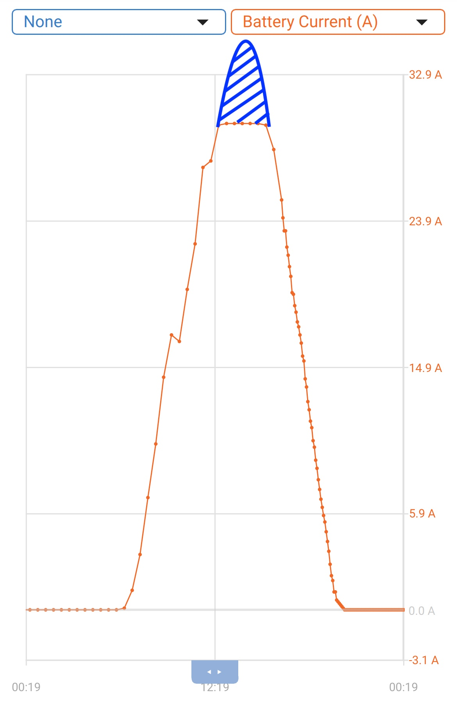
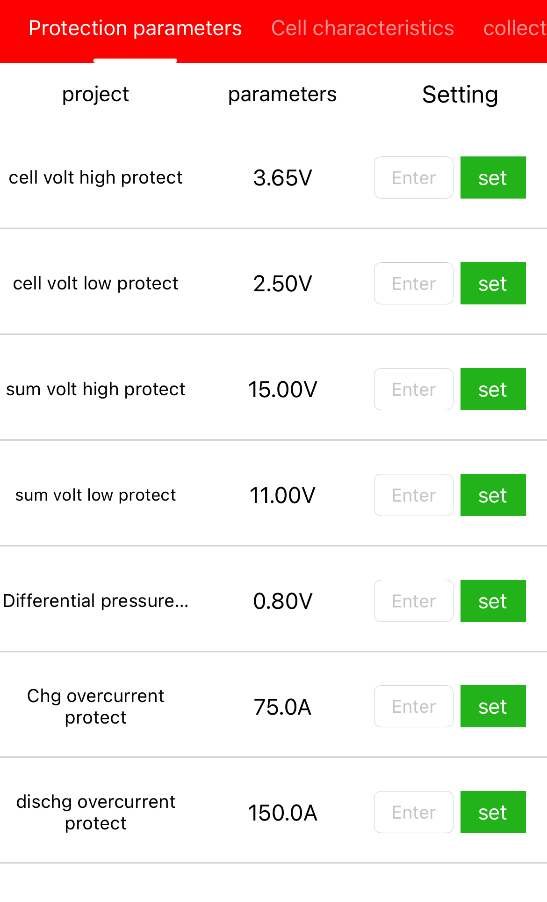
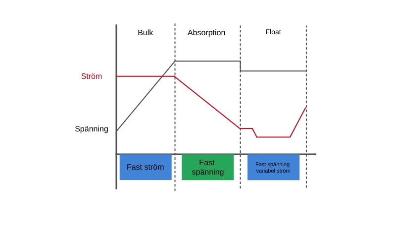

På sidan om Freya ([länk](/freya/#elektronik)) står det några rader om elektroniken ombord och även ett par ord om våra batterier. Det här inlägget kommer dock att ta upp i lite mer detalj hur laddningen av våra batterier är optimerad för vår utrustning och användning.

Men först lite kort om vad vi faktiskt har ombord som har med batterier och laddning att göra.

Vi har två primära laddningskällor, generatorn på motorn och våra solpaneler.

## Generator
Vi börjar lite kort med generatorn som är en 115A temperaturstyrd generator som sitter standard på Volvo Penta D2-75 (och många andra modeller), vår generator ger vid optimala förhållanden max 14.4V in i systemet när den laddar fullt. De där 14.4 volten gör att vi kan ladda våra LiFePO4 batterier utan att riskera att våra BMSer kopplar bort hela eller delar av banken med risk för strömspikar till följd om de skulle tycka att banken är fulladdad, det tillsammans med att generatorn är temperaturreglerad gör att vi inte heller behöver använda en DC/DC laddare mellan generatorn och våra batterier då generatorn helt enkelt sänker effekten när den börjar bli för varm.

Då vi för några år sedan gick över helt och hållet till en enbankslösning, utan det klassiska startbatteriet, bestående av 2x280Ah Litium batterier behöver vi inte heller fundera på dioder eller andra laddfördelare. Vårt "extremt avancerade system" består av en kabel direkt från generatorn till våra batterier eller rättare sagt till bankens busbar, inget annat. Eller jo, en BMV-712 som mäter hur mycket som laddas eller förbrukas, lite som en tankmätare fast för batterier. 

## Solpanelerna
I skrivandets stund har vi 3 solpaneler som ger 215W styck, spänning vid Vmax är 37V, men de smyger gärna upp till strax över 41 när solen tar i på riktigt, Pmax är 5,75A. Panelerna är kopplade i parallell till en liten busbar som sedan löper vidare via en 16mm2 kabel till batteribanken och en 100/30 MPPT från Victron.

Den skarpsynte ser ganska fort att vår MPPT är lite i underkant av vad våra solpaneler ger, det är ett medvetet val då vi uppgraderat från 2 paneler till 3 och ger numera max laddning under så kort tid per dag (3-4 timmar) vilket gör att vi bara "förlorar" 15-20Ah laddning pga att den blå toppen av laddkurvan klipps av.

Nu till själva inställningarna och de lite mer tekniska tankarna runt det hela.

### BMS
Vi börjar med inställningen av våra BMSer, kort och gott är de ställda att fungera som skydd för våra batterier och styr därför inget med laddningen (det överlämnar vi med varm hand åt vår MPPT). Det betyder att BMSen fungerar som "säkring" om vår laddkrets skulle hitta på något oförutsett.
Skulle vi ladda för mycket så kopplar vår BMS bort batteriet om laddningen överstiger 3,65V per cell eller 15,00V totalt, detsamma gäller om volten kryper under 2,50V per cell eller under 11,00V totalt.
Våra BMSer skyddar även batteriet om laddningen skulle överskrida 75A eller uttaget från batteriet skulle ta sig upp till 150A, då våra batterier är monterade parallellt betyder det att vi skulle behöva ladda över 150A eller dra över 300A för att banken skulle kopplas bort vi har inte tillräckligt med elektriska apparater att koppla in för att komma upp till de nivåerna.

### MPPT (Maximum Power Point Tracker)
Vår MPPT (solcellsregulator) ser till att omvandla energin i solens strålar som våra solpaneler fångar till något vi kan använda eller lagra i våra batterier. Då litium skiljer sig något åt från vanliga AGM eller de klassiska bly/syra batterierna behöver man tänka till liiiite mer än vanligt, dock långt ifrån vad alla "experter" anser att man behöver. Att installera lithium är ingen kärnfysik som kräver en professorexamen för att få saker och ting att fungera.

Då ett batteri är uppbyggt av 4 celler där varje cell kan laddas till 3,65V betyder det att hela banken behöver laddas till 3,65x4=14,6V för att bli fulladdad. Nu är det dock så att ett lithiumbatteri inte tycker om att laddas fullt utan mår som allra bäst när det är halvfullt (eller halvtomt beroende på vilken sorts person du är) så vi har ställt in vår MPPT enligt nedan för att batteriet ska må så bra som möjligt. Vår MPPT har ett gäng inställningar så att laddningens olika faser kan justeras att passa batteribanken och hur den används så bra som möjligt, de olika faserna är bulk, absorption och float.

Bulkfasen betyder i vårt fall att MPPTn kommer göra sitt bästa när solen går upp på morgonen att så fort som möjligt med maximal ström (A) ladda upp batteriet till 13,8V. När 13,8V har nåtts går MPPT'n in i nästa fas, absorptionsfasen.

Under absorptionsfasen ändras upplägget och istället för att försöka leverera maximal ström går MPPTn över till att hålla spänningen (V) konstant. I vårt fall händer detta vid 13,8V och den fasen varar tills dess att laddströmmen (tail current) går under 2A. Detta är något som vi tittar närmre på att justera då "best practice" säger att tail current för litium bör ligga mellan 0.02C och 0.05C vilket i vårt fall skulle vara mellan 11.2 och 28A. Enda orsaken till att justera upp tail current skulle vara för att låta systemet gå över till float, som är nästa steg, tidigare om vi använder förbrukare som gör att stömmen inte går under 2A vilket gör att max absorbtionstid skulle behöva triggas för att nästa laddfas skulle aktiveras, men å andra sidan spelar det ingen som helst roll för systemet om det är ligger i absorption eller float då spänningen är satt till 13,8V på båda i vårt fall.  

På tal om nästa laddfas, float. Tanken med float är att när batteriet är fulladdat ska spänningen sänkas till en lägre, konstant spänningsnivå. Syftet är att hålla batteriet fulladdat genom att kompensera för självurladdning, utan att överladda eller stressa batteriet. I vårt fall har float satts till samma värde som absorptionsfasen dvs 13,8V. Vid den spänningen ligger som känt våra batterier redan inom sin "sweet spot nivå" så det finns inget skäl till att sänka spänningen ytterligare. Att ligga kvar på samma spänning gör att eventuell förbrukning primärt hämtas direkt från solpanelerna och MPPTn utan att belasta batteribanken vilket är en liten bonus.

**Sammanfattningsvis ser det ut såhär:**
Bulk laddar upp till 13,8V
Absorption håller 13,8V tills laddningen sjunker under 2A.
Float fortsätter hålla 13,8V tills spänningen sjunker 0,5V till 13,3V vilket är vår re-bulk voltage offset som triggar en ny bulk cykel. Det sker i regel endast under nätterna eller riktigt tråkiga dagar utan sol.  

Ovanstående är vår generella laddcykel så om du läst såhär långt undrar du kaanske hur vi säkerställer att våra celler (inte de små grå utan de stora blå) är balanserade? Det är en bra fråga då många BMSer kräver en viss spänning för att starta balanseringen av cellerna. I vårt fall använder vi BMSer från Daly och de börjar i regel balansera celler när spänningen överskrider 3,4V/cell dvs när banken är laddad till ca 13,6V. Anledningen till att jag skriver ca 13,6V beror inte på att jag inte kan multiplicera 3,4x4 utan för att en cell kan nå 3,4V innan en av kompisarna i samma batteri gör det så balanseringen kan starta lite tidigare eller lite senare. Daly säger att deras BMSer drar 50-75mA från den cell som har högst spänning, jag har dock sett att de drar så lite om 30mA och på en cell som har 280Ah kan balanseringen ta lite tid, ganska mycket tid..

För att vara säkra på att balanseringen ska starta och för att ge batteribanken en liten boost då och då (framför all under vinterhalvåret då vi inte använder motorn så ofta) justerar vi laddningen till 14,4V istället för 13,8V en gång i månaden. Det görs genom att använda equalization-funktionen i vår MPPT. Den är primärt avsedd för att användas tillsammans med bly/syra-batterier för att förhindra sulfatering och syraskiktning. Det gäller såklart inte i vårt fall, utan vår inställning är sådan att en gång i månaden startar en schemalagd equalization där målspänningen är ställd på 14,4V och att den spänningen ska hållas under 90 minuter. Efter det återgår MPPT:n till float och 13,8V.

Fler saker än så är det inte, vi gillar att hålla det så enkelt som möjligt utan massa dyra och komplicerade prylar som man bara måååååste ha för att båten ens ska kunna lämna bryggan för en kvällssegling i skärgården.

Ja just det, ett par små avslutande detaljer:

- Våra celler håller sig fortrande inom ett 0,005-0,001V
- Vi kan starta motorn utan några problem med lithium, den startar till och med fint med bara ett aktivt lithium batteri (även med växel i).
- Nej, vår generator har inte brunnit upp och kommer inte heller göra det inom några minuter bara för att vi laddar lithium med den utan DC/DC laddare eller Balmar regulator.