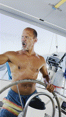

På land tar man vatten många gånger för givet, det finns massor av det i kranen både varmt och kallt. På en båt är det lite annorlunda även om vi är omgivna av massor av vatten.

## Vattenförbrukning

På Freya använder vi i snitt 30 liter vatten per dag under högsäsongen. Vattnet går åt till att duscha efter bad för att slippa dra ombord  *saltvatten*, matlagning, tvätt av kläder, dryck (ett par liter om dagen) och tvätt av båt när vi seglat och fått saltvatten över däck.

> När saltvatten dunstar så lämnar det salt efter sig vilket i sin tur suger åt sig fukt när temperaturen sjunker om nätterna och då blir båten blöt igen. Uppe på däck gör det kanske inte så mycket men saltet sprider sig gärna in i båten med hjälp av tassar och fötter och innan man vet ordet av är både soffan och sängen fuktig på kvällen pga saltet.

Våra 30 liter fördelas på 2 personer (och en båt). Det är i runda slängar 110 liter mindre än vad som används ”per person”!! på land.

## Watermaker
Nu använder (slösar) vi lite mer vatten än vi faktiskt behöver och det beror på att vi har en watermaker eller avsaltningsanläggning som det så vackert heter på svenska ombord. 

Vår watermaker som producerar ca 120 liter vatten i timmen vid en vattentemperatur mellan 20 och 27 grader.. Skulle vattnet vara bräckt (blandning av salt- och sötvatten som det är i Östersjön skulle vi producera mycket mer än så men. Men nu är vi ju inte där så vi får helt enkelt nöja oss med det vi får. Delarna till vår watermaker kostade oss strax under 30k och ett gäng timmar med blandade svordommar och skavda fingrar innan allt var installerat. Märket är en något tweekad MAB (watermaker.se) för saltnivån utanför Östersjön, vår kör vår med en annan motor och med dubbla 40 tums membran då vi testat lite olika varianter av delar åt Ulf.

Jag nämnde att vi använde 110 liter mindre vatten än vad en person gör på land. I relation är vår förbrukning minimal i relation mot snittförbrukningen av de som bor på land i Sverige då svenskar använder i genomsnitt 140 liter vatten per dygn.

*Lite kuriosa, i vår tidigare båt Trull rymde vattentanken 140 liter och den klarade vi (2 personer) oss på ungefär en vecka...*

Det är viktigt att komma ihåg att det mesta av vatten som går åt på land inte används till att dricka, utan till andra hushållssysslor. Efter lite googlande så får man fram en ungefärlig fördelning av hur vattnet används:
 * Personlig hygien (dusch, bad, handtvätt): Cirka 60 liter
 * Toalettspolning: Cirka 30 liter
 * Disk: Cirka 15 liter
 * Tvätt: Cirka 15 liter
 * Mat och dryck: Cirka 10 liter (varav bara 1-2 liter dricks direkt)
 * Övrigt: Cirka 10 liter

Nu är ju detta ett genomsnitt, och den faktiska förbrukningen kan såklart variera en massa beroende på individuella vanor, hur många man är i hushållet och vilka vitvaror man har. Till exempel drar en dusch på fem minuter ungefär 45-60 liter vatten, och en fylld diskmaskin eller tvättmaskin drar mindre vatten per enhet än om de körs halvfulla.

## Virtuellt vatten
En annan ”liten” sak som många inte tänker på när det gäller vatten så finns det ett ett mått till på förbrukning, det ”virtuella vattnet”. Nu är det inte något vatten som finns på internet eller i molnet eller jo det är ju där det finns och kommer från.
Det "virtuella vattnet" är det som går åt för att producera mat, kläder och andra varor vi konsumerar, skulle vi räkna in även den så blir den totala vattenförbrukningen per person i Sverige något högre, uppemot 4000 liter per dag, globalt ligger förbrukningen på ca 5000 liter/dag (nästan 8000 liter/dag och person i USA)...

### Några exempel på virtuellt vatten.

#### Livsmedel:
För att producera ett kilo nötkött går det åt cirka 15 400 liter virtuellt vatten, medan en liter mjölk kräver runt 1000 liter enligt Telge. 

#### Kläder:
En t-shirt av bomull kan kräva upp till 2500 liter virtuellt vatten, och ett par jeans kan kräva upp till 8000 liter enligt WWF. 

#### Elektronik:
Tillverkningen av en bil kan kräva upp till 400.000 liter virtuellt vatten enligt Vesi.fi.

Det är ju tur att vattnet smyger in i kretsloppet igen efter att det används annars hade Freya snart stått på torra land.

För den som tycker det är kul så antingen googlar du "Virtuellt vatten" eller så klickar du dig in på ex [Sydvatten](https://sydvatten.se/vattenfakta/virtuellt-vatten/) och läser mer.