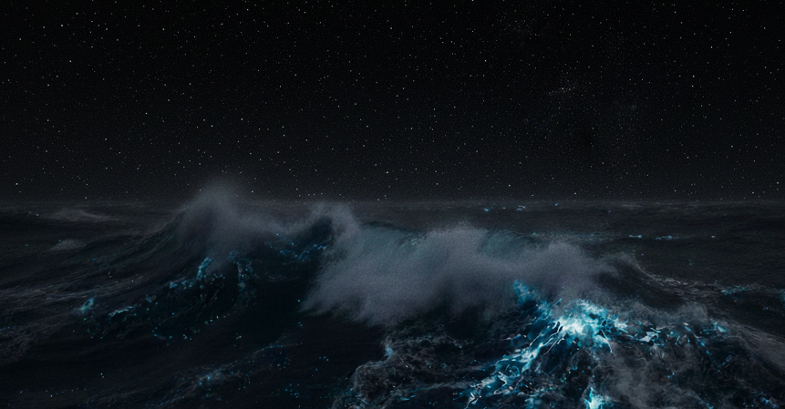

En kort överfart på bara 145nm från Lakka i Grekland till Italien rakt väster ut. Halvvind som skulle toppa mellan 25 till 30 knop när det skulle blåsa som mest ackompanjerat med vågor på upp till 2 meter skulle det vara. Alltså inget konstigt eller besvärligt.

Vi får en ganska långsam start med minimalt med vind till en början men efter 5 timmar kryper vinden upp mot de väntade 25 knopen och Freya tar fart genom vågorna, vinden fortsätter dock att öka och kryper sakta upp mot 30+ knop där den väljer att parkera sig. De där vågorna på 2 meter ser vi både komma och gå, de bygger raskt vidare på höjden då de har fått hela vägen från Kroatien på sig att ta både fart och höjd. Vi sätter ett tredje rev i genuan och ett andra i storen samtidigt som skotvagnen parkeras så långt ner i lä det bara går.    

Freya seglar på bra och gör stadigt över 7 knop, det börjar bli mycket vatten på däck och en och annan nyfiken våg börjar titta närmre på sittbrunnen som än så länge är ganska torr.

Kvällen och natten kommer och då vi gör betydligt mer fart än beräknat seglar vi ikapp kulingen som borde passerat för om oss i samma veva som mörkret faller så vi sätter vi ett fjärde och sista rev i genuan, storen har vi tagit ner helt sedan länge. Freya gör fortfarande stadiga 7 knop fast med ständiga vågor som numera tar sig friheten att regelbundet besöka sittbrunnen och lämna ett par hundra liter vatten efter sig när man minst anar det.

Hon halkar lite titt som tätt ner i vågdalarna och ibland tappar hon fotfästet helt och faller med buller och bång från vågtoppen ned i dalen med resultatet att allt som inte sitter fast i båten hittar nya platser att bo på.

Bortsett från den extremt blöta och numera något kalla komforten i sittbrunnen gör avståndet till land och störande ljus att natten är bländande stjärnklar. Vi har även turen segla genom mareld vilket är en massor av fluorescerande plankton, dinoflagellater, som gömmer sig i vågorna. Vågbruset runt båten gör att de lyser upp så mycket att vågskummet nästan ser ut att glöda. Ibland får man helt enkelt ta det goda med det goda.

Strax innan midnatt kastar vi dock in handsken och stänger om oss, Freya behöver ingen hjälp med seglingen den klarar hon fint själv och då både AIS och radar håller vakande ögon på vad som händer runt om oss räcker det fint att titta till instrumenten lite då och då när vi passerat den nord och sydgående fartygsrutten mellan Grekland och Italien.

Kulingen biter sig fast och följer oss långt in på förmiddagen och hela vägen fram till ankringen utanför den lilla italienska byn Capopiccolo där vi äntligen får sjölä och slipper vågorna. 

Även om det inte var den bästa överfarten vi gjort så var det skönt att se och känna att Freya sköter sig som sig bör även när både vind och vågor tar och hittar på saker som vi inte riktigt väntat oss. Vi behöver bara bli bättre på att fixa mat och leva ombord när det känns som att bo i en snurrande tvättmaskin.