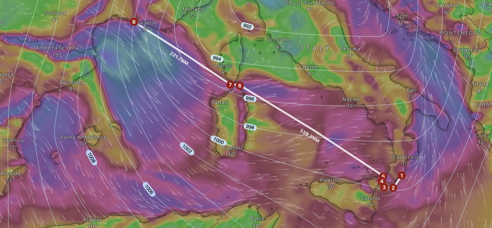

# Segla genom en kontinent

Okey, innan buttra tangentbordsriddare sätter morgonkaffet i fel strupe och får panik så är segla en helt korrekt term att använda även om vi kommer motorera större delen av tiden. Så till dig som nu har panik och en aning ångest över att jag skrev segla, ta det hela med ro och klicka dig in på Aftonbladet istället så blir livet mycket bättre... ;)

## En liten kort bakgrund

För snart 6 år sedan kastade vi loss och seglade söderut, planen var bara söderut men det slutade med att vi svängde vänster efter Spanien och landade i Grekland som så många andra. Efter 5 säsonger har vi undersökt de flesta länder, öar och vikar som är något att ha både i Italien, Grekland och Kroatien och suget efter små strandnära resturanger med billigt vin har tappats någonstans på vägen tillsammans med lusten att leva i +35 graders värme sommartid. Så istället för att segla över Atlanten till samma klimat i Karibien har stäven riktats norrut.

### Var är vi idag

När den här texten publiceras är vi fortfarande i Roccella i södra Italien och väntar tålmodigt på bättre väder då vi har dryga 650nm att segla, om vi tar den korta vägen, innan vi ens når södra Frankrike och då det något lynniga vårvädret fortfaraden tar sig friheter är suget att ge sig ut och bråka med det minimalt.

Vi har 3 väder likt det nedan i prognosen innan det verkar som att bättre tider är här. För den oinvigde så betyder orange 30 knop, lila 40 och blåvitt mellan 50 och 60 knop. 60 knop är extremt ovanligt men det händer och det motsvarar runt 110km/h...

Kort och gott vi väntar och passar på att äta god pizza ett tag till innan vi lämnar.

### Varför så bråttom?

Personligen har vi inte bråttom norrut, det är kombinationenb av båten och vattenståndet i en av kanalerna vi behöver passera som gör att vi har lite tidsbrist. Freya är inte riktigt definitionen av kanalbåt då hennes köl sticker ca 1,8 meter och det i kombination med att delar av kanalsystemet är runt 2 meter djup när det är okey med vatten (vilket det aldrig är när sommaren kommer) gör att vi behöver ta oss en nästan 200 mil till slutet av april för att vara hyfsat säkra på att inte gå på grund och behöva vända eller spendera en förmögenhet på att ställa Freya på lastbil och köra henne förbi den grunda sträckan.  

### Vad är då den faktisak planen när vi väl kommer iväg?

Själva seglandet till Frankrike handlar mer om att hitta vettigt väder då varken blåser för lite eller för mycket, peka båten åt hjälpligt rätt håll, slå på autopiloten och sedan sova så mycket och länge det går tills vi är framme efter en vecka. Självklart kommer det inte bli så, det blir det aldrig så den planen kommer såklart revideras längs med vägen.

Det roliga kommer dock när vi hittat fram till Frankrike och Port Saint Louis du Rôhne där kanalen börjar. Det första vi kommer göra där är att lyfta av masten och bygga en ställning på däck för att kunna släpa den med oss norrut.

Efter det tar vi oss norryt mot Lyon där Rhône och Saône möts, där svänger vi in på Saône 

### Förutsättningar

Tunneln har vertikala väggar som är **1,70 m** höga från vattenytan, med en bredd av **8 m**.
Taket utgörs av ett cirkulärt valv med radien **4 m**, vars centrum befinner sig **1,70 m** över vattenytan i tunnelns mittlinje.

Det objekt vi kontrollerar är en rektangel med bredden **3,65 m** och höjden **3,00 m**, centrerad i tunneln.
Det kritiska hörnet befinner sig alltså vid koordinaten:

$$x = \frac{3{,}65}{2} = 1{,}825 \text{ m från mitten}$$
$$y = 3{,}00 \text{ m över vattenytan}$$

---

## Valvets koordinatsystem

Valvets centrum placeras vid origo för beräkningarna:

$$\text{Centrum} = (0,\ 1{,}70)$$

Det kritiska hörnet i valvets koordinatsystem:

$$\Delta x = 1{,}825 \text{ m}, \quad \Delta y = 3{,}00 - 1{,}70 = 1{,}30 \text{ m}$$

---

## 1. Radieellt avstånd till hörnet

Avståndet från valvets centrum till det kritiska hörnet:

$$r_{\text{hörn}} = \sqrt{\Delta x^2 + \Delta y^2} = \sqrt{1{,}825^2 + 1{,}30^2} = \sqrt{3{,}330625 + 1{,}69} = \sqrt{5{,}020625} \approx 2{,}241 \text{ m}$$

Marginal längs radien mot valvet:

$$\Delta r = 4{,}00 - 2{,}241 = \boxed{1{,}759 \text{ m}}$$

---

## 2. Vertikal marginal (rakt uppåt från hörnet)

Vid $x = 1{,}825$ m från mitten, befinner sig valvets innerkant på höjden:

$$y_{\text{valv}} = 1{,}70 + \sqrt{4^2 - 1{,}825^2} = 1{,}70 + \sqrt{16 - 3{,}330625} = 1{,}70 + \sqrt{12{,}669375}$$

$$y_{\text{valv}} = 1{,}70 + 3{,}559 = 5{,}259 \text{ m}$$

Vertikal marginal från hörnet upp till valvet:

$$\Delta y_{\text{upp}} = 5{,}259 - 3{,}00 = \boxed{2{,}259 \text{ m}}$$

---

## 3. Horisontell marginal (åt sidan från hörnet)

Vid $y = 3{,}00$ m över vattenytan, befinner sig valvets innerkant på det horisontella avståndet:

$$x_{\text{valv}} = \sqrt{4^2 - (3{,}00 - 1{,}70)^2} = \sqrt{16 - 1{,}69} = \sqrt{14{,}31} \approx 3{,}783 \text{ m}$$

Horisontell marginal från hörnet till valvet:

$$\Delta x_{\text{sida}} = 3{,}783 - 1{,}825 = \boxed{1{,}958 \text{ m}}$$

---

## Sammanfattning

| Riktning | Marginal |
|---|---|
| Uppåt (vertikalt från övre hörn) | **2,259 m** |
| Åt sidan (horisontellt från övre hörn) | **1,958 m** |
| Diagonalt (längs valvradien) | **1,759 m** |

Rektangeln ryms med god marginal inom tunnelns profil.
