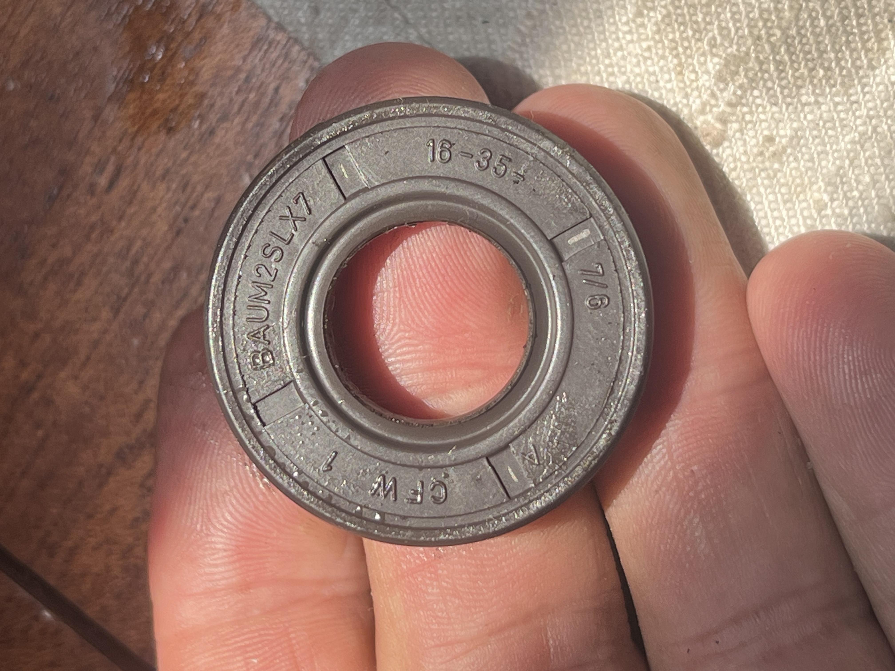
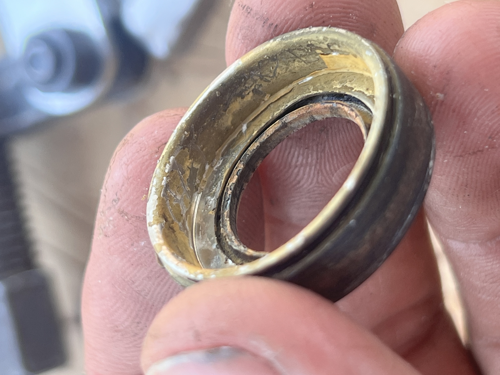
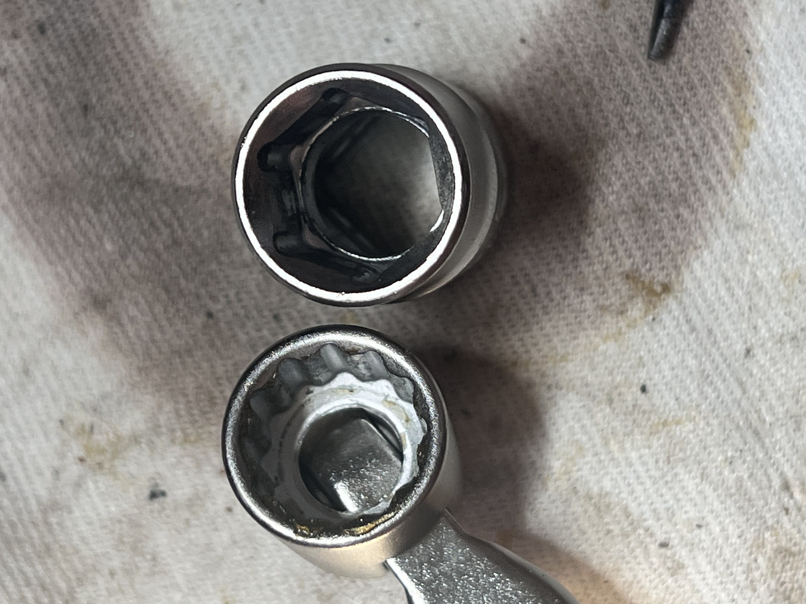
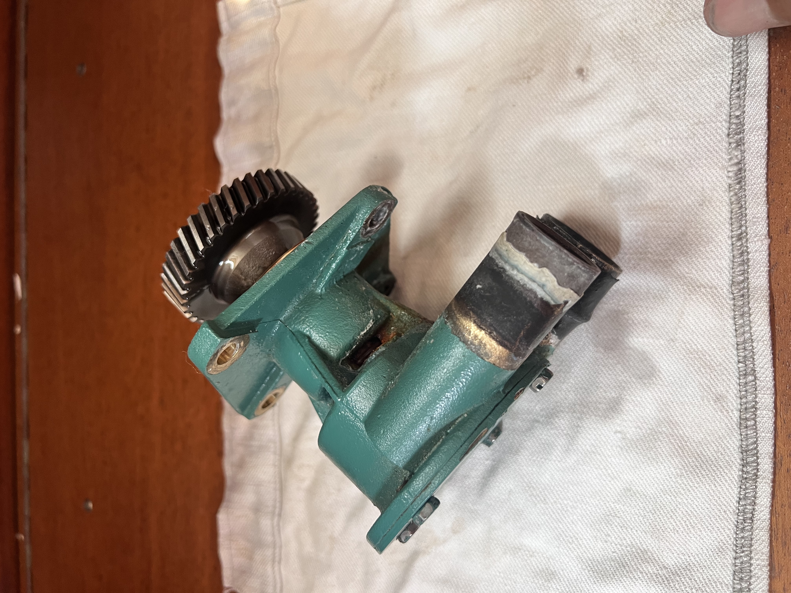
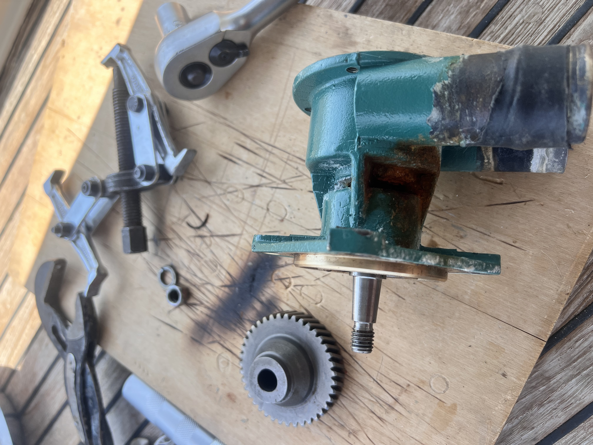
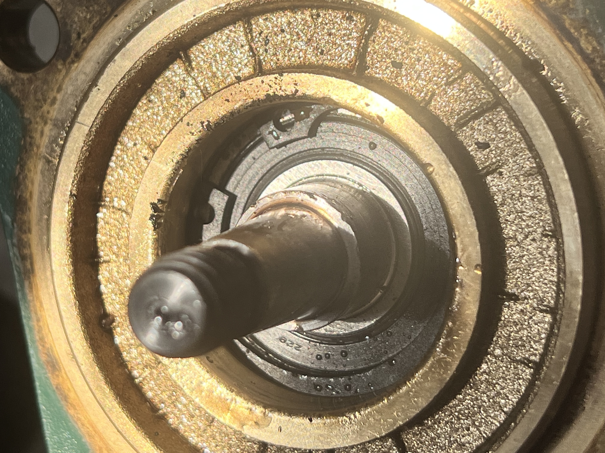
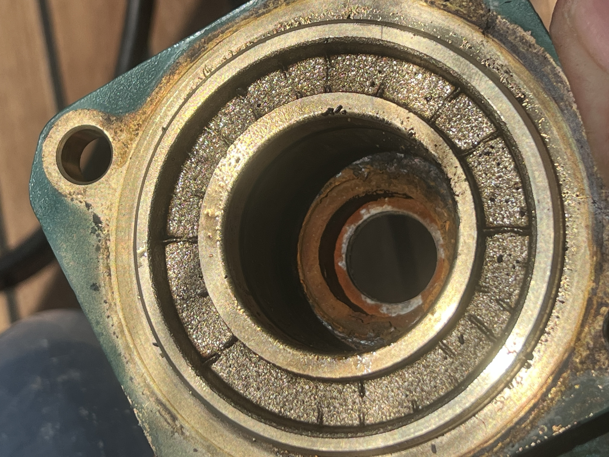

# Länspumen gick var 20'e minut

Efter att vi lämnat vintermarinan så märkte vi efter ett tag att länspumpen gick lite då och då, typ var 20'e minut. Att den går lite då och då är inget konstigt, det kan vara allt från lite slagvatten till att lite duschvatten hittar in på fel ställe men stadigt var 20'e minut är lite väl ofta.  

## En stril ström mindre gott vatten från motorn

Efter några år på båt så blir man en finsmakare när det kommer till vatten. Det första man gör när en liten "pöl" hittas någonstans ombord är att doppa fingret i den och först lukta för att sedan smaka. Doft och smak har utvecklats till en sådan nivå så att vilken sommelier som helst skulle bli tårögd. Det går utan några som helst problem att avgöra om det är regnvatten, färskvatten från vår egen watermaker, spolvatten från bryggan eller saltvatten. I regel är det inte heller några som helst problem att smaka av om det är en mix av dem eller om det är en skvätt diesel, motorolja eller glykol inblandat till i alla fall 2 decimalers noggranhet. 

### Problemet med båtar

För er som inte haft båt så kan jag säta att det inte alltid är så lätt att hitta var vattnet man hittat kommer från och det är inte heller ovanligt att det bara dyker upp ex när båten lutar eller gungar på ett visst vis. Just den här gången behövdes dock inte Sherlock Holmes för att lista ut vart vattnet kom från, det droppade friskt från skallerhålet i sjövattenpumpen som ser till att kylvattnet till motorn får kylvatten.

Det i sig är inte några större bekymmer då det är lätt att byta packboxarna själv, problemet är att få tag i delarna i lite snabbt där vi håller hus för tillfället och att Italien klämmer in en nationaldag mitt i allt som gjorde att allt tar ytterligare tid.

### Volvo giriga som vanligt

Datorn åker fram och google bjuds på frasen "service kit sjövattenpump volvo penta d2-75", massor av träffar med massor av alternativ. Allt från kompretta pumphus som kräver att man säljer sin njure på svarta marknaden till mindre och enkla kit med bara packboxar och ett par o-ringar. Självklart hugger alla till så fort något är till en båt och är det till en Volvo så tillkommer en bonus på 50-200% till bara för att de kan. 

### En packbox är en packbox är en packbox

Tack och lov är packboxar fortfarande packboxar även om Volvo tror att de blir något som dvärgarna i Midgård tillverkat bara för att de slänger på sitt interna reservdelsnummer. När vi då stryker Volvo från listan över artiklar och isället söker efter "O-Ring 37,77x2,62"
och "O-Ring 66,34x2,62" så dräller det av vanliga industriella packboxar för en bråkdel av pengarna. En snabb beställning och 10€ mindre på kontot senare låg paketet med delarna ombord. 

### Det som döljs i snö kommer fram vid tö

Ett gammalt ordspråk är att det som döljs i snö kommer fram vid tö, kan skvallra om att detsamma inte gäller kolstål som döljs i ett pumphus med saltvatten. Det hittas aldrig..

Det är när pumpen demonteras det börjar bli lite spännande men först en kort bakgrund. Pumpen i fråga monterades av våra vänner på Volvo Penta för ca 600 motortimmar sedan i samma veva som motorn byggdes. Dvs pumpen är i stort sett ny och allt i den är från när den var monterades, förutom impellern som bytts ett par gånger, alltså inget ovanligt som bör får en att höja på ögonbrynen när det gäller en motor av vår ålder.

Det som dock var aningens förvånande var att packboxen på saltvattensidan (det sitter två i pumphuset, en som håller saltvatten inne i pumpen och en som håller olja inne i motorn) var i stort sett som bortblåst. Den rostfria fjädern gick inte att hitta, själva damasken var även den spårlöst borta.



"Skicket" på packboxen får mig att dra följande slutledning, den rostfria fjädern som måste sitta på en packbox som går i saltvatten var av vanligt kolstål, dvs den billigare typen av packbox som används i oljor. Undrar om det är standard för att pumparna ska börja läcka och tvinga kunderna till en verkstad som tar 1000kr/timmen för att lägga ett par timmar på att byta packboxen och peta in en ny "Volvo orginal"?

## Värt att tänka på

### Orginal är standard med en logo

Det finns ingen som helst anledning att köpa orginalprylar. Volvo, eller vilken tillverkarde man nu har, tillverkar inte oljefilter, packboxar, oljor eller vad man nu behöver. De sätter sin logo på en redan befintlig produkt, stoppar den i en fin förpackning och höjer priset med hur mycket som helst. Deras affärside är lika bra som de som vatten utan kolsyra, fantastiska marginaler...

### Förtroende är bra men kontroll är bättre

Oavsett vad tillverkaren eller leverantören säger att du köpt, verifiera att det du fått är det du behöver. Packboxen som beställdes var stämplad INOX men magnettricket avslöjade ganska fort att så inte var fallet. Tur att vi hade en extra rostfri fjäder liggandes.



### Några prylar som vi tycker är bra att ha ombord

Utöver den övriga verkstaden såklart...

Värmepistol för att mjuka upp envisa slangar, gasbrännare för att expandera kugghjulet en avdragare med tre hakar är bra att ha (vår har bara två). En fasta nyckel med täta spår (som den till vänster nedan) är mer än toppen då den passar perfekt på impellerspåren som mothåll när muttern som håller kugghjulet ska lossas, vilken storlek det var kommer jag inte ihåg men det var vanlig mm (14-17mm någonting).

### Sist men inte minst några blandade bilder till arkivet

   